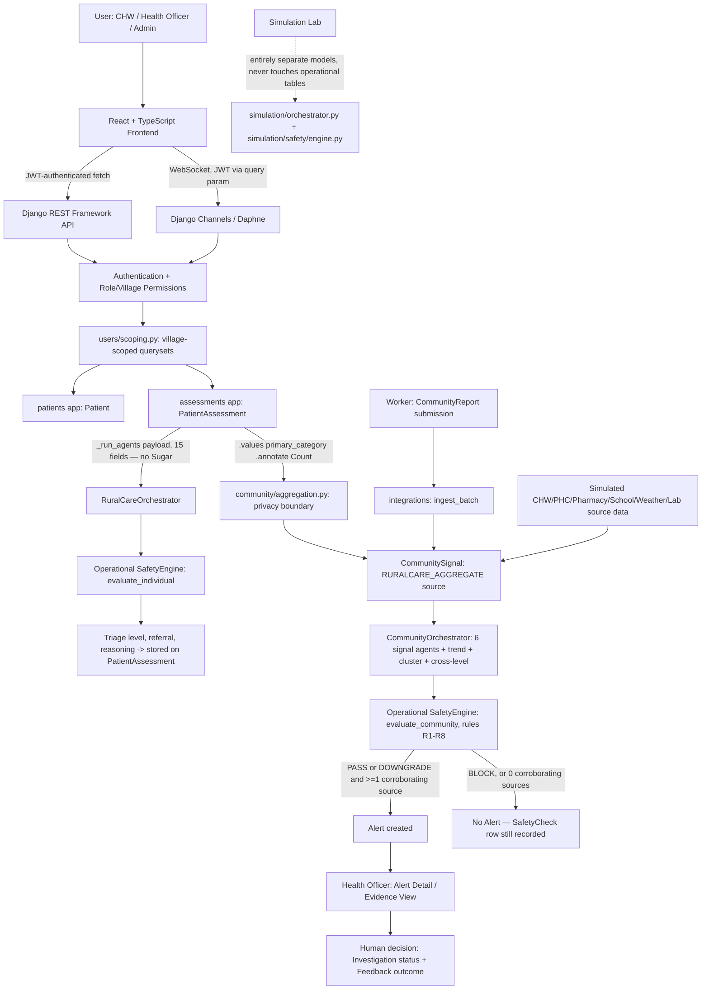
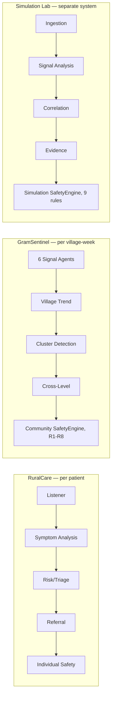
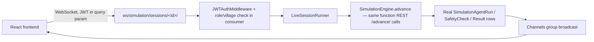
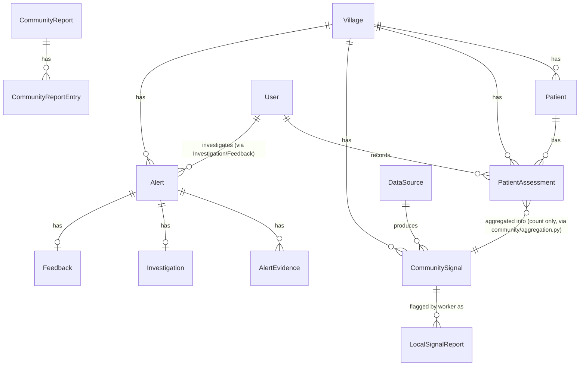

# GramSentinel + RuralCare — Complete Project Knowledge & Jury Preparation

**Purpose of this document:** a technically accurate reference for the project team to study before a hackathon jury review or demo. It is not marketing copy. Every claim below was verified directly against the current codebase at the time of writing. Where the codebase and any older documentation (README, comments) disagree, this document follows the code.

**How to read the labels used throughout:**
- **Implemented** — exists and runs in the current code, verified by reading it.
- **Synthetic / demo data** — real code, but the data it operates on is fabricated for demonstration (no real patients, no real hospital feed).
- **Publicly available real-world context** — the one exception: Manikkampatti's village demographic/geographic profile, which comes from public census-style facts entered into the seed data, not from any live data feed.
- **Not currently implemented** — described only to be ruled out, or listed explicitly under Future Scope (Section 35). Never described as if it exists.

---

## 1. Technology Stack

### 1.1 Full inventory

| Technology | Category | What it does in GramSentinel | Why we use it | Where it is used |
|---|---|---|---|---|
| React 18.3.1 | Frontend framework | Builds the Worker, Officer and Admin interfaces as interactive components that re-render only the part of the screen that changed | Component reuse across three role-specific portals sharing one design system; large ecosystem, familiar to most contributors | `frontend/src` — every page and component |
| TypeScript 5.5.4 | Frontend language | Adds static types on top of JavaScript so the compiler catches mismatched API shapes before runtime | The frontend talks to ~40 backend endpoints with specific response shapes (triage results, safety verdicts, evidence records); typos/shape drift are caught at build time via `npm run typecheck` | Entire `frontend/src` |
| Vite 5.4.8 | Frontend build tool / dev server | Serves the app in development with fast hot-reload and bundles it for production (`vite build`) | Fast local iteration; simple, standard modern tooling | `frontend/vite.config.ts`, `npm run dev` / `npm run build` |
| Tailwind CSS 3.4.13 | Styling | Utility-class-based styling, no separate CSS files per component | Keeps three portals visually consistent without a custom design-system layer | Every `.tsx` file's `className` props |
| React Router 6.26.2 | Frontend routing | Maps URL paths to page components and gates access by role | Standard SPA routing; `RequireRole` wraps every protected route | `frontend/src/App.tsx` |
| Zustand 4.5.5 | Frontend state management | Two small global stores: authentication/session state, and Simulation Lab state (including the live WebSocket connection) | Lighter-weight than Redux for a project with only two genuinely global concerns | `frontend/src/store/auth.ts`, `frontend/src/store/simulation.ts` |
| Recharts 2.12.7 | Charting | Renders every line/bar chart in the app (community trends, admin overview, simulation signal timeline) | Declarative React-native charting, no separate charting runtime to integrate | `pages/admin/Dashboard.tsx`, `pages/officer/Dashboard.tsx`, `pages/officer/CommunityData.tsx`, `pages/officer/SimulationLab.tsx` |
| Python | Backend language | Implements the entire Django backend, all agents, and the deterministic safety engines | Django ecosystem, readable rule-based logic, wide library availability | `backend/` |
| Django 5.0.6 | Backend web framework | Provides the ORM, request routing, authentication scaffolding, admin site, and migrations | Batteries-included framework suited to a data-modeling-heavy healthcare app built under time pressure | `backend/config`, every Django app |
| Django REST Framework 3.15.2 | API layer | Exposes Django models and business logic as JSON APIs the React frontend calls | Standard, well-tested REST layer for Django; serializers double as input validation | Every `views.py`/`serializers.py` in `backend/` |
| djangorestframework-simplejwt 5.3.1 | Authentication | Issues and verifies JWT access/refresh tokens | Stateless auth suited to a decoupled frontend/backend deployment; industry-standard token format | `backend/users/views.py` (`LoginView`), `config/settings.py` `SIMPLE_JWT` |
| Django ORM | Data access | Translates Python model classes into SQL queries; enforces village-scoping via queryset filters | Keeps authorization logic (who can see which village's data) in one place rather than scattered raw SQL | Every `views.py` `get_queryset()` |
| Django Channels 4.1.0 + Daphne 4.1.2 | Real-time / ASGI server | Adds WebSocket support to Django (used for Live Emergence simulation streaming) and serves the whole app over ASGI in both Docker and Render deployments | The Live Emergence feature needs a persistent server-push connection, which plain WSGI/Gunicorn cannot provide | `config/asgi.py`, `simulation/consumers.py`, `simulation/routing.py`; actual production start command in `render.yaml` and `docker/Dockerfile.backend` |
| WhiteNoise 6.7.0 | Static file serving | Serves Django's own static assets (e.g. the Django admin site's CSS/JS) directly from the Python process | Removes the need for a separate static-file server for Django's own assets | `config/settings.py` `MIDDLEWARE` + `STORAGES` |
| django-cors-headers 4.4.0 | Cross-origin requests | Allows the separately-hosted React frontend to call the Django API from a different origin | Frontend and backend are deployed as two separate services (Render static site + Render web service) | `config/settings.py` |
| SQLite | Database (local/dev) | Default local database, zero setup required | Fast local development without needing a Postgres server running | `backend/db.sqlite3`, default in `config/settings.py` when no `DATABASE_URL` is set |
| PostgreSQL | Database (production) | Production database, used automatically once `DATABASE_URL` (a Postgres URL) is set | Production-grade relational database suited to Render's managed Postgres offering | `config/settings.py` (`dj_database_url` config), `render.yaml` |
| Anthropic Claude API (via `requests`) | LLM | Rewords an already-decided triage sentence into plain language for one agent (`RiskTriageAgent`), and rewords one community-trend explanation (`ClusterDetectionAgent`); never decides a triage level, safety verdict, or alert | Used narrowly, for language polish only, so the system keeps working with zero API key present | `backend/agents/llm/client.py` (plain HTTP via `requests`, no Anthropic SDK is installed); called from `agents/ruralcare/triage.py`, `agents/gramsentinel/cluster.py`, `simulation/orchestrator.py` |
| pandas 2.2.2 / numpy 1.26.4 / scikit-learn 1.5.0 | Declared Python dependencies | **Not imported anywhere in the application code** (verified by repository-wide search) | Listed in `requirements.txt`; no current code path uses them | N/A — see note below |
| Docker | Containerization | Packages backend (Daphne) and frontend (Nginx-served static build) as two containers, orchestrated via `docker-compose.yml` | Reproducible local/deployment environment | `docker/Dockerfile.backend`, `docker/Dockerfile.frontend`, `docker-compose.yml` |
| Render | Hosting platform | Intended production host: a Postgres database, a Daphne-run web service, and a static site for the frontend, described in `render.yaml` | Simple PaaS deployment for a hackathon-timeline project | `render.yaml` (see accuracy note in Section 22 / Limitations — this file is explicitly self-documented as not fully verified against a live deployment) |
| GitHub | Source control / collaboration | Hosts the repository and its history | Standard | — |
| pytest 8.2.2 + pytest-django 4.8.0 | Backend testing | Runs the backend test suite (564 tests as of this document, across 25 files in `backend/tests/`) | Standard Python testing stack, integrates with Django's test database handling | `backend/tests/` |
| (none) | Frontend testing | **No frontend test framework is installed** — no vitest, jest, or Testing Library, and no `*.test.tsx`/`*.spec.ts` files exist | Not currently part of the project | `npm run typecheck` and `npm run build` are the current frontend verification gates |

**Note on pandas/numpy/scikit-learn:** these three packages are listed in `requirements.txt` but a full-repository search found **zero imports of any of them** in application code. Do not describe GramSentinel as using a trained machine-learning model or a pandas-based analytics pipeline — every "analytics" computation in the codebase (trend classification, correlation between sources, triage scoring, safety rules) is hand-written deterministic Python using plain comparisons and thresholds, not a statistics or ML library. If a jury member asks about this directly, the honest answer is: these are declared dependencies with no current usage; all logic in the demo is either plain deterministic Python or an optional LLM call for wording only.

**Note on Gunicorn:** `gunicorn==22.0.0` is listed in `requirements.txt`, but it is **not what actually runs the app**. Both `docker/Dockerfile.backend`'s CMD and `render.yaml`'s `startCommand` run **Daphne** (`daphne -b 0.0.0.0 -p $PORT config.asgi:application`), specifically because the Simulation Lab's Live Emergence feature needs a WebSocket-capable ASGI server, which Gunicorn's default WSGI worker does not provide. If asked "why Gunicorn," the accurate answer is: it isn't actually used for the app's own server process in the current deployment configuration.

### 1.2 Jury-language explanations of the core technologies

**React** — "React is the frontend framework used to build the interactive dashboards and portals. Instead of reloading an entire page, React updates only the part of the interface that changed when new data arrives."
*How I'd say it to the jury:* "We use React to build the Worker, Officer and Admin interfaces as reusable interactive components."

**TypeScript** — "TypeScript is JavaScript with type-checking added. It catches a whole category of bugs — like calling an API and using its response the wrong way — before the app ever runs."
*How I'd say it to the jury:* "TypeScript keeps our frontend in sync with the exact shape of data our backend actually returns."

**Django** — "Django is the Python web framework running our backend. It gives us a structured way to define data models, enforce rules on how that data can be read or written, and expose it as an API."
*How I'd say it to the jury:* "Django is the backbone that stores every patient assessment, community signal, and alert, and enforces who is allowed to see what."

**Django REST Framework (DRF)** — "DRF is the layer that exposes Django backend functionality as APIs the React frontend can call, and validates every incoming request before it touches the database."
*How I'd say it to the jury:* "Every action a worker or officer takes goes through DRF, which checks their role and their village before anything is read or written."

**JWT (via SimpleJWT)** — "A JSON Web Token is a signed, self-contained proof of who a user is, sent with every request instead of a server-side session."
*How I'd say it to the jury:* "When someone logs in, they get a signed token. Every subsequent request carries that token, and the backend checks it — it never trusts anything the frontend claims about who the user is or which village they belong to."

**Django Channels + Daphne** — "Channels adds WebSocket support to Django — a persistent two-way connection, instead of the browser having to repeatedly ask 'anything new?'. Daphne is the server that actually runs this ASGI-based (WebSocket-capable) version of Django."
*How I'd say it to the jury:* "Our Live Emergence simulation streams each agent's result to the officer's screen the instant it's computed, over a WebSocket — that's Channels and Daphne."

**PostgreSQL / SQLite** — "SQLite is a zero-setup file-based database we use for local development. PostgreSQL is the production-grade relational database the app switches to automatically in a deployed environment."
*How I'd say it to the jury:* "Locally everything runs on SQLite for simplicity; in production, the same Django models run against PostgreSQL — no code changes required, just a different `DATABASE_URL`."

**LLM (Anthropic Claude API)** — "A large language model is called in exactly two narrow places: to reword an already-decided triage sentence into plain language, and to reword a community-trend explanation. It never decides the triage level, never decides whether an alert is raised, and the system runs correctly with zero API key configured — it just falls back to a pre-written template sentence."
*How I'd say it to the jury:* "AI helps us explain a decision in plain language. It does not make the decision. Every clinical or safety-relevant number is computed by deterministic code first, and the safety engine re-checks the wording afterward for banned words like 'diagnosed' or 'outbreak confirmed.'"

**Docker** — "Docker packages the backend and frontend, with all their dependencies, into portable containers that run the same way on any machine."
*How I'd say it to the jury:* "Docker lets us hand someone a `docker-compose up` and get the exact same running system we're demoing today."

**pytest / pytest-django** — "pytest is the testing framework; pytest-django adds support for testing against a real (temporary) Django database."
*How I'd say it to the jury:* "We currently have 564 backend tests covering the triage pipeline, the safety engine, village-scoping, and the simulation lab."

---

## 2. What is GramSentinel?

**A. One sentence:**
GramSentinel is a two-layer rural health platform: RuralCare gives a community health worker AI-assisted decision support for one patient at a time, and GramSentinel aggregates those (and other) signals to help a Health Officer notice when a village's health pattern needs a closer look — with every safety-relevant decision made by transparent, deterministic rules and a human always in the loop.

**B. 30-second explanation:**
"A community health worker examines a patient and records symptoms and vitals. RuralCare's multi-agent pipeline suggests a triage level and referral, with a deterministic safety layer that can only escalate — never downgrade — a rescue-critical case. Separately, all patient encounters are anonymously aggregated by category and combined with other signals — worker-reported community counts, PHC/pharmacy/school/weather feeds — into GramSentinel, which uses the same kind of specialized, deterministic-first agents to flag when a village's pattern rises above its own baseline. A Health Officer reviews that flag, investigates, and makes the human call. Nothing in the system diagnoses a disease or declares an outbreak on its own."

**C. 1-minute explanation:**
"RuralCare is the individual layer: a CHW records a patient's symptoms and vitals; a five-agent pipeline (listener, symptom analysis, risk/triage, referral, safety) turns that into a triage level, a referral recommendation, and plain-language reasoning — with one narrow, optional LLM call used only to word the explanation, never to decide the level, and a deterministic safety agent that can force a case to URGENT if any of twelve fixed red-flag conditions are met. The worker can also record blood sugar and when it was measured, purely for the patient's own record — that reading is structurally excluded from the pipeline above and never influences the triage level.

GramSentinel is the community layer: individual encounters are aggregated into anonymous per-category weekly counts — the aggregation code physically cannot read a patient's name, symptoms text, or vitals, only a count grouped by category — and combined with worker-submitted community reports and simulated PHC/pharmacy/school/weather source feeds. A second multi-agent pipeline analyzes each source, checks whether independent sources agree, and an eight-rule deterministic Safety Engine decides whether a potential signal is even allowed to become an Alert — it can BLOCK a signal outright (for example, if only one source is anomalous, or if the generated text uses a prohibited phrase like 'outbreak confirmed'). Only a PASS or DOWNGRADE verdict produces an Alert, and even then, a Health Officer must review it and record whether it was a valid signal or a false alert. The AI never gets the last word — the deterministic rules and the human do."

**D. 3-minute technical explanation:**
Add to the above: "Architecturally there are genuinely two separate multi-agent systems and two separate deterministic safety engines in this codebase — one pair for the operational RuralCare/GramSentinel pipeline (`agents/orchestration/orchestrator.py`, `safety/engine.py`), and a second, intentionally independent pair for the Simulation Lab, a training/demo module (`simulation/orchestrator.py`, `simulation/safety/engine.py`) that Health Officers can use to practice investigating synthetic scenarios — including Replay (revisit past weeks) and What-If (temporarily rerun the real pipeline against hypothetical source values, in a database transaction that's always rolled back, so nothing operational is ever touched). The simulation module never creates a real Alert, and its data lives in entirely separate database tables. Every LLM call in the system — there are exactly three call sites across the whole codebase — degrades to a deterministic template sentence if the API key is absent or the call fails or times out; the system's clinical and safety-relevant behavior is identical with or without an LLM available."

**Core concept — "From one patient to the whole village":** a single CHW visit is individually useful (RuralCare) and, in anonymized aggregate, contributes one data point to a village-level early-warning picture (GramSentinel). Neither layer diagnoses, and GramSentinel never autonomously declares an outbreak — it surfaces a potential signal for a human to investigate.

**Layer summary:**

| Layer | Level | Who uses it | What it produces |
|---|---|---|---|
| RuralCare | Individual patient | CHW / PHC Worker | Triage level, referral recommendation, plain-language reasoning — decision support, not a diagnosis |
| ASHA / Health Worker | Community-facing bridge | CHW / PHC Worker | Submits weekly community reports, sees local signals, can flag a specific rising signal to the Health Officer |
| GramSentinel | Village / community | Health Officer | Potential signals, evidence, and (when the safety engine allows it) Alerts for human investigation |
| Health Officer | Investigation & decision | Health Officer | The human decision: mark under investigation, and record Valid Signal / False Alert / Resolved |

---

## 3. System Architecture



**Explaining every arrow:**

- **User → React Frontend**: a CHW, Health Officer, or Administrator interacts with one of three role-gated portals in the browser.
- **Frontend → Django REST API**: every data read/write is a `fetch()` call carrying a `Bearer` JWT, hitting one of DRF's ~50 endpoints.
- **Frontend → Django Channels (WebSocket)**: only the Simulation Lab's Live Emergence feature uses a persistent WebSocket, authenticated by putting the JWT in the connection URL's query string (a browser WebSocket cannot set an `Authorization` header).
- **API/WebSocket → Authentication + Permissions**: DRF's `JWTAuthentication` identifies the user; permission classes (`IsWorker`, `IsHealthOfficer`, `IsPlatformAdmin`, `IsWorkerOrOfficer`) then gate the endpoint by role.
- **→ village-scoped querysets (`users/scoping.py`)**: every village-sensitive queryset is filtered by `request.user.village_id` server-side — never by anything the client sends. A user with no village assigned (an "unscoped" officer, or an admin) sees everything they're otherwise permitted to see; this is a deliberate "district-wide officer" design, not a bug.
- **Assessment submission → `_run_agents()` payload → RuralCareOrchestrator**: the payload dict sent to the orchestrator has exactly 15 fixed keys (symptoms, vitals, duration, history, age, village code, cluster) — `sugar_mg_dl` and `blood_sugar_measurement_type` are structurally never included, because the dict is built by explicit key-by-key assignment, not by spreading the whole input.
- **RuralCareOrchestrator → operational SafetyEngine (`evaluate_individual`)**: after the deterministic triage score and level are computed, twelve fixed red-flag rules are checked; any match forces the level to URGENT (one-directional — it can only raise, never lower, the level).
- **PatientAssessment → `community/aggregation.py`**: this is the only bridge from individual to community data. The query is a `.values("primary_category").annotate(Count("id"))` — structurally, no other field on `PatientAssessment` (name, vitals, sugar, notes, symptoms text) can pass through this boundary.
- **Aggregation output + worker community reports + simulated source feeds → `CommunitySignal`**: the shared unit consumed by the worker's Local Signals view and by the community agent pipeline.
- **`CommunitySignal` → CommunityOrchestrator**: six per-source signal agents (CHW/PHC/Pharmacy/School/Weather/Lab), then Village Trend, Cluster Detection, and Cross-Level Intelligence agents.
- **CommunityOrchestrator → operational SafetyEngine (`evaluate_community`)**: eight deterministic rules (R1–R8) decide PASS / DOWNGRADE / BLOCK.
- **SafetyEngine → Alert or no Alert**: an `Alert` is only created if the verdict is not BLOCK and at least one corroborating source is anomalous; a `SafetyCheck` audit row is written either way.
- **Alert → Health Officer UI → human decision**: the officer can mark an alert under investigation and record an outcome (`Valid Signal` / `False Alert` / `Resolved`) — this human step is the only way an alert's real-world meaning is ever confirmed.
- **Simulation Lab**: intentionally drawn as a separate box — it reuses `Village` and the user account model, but its own orchestrator, safety engine, and every result table are entirely separate from the operational path above, so nothing a Health Officer does in the Simulation Lab can create a real Alert or touch a real patient record.

---

## 4. Data Flow

### A. Patient assessment
```
INPUT: worker submits symptoms/vitals/duration/history/sugar+type via New Assessment form
  ↓
PROCESS: AssessmentInputSerializer validates (assessments/serializers.py) — e.g. sugar and its
         measurement type are required together, rejected if only one is present
  ↓
AGENT: assessments/views.py::_run_agents() builds a 15-key payload (no sugar) and calls
       RuralCareOrchestrator.run() — Listener → SymptomAnalysis → RiskTriage (+optional LLM wording)
       → Referral
  ↓
SAFETY: IndividualSafetyAgent → operational SafetyEngine.evaluate_individual() — 12 red-flag checks,
        can force triage_level to URGENT
  ↓
OUTPUT: PatientAssessment row created (assessments/views.py::AssessmentListCreateView.create()) with
        triage_level, reasoning_summary, referral_recommendation, red_flags, safety_status, and
        (separately, unused by the above) sugar_mg_dl + blood_sugar_measurement_type
  ↓
HUMAN ACTION: worker reviews the AI suggestion on screen, then explicitly "Accept & Record" or "Revise"
```

### B. RuralCare triage (the agent pipeline itself, in detail — see Section 5 for full per-agent documentation)
```
INPUT: symptoms, vitals, duration, symptom_timeline, history, age_months, village_code, cluster
  ↓
PROCESS: PatientListenerAgent normalises symptom text → SymptomAnalysisAgent groups into syndromes,
         computes symptom_burden and duration_band → RiskTriageAgent computes a deterministic
         additive score and level, optionally asks the LLM to reword the sentence → ReferralAgent
         maps the level to a fixed referral pathway
  ↓
AGENT: (see above — five agents run in a fixed order, each receiving the previous one's output)
  ↓
SAFETY: IndividualSafetyAgent checks 12 fixed red-flag predicates; any match forces URGENT
  ↓
OUTPUT: triage_level (post-safety), model_triage_level (pre-safety), triage_score,
        contributing_factors, reasoning_summary, referral_recommendation, red_flags,
        escalation_forced, safety_status, agent_trace, flow
  ↓
HUMAN ACTION: worker sees this as the "AI suggestion" and chooses Accept & Record or Revise
```

### C. Community signal
```
INPUT: either (a) a worker's weekly CommunityReport submission, (b) the RuralCare aggregation boundary
       (community/aggregation.py, run automatically after every assessment submission), or
       (c) a simulated CHW/PHC/Pharmacy/School/Weather/Lab source feed (seed data / integrations app)
  ↓
PROCESS: integrations/ingestion.py::ingest_batch() normalises each source's value into a CommunitySignal
         row (village, category, week_label, value, baseline, is_reported, data_quality)
  ↓
AGENT: (only when triggered by a CommunityReport submission) CommunityOrchestrator routes each
       DataSource's payload to its matching signal agent (CHW/PHC/Pharmacy/School/Weather/Lab),
       then VillageTrendAgent → ClusterDetectionAgent → CrossLevelIntelligenceAgent
  ↓
SAFETY: operational SafetyEngine.evaluate_community() — 8 rules, PASS/DOWNGRADE/BLOCK
  ↓
OUTPUT: an Alert (if not BLOCK and >=1 corroborating source) or no Alert (SafetyCheck row still written)
  ↓
HUMAN ACTION: (only if an Alert was raised) Health Officer reviews it — see flow E/F below
```

### D. Health Worker → Health Officer report
```
INPUT: worker views Local Signals (GET /api/local-signals/), sees a signal >=30% above its baseline
  ↓
PROCESS: worker clicks "Report to Health Officer" → POST /api/local-signal-reports/ with just
         {signal: <id>, note}; server re-derives category/value/baseline/village from the
         CommunitySignal row itself, never trusts client-supplied values
  ↓
AGENT: none — this path deliberately never calls the agent pipeline or creates an Alert
  ↓
SAFETY: village-match check (403 if not the worker's own village), threshold check (400 if the
        signal isn't actually >=30% above baseline), duplicate protection (a DB unique constraint
        on worker+signal)
  ↓
OUTPUT: a LocalSignalReport row, acknowledged_at=null
  ↓
HUMAN ACTION: any Health Officer whose village scope includes that village sees it in their
              dashboard/Community Reports inbox; opening that list marks it acknowledged
```

### E. GramSentinel alert
```
INPUT: a completed CommunityOrchestrator run's evidence + cross-level verdict for one category/week
  ↓
PROCESS: operational SafetyEngine.evaluate_community() runs rules R1-R8 in a fixed order
  ↓
AGENT: (already ran — this is the safety stage that follows the agent pipeline in flow C)
  ↓
SAFETY: verdict = BLOCK if any BLOCKING rule fails; else DOWNGRADE if any DOWNGRADING rule fails;
        else PASS. Severity/confidence computed only on non-BLOCK verdicts.
  ↓
OUTPUT: alerts/services.py::run_community_pipeline() creates an Alert (status=DETECTED) only if
        verdict != BLOCK and corroborating_source_count > 0; a SafetyCheck audit row is always
        written, with alert=None on a BLOCK/no-corroboration outcome
  ↓
HUMAN ACTION: Health Officer opens Alert Detail / Evidence View
```

### F. Health Officer investigation
```
INPUT: an Alert with status=DETECTED
  ↓
PROCESS: officer opens Evidence View (GET /api/alerts/<id>/evidence/) — per-source evidence cards,
         cross-level verdict, agreement/disagreement map, safety panel, agent trace
  ↓
AGENT: none further — investigation reads already-computed evidence, it does not re-run agents
  ↓
SAFETY: the safety verdict already computed is displayed, not recomputed
  ↓
OUTPUT: PATCH /api/alerts/<id>/status/ moves the Alert to UNDER_INVESTIGATION (creates/updates an
        Investigation row); POST /api/alerts/<id>/feedback/ records the final outcome
        (VALID_SIGNAL / FALSE_ALERT / RESOLVED), which also force-closes the Alert
  ↓
HUMAN ACTION: this IS the human action — there is no further automated step after Feedback is recorded
```

### G. Simulation
```
INPUT: officer selects a scenario (4 are seeded: Emerging Community Signal, Stable Community,
       Live Signal Emergence, Missing Data) and starts a session
  ↓
PROCESS: simulation/orchestrator.py::MultiAgentOrchestrator runs 4 stages (ingestion, signal_analysis,
         correlation, evidence) against that week's pre-seeded SimulationEvent data
  ↓
AGENT: (the 4 stages above are themselves the "agents" in this pipeline — see Section 14)
  ↓
SAFETY: simulation/safety/engine.py — a SEPARATE 9-rule engine (PASS/BLOCK/INSUFFICIENT vocabulary,
        precedence BLOCK > INSUFFICIENT > PASS), run by simulation/services.py as stage 5
  ↓
OUTPUT: SimulationAgentRun rows (one per stage) + a SimulationResult row (evidence strength, gate
        result, priority) — all in simulation-only tables, never touching Alert/CommunitySignal/etc.
  ↓
HUMAN ACTION: officer can Replay past weeks, run What-If/Counterfactual hypotheticals (isolated in a
              rolled-back DB transaction), or open the Investigation Notebook to practice recording a
              decision — none of this affects any real operational record
```

---

## 5. Multi-Agent System

**Important accuracy note before the per-agent breakdown:** this codebase contains **two separate multi-agent systems**, each with its own orchestrator and its own deterministic safety engine:

1. **The operational pipeline** — `RuralCareOrchestrator` (per patient) and `CommunityOrchestrator` (per village-week), backed by `safety/engine.py`'s `SafetyEngine`. This is what runs on every real assessment/report submission.
2. **The Simulation Lab pipeline** — `simulation/orchestrator.py`'s `MultiAgentOrchestrator`, backed by the physically separate `simulation/safety/engine.py`'s `SafetyEngine`. This is documented in its own module docstring as intentionally independent of the operational engine — it evaluates a training/practice session, never a real Alert.

The agents below are grouped by which pipeline they belong to. All are real, all were verified by reading the actual source files (not filenames).

### 5.1 RuralCare agents (operational, per-patient)

Execution order: Listener → Symptom Analysis → Risk/Triage → Referral → Individual Safety.

#### Patient Listener Agent

**Purpose**: Turn a worker's free-form symptom entries into a clean, structured record the rest of the pipeline can reason about.

**Input**: the raw payload dict — symptom strings, free-text symptom description, optional day-wise symptom timeline, duration in days, vitals, age in months, history.

**Input source**: API request body, forwarded unchanged from `assessments/views.py::_run_agents()`.

**Processing**: maps symptom strings/free text to canonical codes using a fixed synonym table (`agents/ruralcare/vocabulary.py::SYMPTOM_SYNONYMS`, ~26 canonical codes including some Tamil/Hindi transliterations like `"jvaram"` for fever) via exact dictionary lookup — no fuzzy matching, no LLM. Cleans the optional day-wise timeline. Computes which vitals are missing and builds completeness notes.

**Output**: `encounter` (normalised symptoms, any unrecognised text entries kept visible rather than discarded, duration, vitals, age, history), `supplementary_context`, `completeness`.

**Stored data**: not persisted directly; its output feeds the next agent and ultimately contributes to `PatientAssessment.symptoms`/`symptom_timeline` and the `completeness` field inside the returned support payload.

**Next agent**: Symptom Analysis Agent.

**Failure behaviour**: if it raises, the orchestrator short-circuits and returns `{"ok": False, "error": ...}`, which `assessments/views.py` converts into an `AgentFailure` (HTTP 502) — the assessment is not saved.

**LLM or deterministic?** Deterministic — no LLM import anywhere in `listener.py`.

**Jury explanation**: "This is the first agent — it takes whatever the worker typed or selected and turns it into a clean, structured list the rest of the system can work with. It doesn't guess at anything it doesn't recognise; unrecognised text is kept, not dropped."

**Example**: a worker enters `"jvaram"` (Tamil for fever) in free text — the listener recognises it as the canonical `fever` symptom via the synonym table, alongside any checkbox-selected symptoms.

---

#### Symptom Analysis Agent

**Purpose**: Group individual symptoms into clinically meaningful patterns and compute a symptom-burden score.

**Input**: the Listener's output (normalised symptom codes, duration, vitals).

**Input source**: previous agent (Listener).

**Processing**: groups symptom codes into fixed `SYNDROME_GROUPS` (febrile / respiratory / gastrointestinal / neurological / haemorrhagic), sums a fixed per-symptom `SYMPTOM_WEIGHT` table into a `symptom_burden` number, buckets duration into `UNSTATED`/`ACUTE`/`SUB_ACUTE`/`PROLONGED` bands by fixed day thresholds (1/3/7 days), and calls `community/aggregation.py::category_for_symptoms()` to assign a `signal_category` (one of the 20 `SignalCategory` values, e.g. `FEVER`, `RESPIRATORY`) — this is the same category vocabulary the community layer uses, which is how one patient's category later contributes to an aggregate count.

**Output**: `normalised_symptoms`, `syndrome_groups`, `primary_syndrome`, `symptom_burden`, `duration_band`, `signal_category`, vitals, age.

**Stored data**: `primary_category` on `PatientAssessment`.

**Next agent**: Risk/Triage Agent.

**Failure behaviour**: same short-circuit as above.

**LLM or deterministic?** Deterministic.

**Jury explanation**: "This agent looks at the pattern of symptoms together, not one at a time — fever plus breathlessness reads differently than fever alone. It also decides which of our twenty health-signal categories this encounter belongs to, which is the same category used later when we look at the whole village."

**Example**: fever + cough + breathlessness groups into the respiratory syndrome, contributing to `symptom_burden`, and is categorised as `FEVER` or `RESPIRATORY` depending on the exact symptom mix.

---

#### Risk / Triage Agent

**Purpose**: Compute a deterministic triage score and level, then (optionally) ask an LLM to reword the explanation in plain language.

**Input**: the Symptom Analysis Agent's output.

**Input source**: previous agent.

**Processing (deterministic scoring, `agents/ruralcare/triage.py`)**: starts from `symptom_burden`; adds +2.0 if duration ≥7 days, +1.0 if ≥3 days; +2.0 if temperature ≥39.0°C, +1.0 if ≥38.0°C; +2.5 if SpO2 <95; +1.5 if respiratory rate >24; +1.5 if systolic BP <100; +1.0 if pulse >110; +1.0 extra if age <60 months and the score is already >0. Level = **URGENT** if score ≥7.0, **CONCERNING** if ≥3.0, else **ROUTINE** (fixed thresholds, `CONCERNING_THRESHOLD=3.0`, `URGENT_THRESHOLD=7.0`).

**Processing (optional LLM step)**: the deterministic level and score are already final at this point. The agent may call the LLM only to reword the plain-language sentence describing the decision — with a system prompt that explicitly forbids changing the triage level and forbids the words "diagnosis", "confirmed", "outbreak", "guaranteed". If the LLM is unavailable, times out, or its output contains any banned word, the agent silently falls back to a pre-written deterministic template sentence.

**Output**: `triage_level` (pre-safety), `triage_score`, `contributing_factors`, `reasoning_summary`, `used_llm` flag.

**Stored data**: `triage_score`, and (as `model_triage_level`) the pre-safety level, on `PatientAssessment`.

**Next agent**: Referral Agent.

**Failure behaviour**: an LLM failure never fails the agent — it degrades to the template. Any other unhandled exception triggers the same orchestrator short-circuit as above.

**LLM or deterministic?** **Hybrid** — the decision (score and level) is 100% deterministic; only the sentence wording is optionally LLM-assisted, and only this one agent in the entire RuralCare pipeline ever calls an LLM.

**Jury explanation**: "The score and the triage level are pure arithmetic — the same inputs always give the same level, no matter what the AI says. We optionally ask an AI to make the explanation read more naturally for the worker, but it is not allowed to change the level, and we scan its output for banned words like 'diagnosis' or 'outbreak' before ever showing it."

**Example**: temperature 39.2°C (+2.0), duration 4 days (+1.0), symptom_burden 2.0 → score 5.0 → **CONCERNING**.

---

#### Referral Agent

**Purpose**: Translate a triage level into a concrete, fixed referral recommendation and follow-up interval.

**Input**: the merged output of Symptom Analysis + Risk/Triage.

**Input source**: previous two agents (the orchestrator explicitly merges both dicts before calling this agent).

**Processing**: a fixed lookup table, `REFERRAL_PATHWAYS`, keyed by triage level: URGENT → `SAME_DAY_FACILITY_REFERRAL` (1-day follow-up); CONCERNING → `PHC_REFERRAL` (2-day follow-up); ROUTINE → `COMMUNITY_FOLLOW_UP` (5-day follow-up). No AI or scoring involved — a pure dictionary lookup.

**Output**: `referral_recommendation`, `referral_pathway`, `followup_interval_days`.

**Stored data**: `referral_recommendation`, `followup_interval_days` on `PatientAssessment`; also used to auto-schedule a `FollowUp` row on assessment submission.

**Next agent**: Individual Safety Agent.

**Failure behaviour**: same short-circuit pattern.

**LLM or deterministic?** Deterministic.

**Jury explanation**: "Once we know the triage level, the referral is just a fixed lookup — Urgent always means same-day facility referral, Concerning always means PHC referral within two days. There's no ambiguity or AI judgment in this step."

**Example**: URGENT → same-day facility referral, follow-up due in 1 day.

---

#### Individual Safety Agent

**Purpose**: The final, deterministic check that can escalate — but never downgrade — a triage decision, based on fixed clinical red-flag rules.

**Input**: the merged Symptom Analysis + Risk/Triage output.

**Input source**: previous agents (not the Referral Agent's output — Safety and Referral both branch off the same merged upstream output).

**Processing**: builds an `IndividualCase` and calls `safety/engine.py::SafetyEngine.evaluate_individual()`, which checks 12 fixed predicates from `safety/red_flags.py`: altered consciousness, seizure, fever + neck stiffness, SpO2 <92, respiratory rate >30, systolic BP <90, very high fever (≥40.0°C), chest pain + breathlessness, bleeding, severe dehydration, young infant (<2 months) with fever, and prolonged fever (≥7 days). **Any single match forces `final_triage_level = URGENT`**, regardless of the model's computed level — this override only ever raises the level, never lowers it.

**Output**: `final_triage_level`, `model_triage_level`, `escalation_forced`, `red_flags`, `safety_status`, `safety_verdict`, `safety_result`, `safety_note`.

**Stored data**: `triage_level` (the post-safety, final value), `red_flags`, `escalation_forced`, `safety_status` on `PatientAssessment`.

**Next agent**: none — this is the last agent; the orchestrator itself assembles the final human-facing output afterward.

**Failure behaviour**: same short-circuit pattern; a safety-stage failure specifically raises a `SafetyEngineFailure` (HTTP 503) via the custom exception handler.

**LLM or deterministic?** Deterministic — its own module docstring states it is "deliberately the only [agent] with no model inference in it at all." This is the same `SafetyEngine` class used for community-level evidence gating, just invoked through its `evaluate_individual` method.

**Jury explanation**: "This is the one agent that never calls any AI, on purpose. It checks a fixed list of twelve red-flag conditions — things like very low oxygen or a seizure — and if any one of them is true, it forces the case to Urgent no matter what the earlier score said. It can only push the alarm up, never down."

**Example**: a child under 2 months with fever triggers the young-infant-fever red flag, forcing URGENT even if the arithmetic score alone would have landed on CONCERNING.

### 5.2 GramSentinel community agents (operational, per village-week)

Execution order: six Signal Agents (routed by source kind) → Village Trend Agent → Cluster Detection Agent → Cross-Level Intelligence Agent.

#### Signal Agents (CHW / PHC / Pharmacy / School / Weather / Lab)

**Purpose**: Each turns one data source's reported value into a uniform "evidence card" — did this source show an anomaly compared to its own baseline?

**Input**: one source's payload for one village/week (kind, current value, baseline, unit, data quality, is_reported flag).

**Input source**: `integrations/ingestion.py::build_agent_payloads()`, which reads active `DataSource`/`CommunitySignal` rows for the village.

**Processing**: each agent applies its own configured anomaly threshold from `config/settings.py`'s `GRAMSENTINEL["ANOMALY_THRESHOLDS"]` (CHW 40%, PHC 30%, PHARMACY 30%, SCHOOL 50%, plus an absolute-point-rise rule for School) to the source's own baseline — a same-source-only comparison, not cross-source. The Weather agent is a deliberate special case: it can flag environmental anomalies (e.g. rainfall spikes) but is *forced* to `is_corroborating = False` and its status downgraded from `ANOMALY_DETECTED` to `SUPPORTING_CONTEXT`, because rainfall/environment is context, not itself evidence of a health event.

**Output**: one evidence card per source: `{source, category, week, baseline, current_value, change_pct, data_quality, status, is_corroborating, explanation}`.

**Stored data**: becomes an `AlertEvidence` row if an Alert is ultimately raised.

**Next agent**: Village Trend Agent (all cards are collected first).

**Failure behaviour**: short-circuits the community pipeline the same way as the RuralCare agents.

**LLM or deterministic?** Deterministic — pure threshold comparison against each source's own baseline.

**Jury explanation**: "Each data source gets its own specialist agent that only asks one question: is this source's own number unusually high compared to its own normal baseline? Weather is treated specially — it can add useful context, like heavy rain before a diarrhoeal signal, but it's never counted as direct evidence on its own."

**Example**: CHW-reported fever cases jump from a baseline of 2 to a reported 7 in one week — that's a 250% rise, well above the 40% CHW threshold, so the CHW Signal Agent marks it `ANOMALY_DETECTED` and `is_corroborating=True`.

---

#### Village Trend Agent

**Purpose**: Look across all six sources' evidence cards together and characterize the overall village-level trend for a category.

**Input**: the full list of evidence cards from all signal agents.

**Input source**: previous agents (all six run first, in parallel conceptually, feeding one shared list).

**Processing**: deterministic aggregation across cards — counts how many sources are anomalous, which are corroborating vs. context-only.

**Output**: a trend summary feeding cluster detection.

**Stored data**: contributes to `Alert.corroborating_source_count`.

**Next agent**: Cluster Detection Agent.

**Failure behaviour**: same short-circuit pattern.

**LLM or deterministic?** Deterministic.

**Jury explanation**: "This agent doesn't look at one source — it looks at the whole picture across sources for one village and one health category, to see if there's a pattern worth investigating further."

---

#### Cluster Detection Agent

**Purpose**: Turn the village trend into a candidate pattern ("hypothesis") and optionally generate a plain-language explanation.

**Input**: the Village Trend Agent's output.

**Input source**: previous agent.

**Processing**: builds a `candidate_pattern`/hypothesis object; may call the LLM to phrase a narrative explanation of the pattern (one of the system's three total LLM call sites) — same graceful-degradation behavior as the Risk/Triage agent: falls back to a template if the LLM is unavailable or fails.

**Output**: a `Hypothesis` object (`kind="correlation_hypothesis"`, never anything stronger), plus narrative text.

**Stored data**: contributes to `Alert.title`/`summary`.

**Next agent**: Cross-Level Intelligence Agent.

**Failure behaviour**: LLM failure degrades to template; other failures short-circuit.

**LLM or deterministic?** Hybrid — the *pattern itself* is deterministic; only the narrative wording is optionally LLM-assisted, with the same "correlation_hypothesis, never outbreak" constraint enforced later by the Safety Engine's Rule 6.

**Jury explanation**: "This agent names the pattern we're seeing — carefully, always as a 'correlation hypothesis', never as a confirmed outbreak. If it uses an AI to help phrase that, the safety engine afterward scans the wording for prohibited phrases like 'outbreak confirmed' before anything is shown to a human."

---

#### Cross-Level Intelligence Agent

**Purpose**: Check whether the community-level pattern agrees or disagrees with what RuralCare's own aggregated individual encounters show for the same village/category/week.

**Input**: the community hypothesis, plus `community/aggregation.py::aggregated_individual_snapshot()` (counts/baselines built only from `RURALCARE_AGGREGATE`-source `CommunitySignal` rows).

**Input source**: previous agent (community hypothesis) + the aggregation boundary (individual-layer counts, already anonymized).

**Processing**: deterministic threshold logic on percentage change, gated by three boolean alignment checks (category, geography, time). If `change_pct >= 40.0` → `CONSISTENT`; if `change_pct <= 10.0` → `CONTRADICTORY`; otherwise → `SILENT` (movement not decisive either way). This is a same-direction-as-primary-signal comparison, not a correlation coefficient or any statistical model.

**Output**: `cross_level_verdict` (CONSISTENT / CONTRADICTORY / SILENT), `cross_level_statement`.

**Stored data**: `Alert.cross_level_verdict`, `Alert.cross_level_statement`.

**Next agent**: none — this feeds directly into the Safety Engine.

**Failure behaviour**: same short-circuit pattern.

**LLM or deterministic?** Deterministic.

**Jury explanation**: "This is the one place where the two layers of the system talk to each other — it checks whether what individual patient visits are showing (in fully aggregated, anonymous form) agrees with what the community-level sources are showing. Agreement raises confidence; disagreement lowers it — that adjustment is a fixed number in the safety engine's confidence score, not a subjective judgment."

**Example**: RuralCare's own aggregated fever-category count for the village is also up sharply that week → `CONSISTENT` → the Safety Engine's confidence score gets a +0.15 boost.

### 5.3 Simulation Lab agents (training/practice pipeline — separate system)

Execution order: Ingestion → Signal Analysis → Correlation → Evidence → (Safety, run separately).

#### Ingestion Stage

**Purpose**: Read one simulated week's per-source signal data and the previous week's, for downstream comparison.

**Input**: current + previous `SimulationEvent` rows for the session.

**Input source**: pre-seeded `SimulationSourceSignal` rows (synthetic scenario data).

**Processing**: deterministic read/reshape into `{week, sources: {source_type: {reported, value}}, reported_source_count, missing_source_count}`.

**Output**: as above.

**Stored data**: not persisted by this stage itself; `simulation/services.py` persists a `SimulationAgentRun` row recording it ran.

**Next agent**: Signal Analysis Stage.

**Failure behaviour**: caught by `run_stage`, recorded as `FAILED`; every downstream stage (including the safety slot) is then explicitly marked as a skipped failure rather than silently omitted.

**LLM or deterministic?** Deterministic.

**Jury explanation**: "This just reads the week's simulated data — which sources reported, and what they said."

---

#### Signal Analysis Stage

**Purpose**: Classify this week's trend for the primary signal.

**Input**: Ingestion's output.

**Input source**: previous stage.

**Processing**: deterministic classification (`_classify_trend`) into `NORMAL`/`STABLE`/`INCREASING`/`SIGNAL_DETECTED`, computed **before** any LLM call, using relative % change and absolute count thresholds. Optionally calls the LLM only to reword the one-sentence explanation — never to decide the trend classification itself.

**Output**: trend classification + explanation, `explanation_used_llm` flag.

**Stored data**: `SimulationAgentRun` row.

**Next agent**: Correlation Stage.

**Failure behaviour**: LLM failure/exception → silent fallback to a deterministic template sentence; other failures short-circuit remaining stages.

**LLM or deterministic?** Hybrid (classification deterministic; wording optionally LLM-assisted) — this is the third and last of the system's three total LLM call sites.

**Jury explanation**: "The trend label — is this normal, stable, increasing, or a detected signal — is decided by arithmetic first. The AI, if available, only helps phrase the sentence describing it."

---

#### Correlation Stage

**Purpose**: Compare each other source's own week-over-week direction against the primary signal's direction.

**Input**: Signal Analysis's output + each source's current/previous values.

**Input source**: previous stage + ingested source data.

**Processing**: `_trend_direction(change)` returns `UP`/`DOWN`/`FLAT`. If a source's direction matches the primary signal's direction → `SUPPORTING`; if either is `FLAT` → `INSUFFICIENT`; otherwise → `CONFLICTING`. A source with no report this week is `INSUFFICIENT` by construction. This is a direction comparison, not a correlation coefficient or regression.

**Output**: per-source relationship labels (`SUPPORTING`/`CONFLICTING`/`INSUFFICIENT`).

**Stored data**: `SimulationAgentRun` row.

**Next agent**: Evidence Stage.

**Failure behaviour**: same pattern.

**LLM or deterministic?** Deterministic.

**Jury explanation**: "For each other data source, we just ask: did it move in the same direction as the main signal this week, the opposite direction, or not enough to tell? That's the entire comparison — no statistics library, just direction."

---

#### Evidence Stage

**Purpose**: Assemble ingestion + trend + correlation into one preliminary evidence package.

**Input**: outputs of the three prior stages.

**Input source**: previous stages.

**Processing**: deterministic assembly, explicitly labelled `preliminary_evidence: True` — the module itself states this is "not a final evidence strength or safety determination."

**Output**: the preliminary evidence dict.

**Stored data**: `SimulationAgentRun` row; feeds `SimulationResult.evidence_strength` once the Safety stage (next) finalizes it.

**Next agent**: the Safety stage (run by `simulation/services.py`, not by the orchestrator itself — see Section 11 for its 9 rules).

**Failure behaviour**: same pattern.

**LLM or deterministic?** Deterministic.

**Jury explanation**: "This just bundles the previous three stages' results into one evidence summary — it deliberately does not yet say whether the evidence is strong enough to act on. That call belongs to the safety stage next."

---

## 6. Agent Execution Pipeline

### 6.1 RuralCare pipeline (per patient)

```
Listener → Symptom Analysis → Risk/Triage (+ optional LLM wording) → Referral → Individual Safety
```
Order matters because each stage narrows/depends on the last: Symptom Analysis needs the Listener's clean symptom list; Risk/Triage needs Symptom Analysis's syndrome grouping and burden score; Referral needs a final triage *level* to look up a pathway; Individual Safety runs last, deliberately, so it has the complete clinical picture before deciding whether to force an escalation — and because it is the one stage allowed to override everything before it. If any stage fails, the orchestrator returns `{"ok": False}` and the assessment is not saved — there is no partial/best-effort save.

### 6.2 GramSentinel community pipeline (per village-week-category)

```
Signal Agents (CHW/PHC/Pharmacy/School/Weather/Lab, one per active source)
    → Village Trend Agent → Cluster Detection Agent → Cross-Level Intelligence Agent
    → operational SafetyEngine.evaluate_community() (8 rules, R1-R8)
    → Alert created (or not)
```
The Safety Engine runs last and is not itself one of the numbered agents — it is a separate, deterministic gate the agent pipeline's output must pass through before anything is shown to a Health Officer as an Alert.

### 6.3 Simulation pipeline (per simulated week)

```
Ingestion → Signal Analysis → Correlation → Evidence → (Safety, 9 rules, run by simulation/services.py)
```
The orchestrator (`simulation/orchestrator.py`) itself only executes the first four stages; the fifth (Safety) is invoked separately, using the physically separate simulation Safety Engine.



**What gets persisted at each stage:** RuralCare agents persist nothing individually — only the final orchestrator output is written to `PatientAssessment`, in one transaction, on success. GramSentinel agents' evidence cards persist as `AlertEvidence` rows only if an `Alert` is actually created; a `SafetyCheck` row is written regardless of outcome. Simulation stages each persist their own `SimulationAgentRun` row immediately (for inspectability in the Investigation Notebook / Agent Pipeline view), plus one `SimulationSafetyCheck` per rule and one `SimulationResult` per completed evidence stage.

**What happens if an earlier stage fails:** in all three pipelines, a failure is caught, recorded with a clean error message (never a raw traceback), and every remaining stage is explicitly marked as skipped/failed rather than silently omitted or falsely marked complete — this is deliberate for inspectability (the `agent_trace`/`SimulationAgentRun` list always shows the true state of every stage).

---

## 7. Where Does the Information Come From?

| Information | Source | Real/Synthetic | Used By | Displayed Where |
|---|---|---|---|---|
| Patient identity (name, code) | Worker-entered at registration | Synthetic demonstration data | RuralCare only | Patient Detail, New Assessment |
| Temperature, pulse, respiratory rate, BP, SpO2 | Worker-entered vitals at assessment time | Synthetic demonstration data | RuralCareOrchestrator (triage scoring + safety red flags) | New Assessment, Previous Assessments, Patient Detail |
| Blood Sugar (`sugar_mg_dl`) + measurement type | Worker-entered, optional | Synthetic demonstration data | **Nothing** — explicitly excluded from `_run_agents()`'s payload; stored on `PatientAssessment` only for the worker's own record-keeping | New Assessment, Previous Assessments |
| Symptoms / duration / history | Worker-entered | Synthetic demonstration data | RuralCareOrchestrator (all five agents) | New Assessment, Triage Support, Patient Detail |
| `primary_category` (per-assessment signal category) | Computed by Symptom Analysis Agent from symptoms | Derived from synthetic input | Cross-Level Intelligence Agent (via aggregation) | Not directly shown; feeds `CommunitySignal` via aggregation |
| Community signals — worker-submitted weekly counts | `CommunityReport`/`CommunityReportEntry`, worker-entered | Synthetic demonstration data | CommunityOrchestrator, Officer Community Data | Officer Dashboard, Community Data |
| CHW/ASHA observations (unusual_observation, notes) | `CommunityReport.notes` | Synthetic demonstration data | Displayed as-is to Health Officer | Community Data ("Observations from your workers") |
| PHC signals | Seeded `CommunitySignal` rows, `source_kind=PHC` | **Simulated source feed** — no real PHC system integration exists | PHC Signal Agent | Local Signals, Evidence View |
| Pharmacy signals | Seeded `CommunitySignal` rows, `source_kind=PHARMACY` | **Simulated source feed** — no real pharmacy integration exists | Pharmacy Signal Agent | Local Signals, Evidence View |
| School absenteeism signals | Seeded `CommunitySignal` rows, `source_kind=SCHOOL` | **Simulated source feed** — no real school-system integration exists | School Signal Agent | Local Signals, Evidence View |
| Weather/environment signals | Seeded `CommunitySignal` rows, `source_kind=WEATHER` | **Simulated source feed** — no live weather API is called | Weather Signal Agent (context-only, never corroborating) | Local Signals, Evidence View |
| Lab confirmation signals | Seeded `CommunitySignal` rows, `source_kind=LAB` | **Simulated source feed** — no real laboratory integration exists | Lab Evidence Agent | Evidence View |
| RuralCare aggregate signal | Computed by `community/aggregation.py` from real (synthetic-data) `PatientAssessment` rows in this deployment | Derived from synthetic patient data, but the aggregation *mechanism* itself is real, running code | Cross-Level Intelligence Agent | Not directly shown; internal comparison only |
| Simulation Lab signals | `SimulationEvent`/`SimulationSourceSignal`, hand-authored scenario data | Synthetic demonstration data, entirely separate tables from the above | Simulation pipeline only | Simulation Lab, Investigation Notebook |
| Alerts | `alerts/services.py::run_community_pipeline()`, output of the community pipeline + Safety Engine | Generated from the (synthetic) inputs above by real running code | Health Officer | Alert Detail, Alert History, Officer Dashboard, Admin Dashboard |
| Investigation decisions / Feedback outcomes | Health Officer, entered directly in the UI | Real user input (the *decision* is a genuine human judgment, even though the underlying alert is based on synthetic data in this demo) | — | Alert Detail |
| Manikkampatti village profile (population, households, etc.) | Hand-entered into `data/synthetic/scenario.py`'s `VILLAGES["ARY"]`, sourced from public census-style figures | **Publicly available village-level context** | `Village` model, `core/constants.py::real_world_village_profile()` | Worker/Officer/Admin dashboards ("Real World Community Profile" card) |

**Never described as implemented in this document:** a live PHC/pharmacy/school/weather/lab data feed, a live epidemiological surveillance integration, or a connection of any kind to real Manikkampatti medical records. All six non-RuralCare source kinds exist as fully working *code paths* (agents, thresholds, evidence cards) — what's synthetic is only the *data* flowing through them in this deployment, not the logic itself.

---

## 8. Manikkampatti Context

Verified fields, exactly as entered in `backend/data/synthetic/scenario.py`'s `VILLAGES["ARY"]` entry (the only village in this codebase with `real_world_profile=True`):

| Field | Value |
|---|---|
| Village | Manikkampatti |
| Taluk | Melur |
| District | Madurai |
| State | Tamil Nadu |
| Census population | 676 |
| Households | 188 |
| Male | 349 |
| Female | 327 |
| Children 0–6 | 84 |
| Area | 222.82 hectares |
| Census Village Code | 640545 |
| PIN | 625122 |
| ASHA / community health worker | Available |
| Nearby Government PHC | Yes |
| Health Sub-Centre inside village | Not reported |
| PHC inside village | Not reported |
| CHC inside village | Not reported |

**"Not reported" does not mean "does not exist."** It means the specific public data source used to build this demographic profile did not report a value for that field — it is a data-provenance label, not a negative claim about the village's actual healthcare infrastructure. The application never converts "Not reported" into "No" anywhere in the code (confirmed: these are stored and displayed as literal status strings, not booleans).

**What is real vs. synthetic in this context:**
- Manikkampatti's demographic and geographic figures above are **publicly available village-level context** — hand-entered from public census-style data into the seed script, not pulled from a live feed.
- Every patient record, assessment, vital sign, community report, and alert associated with "Manikkampatti" (village code `ARY`) in this running application is **synthetic demonstration data** — fabricated for the demo, generated by `core/management/commands/seed_demo.py` and `data/synthetic/scenario.py`.
- The second demo village, "Kovilur" (code `KVL`), has no real-world profile at all (`real_world_profile` is unset) — it is a fully fictional village used for the richer demo scenario (more corroborating sources, higher-severity alert), while Manikkampatti (fewer sources) is deliberately used as the "negative control" scenario in the seed data's own comments.

**Jury-safe answer to "Are you actually collecting medical data from Manikkampatti?"**
"No. We used Manikkampatti's public demographic and geographic profile — population, households, ASHA availability, nearby PHC — as real-world context to ground the demo in an actual village. Every patient, assessment, vital sign, and health signal in the running application is synthetic data we generated for the demonstration. We have no connection to any real medical record system, and nothing in this prototype has ever touched a real patient's health information."

---

## 9. RuralCare — Individual-Level Layer

### 9.1 Patient selection

A worker starts a New Assessment by either selecting an existing patient (`GET /api/patients/`, village-scoped) or registering a new one (`POST /api/patients/`, `patient_code` auto-generated like `KVL-P-012` if left blank). A worker can only create/see patients in their own village — `PatientListCreateView` explicitly 403s an attempt to register a patient outside the worker's own village, and its queryset is filtered by `request.user.village_id`.

### 9.2 Patient profile

`Patient` model fields: `patient_code`, `display_name`, `age_years`, `age_months`, `sex` (`Sex` choices: Female/Male/Other/Unknown, default Unknown), `height_cm`, `weight_kg`, `phone_number`, `house_location`, `village` (FK), `created_by`, `created_at`. A `linked_user` field exists in the schema but is explicitly documented in code as a dead remnant of a removed "patient portal" login feature — no current code path sets it meaningfully.

### 9.3 Assessment (New Assessment flow)

Captures: symptom checkboxes + free-text "other" symptom (required if selected), an optional day-wise symptom timeline (up to 3 days), duration in days, six vitals (temperature, pulse, respiratory rate, systolic/diastolic BP, SpO2), and Blood Sugar with its measurement type (Section 9.6 below). The worker then requests an AI suggestion (`POST /api/assessments/preview/`), which runs the full RuralCare agent pipeline without saving anything, and displays the result in the **Triage Support panel**.

### 9.4 Previous Assessments

Fetched via the same `GET /api/patients/<id>/` endpoint used for the patient detail page — no separate endpoint exists. Returns the patient's full assessment history (`is_draft=False`, ordered most-recent-first), each showing its triage pill, reasoning summary, referral recommendation, symptoms, and — since the Sugar feature — Blood Sugar and Measurement lines when present.

### 9.5 Vital signs

The six core vitals feed directly into the deterministic triage score (Section 5.1, Risk/Triage Agent). They are stored on `PatientAssessment` and also displayed in Previous Assessments and Patient Detail.

### 9.6 Sugar — current architecture (as actually implemented)

`PatientAssessment.sugar_mg_dl` (`PositiveSmallIntegerField`, nullable) and `PatientAssessment.blood_sugar_measurement_type` (`CharField`, choices `fasting`/`random`/`2_hour_post_meal`, blank default) were added specifically as **individual assessment record-keeping fields**, not as triage inputs. Validation (`AssessmentInputSerializer.validate()`): if sugar is provided, a measurement type is required; if a measurement type is provided without sugar, it's rejected; both may be omitted together. The model's own `help_text` on both fields states explicitly: *"Not used by triage logic."*

**Sugar and its measurement type are structurally excluded from the AI orchestrator.** `assessments/views.py::_run_agents()` builds the payload sent to `RuralCareOrchestrator.run()` as an explicit, fixed 15-key dictionary (symptoms, vitals, duration, history, age, village code, cluster) — `sugar_mg_dl` and `blood_sugar_measurement_type` are simply never among those keys. This was confirmed both by direct code reading and by a dedicated test that patches the orchestrator's `run()` method to capture the exact payload dict and assert both fields are absent. **Do not claim sugar-based triage anywhere in a demo or answer — it is explicitly excluded, by design, to avoid introducing an unvalidated clinical threshold (like a diabetes classification) into an AI-assisted triage decision.**

### 9.7 Triage support / AI suggestion

The `TriageSupportPanel` component renders the preview result: triage level, contributing factors, plain-language reasoning, referral recommendation, and safety status. Two actions follow: **"Accept & Record Assessment"** (`POST /api/assessments/`, saves the `PatientAssessment` and triggers aggregation), or **"Revise Assessment"** (clears the preview locally and returns to the editable form — does not resubmit or discard the worker's entered data).

### 9.8 Safety and privacy (individual layer)

Every triage decision passes through the Individual Safety Agent's 12 fixed red-flag checks (Section 5.1) before being shown to the worker. Patient data is village-scoped end-to-end: a worker can only ever read/write patients and assessments in their own village (`request.user.village_id`, never client-supplied).

### 9.9 Why patient assessment data does not directly become a GramSentinel alert

There is exactly one, narrow bridge from individual to community data: `community/aggregation.py::build_aggregate_payloads()`, which runs a `.values("primary_category").annotate(Count("id"))` query — structurally, only a *count of encounters grouped by category* can cross this boundary. No patient name, no symptom text, no vitals, no sugar reading, no notes field can pass through it, because the query never selects those columns in the first place. This aggregate count becomes one `CommunitySignal` row (source kind `RURALCARE_AGGREGATE`), which is then treated as *context* for the Cross-Level Intelligence Agent — it is explicitly excluded from the "corroborating source" set (`CONTEXT_SOURCE_KINDS`, alongside Weather), precisely because it would otherwise double-count the same population already partly reflected in CHW/PHC reports. An alert can only ever be raised from the *community* pipeline (worker-submitted `CommunityReport` triggering `run_community_pipeline()`), never automatically from a single patient assessment.

---

## 10. GramSentinel — Community-Level Layer

### 10.1 Community signals

`CommunitySignal` is the shared unit: one normalised measurement from one source (`DataSource`), for one category, for one week, with `value`, `baseline`, `is_reported`, and `data_quality`. Populated three ways: worker `CommunityReport` submissions, the RuralCare aggregation boundary, and simulated CHW/PHC/Pharmacy/School/Weather/Lab source feeds (seeded, not live).

### 10.2 Aggregation & source fusion

Six source kinds are implemented end-to-end (`CHW`, `PHC`, `PHARMACY`, `SCHOOL`, `WEATHER`, `LAB`), each with its own registered Signal Agent and its own anomaly threshold. A seventh kind, `RURALCARE_AGGREGATE`, is the individual-to-community bridge (Section 9.9) and is deliberately excluded from the six signal agents' routing table — it feeds only the Cross-Level Intelligence Agent.

### 10.3 Trend detection & correlation

The Village Trend Agent looks across all six sources' evidence cards for one category/week; the Cluster Detection Agent turns that into a `candidate_pattern` (always typed as `"correlation_hypothesis"`, never a stronger claim); the Cross-Level Intelligence Agent checks whether the community pattern agrees with RuralCare's own aggregated individual data (`CONSISTENT`/`CONTRADICTORY`/`SILENT`, by a fixed percentage-change threshold comparison).

### 10.4 Evidence

Each source contributes an `AlertEvidence` row if an Alert is raised: source, category, baseline, current value, change %, data quality, status, and whether it counted as corroborating.

### 10.5 SafetyEngine (community scope)

See Section 11 for the full rule-by-rule breakdown. In short: 8 deterministic rules decide PASS / DOWNGRADE / BLOCK; only PASS or DOWNGRADE (with at least one corroborating source) results in an `Alert` being created.

### 10.6 Alerts & Health Officer investigation

`alerts/services.py::run_community_pipeline()` creates an `Alert` (status `DETECTED`) automatically once the pipeline + safety engine clears it — there is no "raise alert" button; the human step is submitting the underlying `CommunityReport`, not deciding whether an alert fires. The Health Officer then moves it to `UNDER_INVESTIGATION` (`PATCH /api/alerts/<id>/status/`) and eventually records `VALID_SIGNAL` / `FALSE_ALERT` / `RESOLVED` (`POST /api/alerts/<id>/feedback/`), which force-closes the alert.

### 10.7 What GramSentinel explicitly does not do

- **GramSentinel does not diagnose individuals.** Nothing in the community pipeline reads or names a specific patient; it only ever aggregates and compares category-level counts.
- **GramSentinel does not autonomously declare outbreaks.** Rule 6 of the Safety Engine specifically blocks any hypothesis that isn't typed as `"correlation_hypothesis"`, and scans generated text for prohibited phrases (`"outbreak confirmed"`, `"diagnosed with"`, `"guaranteed"`, etc.) — a match is a hard BLOCK, not a warning.
- **Potential signal ≠ confirmed disease.** An `Alert`'s existence means a deterministic rule set found a pattern worth a human look; it says nothing about what is actually causing that pattern.

### 10.8 Signal → Alert → Investigation → Decision, defined precisely

| Term | What it actually is in code | What it is NOT |
|---|---|---|
| **Signal** (`CommunitySignal`) | One source's raw value for one category/week, with a computed `change_pct` | Not itself a claim of anything unusual — most signals are normal |
| **Alert** (`Alert`) | A `SafetyEngine`-cleared pattern, automatically created, `status=DETECTED` | Not a diagnosis, not an outbreak declaration, not yet reviewed by anyone |
| **Investigation** (`Investigation`) | A record that a Health Officer is actively reviewing an Alert (`status` UNDER_INVESTIGATION / MONITORING / MORE_DATA_REQUESTED / COMPLETED) | Not itself a conclusion |
| **Valid Signal** (`Feedback.outcome = VALID_SIGNAL`) | A human confirmed the alert was worth raising | **Not** a disease confirmation — see Section 17 |
| **False Alert** (`Feedback.outcome = FALSE_ALERT`) | A human determined the alert should not have been raised (or the pattern resolved as a non-event) | — |
| **Human Decision** | The `Feedback` record itself — the only point in the whole pipeline where a person, not code, has the final word | Everything upstream of this is decision *support* |

---

## 11. Deterministic SafetyEngine

**There are two separate SafetyEngine classes in this codebase.** This is an important accuracy point — do not conflate them in a jury answer.

1. **Operational engine** — `backend/safety/engine.py`, used for every real patient assessment (`evaluate_individual`) and every real community alert decision (`evaluate_community`). This is the engine described in detail below.
2. **Simulation engine** — `backend/simulation/safety/engine.py`, used only by the Simulation Lab training/practice module. Its own module docstring states it is independent of the operational engine "by design." It has a *different* rule set and a *different* status vocabulary (`PASS`/`BLOCK`/`INSUFFICIENT` vs. the operational engine's `PASS`/`DOWNGRADE`/`BLOCK`) — documented separately at the end of this section.

### 11.1 Operational engine — community rules (R1–R8), `safety/rules.py`

| Rule | Name | What it checks | Severity |
|---|---|---|---|
| R1 | Single-source ceiling | If exactly one independent corroborating source is anomalous, the result cannot be high-confidence | Downgrading |
| R2 | Corroboration threshold | Count of independent corroborating sources must be ≥ `MIN_INDEPENDENT_SOURCES` (2, configured in `settings.py`) | Downgrading |
| R3 | Geographic consistency | All anomalous records must share at most one cluster | Downgrading |
| R4 | Temporal window consistency | Span between the earliest and latest anomalous record must be ≤ `TEMPORAL_WINDOW_DAYS` (10) | Downgrading |
| R5 | Data quality sufficiency | Ratio of corroborating sources with GOOD/PARTIAL data quality must be ≥ `MIN_DATA_QUALITY_RATIO` (0.6) | Downgrading |
| R6 | No automatic outbreak declaration | The hypothesis must be typed `"correlation_hypothesis"`, and its narrative/statement text is scanned (case-insensitive) against a fixed list of prohibited phrases | **Blocking** |
| R7 | Human review required | Always passes — records the standing obligation that a human must review | Advisory |
| R8 | Missing data never treated as zero | BLOCK if any non-reporting source (`is_reported=False`) carries a numeric value anyway (a data-integrity guard) | **Blocking** |

**For each rule:**
- **What it checks** — see table above.
- **Why it exists** — R1–R5 exist so that one noisy or isolated source, one geographically scattered coincidence, an old and a new anomaly being conflated, or poor-quality data cannot alone produce a high-confidence alert. R6 exists so the system's own generated language can never overstate what a correlation hypothesis actually is. R7 exists to make human review structurally mandatory, not optional. R8 exists so a missing report is never silently treated as "zero cases" — a classic public-health surveillance error that would hide a data gap as good news.
- **PASS meaning** — every rule cleared; verdict `PASS`, status `REQUIRES_HUMAN_REVIEW`; severity `HIGH` if ≥4 corroborating sources, else `MODERATE`.
- **BLOCK meaning** — a blocking rule (R6 or R8) failed; verdict `BLOCK`, status `BLOCKED`; **no `Alert` is created**, though a `SafetyCheck` audit row is still written with `alert=None`.
- **INSUFFICIENT** — this exact word is not part of the operational engine's vocabulary (that belongs to the separate simulation engine, see 11.2); the operational engine's equivalent concept is **DOWNGRADE**, meaning a downgrading rule failed but nothing blocking did — verdict `DOWNGRADE`, status `MONITOR_ONLY` (≤1 corroborating source) or `REQUIRES_VERIFICATION` (otherwise); an `Alert` **can** still be created on DOWNGRADE, just at lower confidence/severity.
- **What happens downstream** — `alerts/services.py::run_community_pipeline()` creates an `Alert` only if the verdict is not `BLOCK` **and** `corroborating_source_count > 0`; otherwise no `Alert` exists for that pattern, ever, regardless of what the agents computed.

**Precedence** (operational engine): any BLOCKING rule failure wins outright → `BLOCK`. Otherwise, any DOWNGRADING rule failure → `DOWNGRADE`. Otherwise → `PASS`. There is also a transparent, capped (≤0.95) arithmetic confidence score — the engine's own code comments describe it as "a transparent arithmetic score, not a learned one," factoring in corroborating-source count, lab presence, the Cross-Level verdict, and data-quality penalties.

### 11.2 Operational engine — individual rules (red flags, `safety/red_flags.py`)

12 fixed predicates (Section 5.1, Individual Safety Agent) — any single match forces `final_triage_level = URGENT`. This is the *only* individual-level safety mechanism; it has no PASS/DOWNGRADE/BLOCK vocabulary of its own — its two outcomes are simply "escalation forced" or "not forced."

### 11.3 Why this layer is not an LLM

Confirmed both by the module's own docstring ("no LLM client is imported and no model output is consulted") and by a repository-wide search finding zero `get_llm_client()` calls anywhere under `backend/safety/`. Every rule is a plain Python comparison against a fixed threshold or enum check — the same input always produces the same output, which is testable and auditable in a way a model's output is not.

**Jury answer to "Why did you not let the AI decide whether the alert is safe?"**
*Short answer:* "Because a safety gate needs to be predictable and explainable every single time, and a language model isn't guaranteed to be either."
*Jury answer:* "The rules that decide whether an alert is even allowed to exist — enough independent sources, consistent geography and timing, no missing data pretending to be zero, no overstated language — are all plain, fixed Python logic with no AI involved. That means the same inputs always produce the same safety verdict, and every decision can be traced back to exactly which rule passed or failed. We do use an AI model, but only in three narrow places to reword an already-decided sentence — never to decide a triage level, a safety verdict, or whether an alert exists."

### 11.4 Simulation engine — 9 rules, PASS/BLOCK/INSUFFICIENT (for completeness — training module only)

| # | Rule | Checks | Result |
|---|---|---|---|
| 1 | `village_scope_verified` | Officer's scoped village matches the session's village | PASS/BLOCK |
| 2 | `reporting_period_validated` | The requested week is a real, gapless seeded week | PASS/BLOCK |
| 3 | `duplicate_records_checked` | No more than one ingestion run per week | PASS/BLOCK |
| 4 | `sufficient_historical_window` | ≥3 revealed weeks if trend is increasing/signal-detected | PASS/INSUFFICIENT |
| 5 | `source_relationships_evaluated` | Evidence output shape valid, relations in the allowed set | PASS/INSUFFICIENT |
| 6 | `missing_data_assessed` | Completeness ≥80% | PASS/INSUFFICIENT |
| 7 | `no_individual_diagnosis_generated` | Narrative scanned for individual-diagnosis phrases | PASS/BLOCK |
| 8 | `no_autonomous_outbreak_declaration` | Narrative scanned for outbreak-declaration phrases | PASS/BLOCK |
| 9 | `human_review_required` | Always PASS | PASS |

**Precedence, quoted from code:** `"BLOCK > INSUFFICIENT > PASS — a fixed precedence over a small enum, never a weighted score or percentage."` This engine also only ever downgrades (never upgrades) a preliminary evidence-strength label based on its gate result. It is statically enforced to remain LLM-free — the test suite scans this package's own source text and fails the build if an LLM import ever appears in it.

---

## 12. Missing Data vs. Zero

The distinction:

| State | Meaning | Encoded as |
|---|---|---|
| Reported, value 0 | The source actively reported this week, and the true count was zero | `is_reported=True`, `value=0` |
| Not reported | The source did not submit anything this week — unknown, not zero | `is_reported=False`, `value=null` |

**Why this matters for public-health surveillance:** if a PHC's silence were recorded as "0 cases," a real spike could be masked by exactly the weeks where reporting broke down — the system would read a data outage as reassuring news. This is treated as serious enough to be enforced at the database level in the Simulation Lab: `SimulationSourceSignal` carries a `CheckConstraint` requiring `reported=True ⇒ value is not null` and `reported=False ⇒ value is null` — it is structurally impossible to store a "not reported" row with a numeric value, or a "reported" row with no value. The same distinction is enforced by the operational Safety Engine's Rule 8 (missing data never treated as zero) — a BLOCKING rule, not a warning.

**Jury example:** "In our Missing Data simulation scenario, the PHC source stops reporting from week 3 onward. If we had defaulted that to zero, the system would show PHC cases falling to nothing — exactly the wrong signal. Instead it's shown as 'not reported,' and by week 4 the safety engine's own week-4 status is `INSUFFICIENT_DATA` — the system tells the officer it doesn't have enough information, rather than quietly assuming everything is fine."

---

## 13. Multi-Source Evidence

**Important accuracy note:** the `SUPPORTING`/`CONFLICTING`/`INSUFFICIENT` vocabulary exists **only in the Simulation Lab's Correlation stage** (Section 5.3). The operational GramSentinel pipeline uses two different, analogous vocabularies at its own two correlation points — documented separately below so the two are not conflated.

### 13.1 Simulation Correlation stage — `SUPPORTING` / `CONFLICTING` / `INSUFFICIENT`

Deterministic direction comparison (`simulation/orchestrator.py::_correlation()`), no statistics library, no LLM:
```
source_direction = UP / DOWN / FLAT, based on this week's value vs last week's for that source
primary_direction = the same, for the primary signal being investigated

if source_direction == primary_direction:      relationship = SUPPORTING
elif either direction is FLAT:                  relationship = INSUFFICIENT
else:                                            relationship = CONFLICTING
```
A source that didn't report this week, or has no usable prior value, is `INSUFFICIENT` by construction — it is never numerically compared at all.

### 13.2 Operational pipeline's analogous states

- **`EvidenceStatus`** (per-source, from each Signal Agent): `ANOMALY_DETECTED`, `NORMAL`, `SUPPORTING_CONTEXT`, `CORROBORATING`, `INSUFFICIENT_DATA`, `NOT_REPORTED`.
- **Cross-Level verdict** (`agents/cross_level/agent.py`): `CONSISTENT` / `CONTRADICTORY` / `SILENT`, decided by the same kind of deterministic percentage-change threshold comparison as the simulation's Correlation stage (`change_pct >= 40.0` → `CONSISTENT`; `<= 10.0` → `CONTRADICTORY`; otherwise `SILENT`) — not a correlation coefficient, not a trained model.

### 13.3 How source disagreement affects evidence

In both pipelines, disagreement lowers confidence rather than being ignored or overridden. Operationally, a `CONTRADICTORY` Cross-Level verdict subtracts 0.20 from the Safety Engine's confidence score (a `CONSISTENT` verdict adds 0.15); in the simulation, a `CONFLICTING` source shows up explicitly in the Investigation Notebook's "Contradictions" section with fixed, generic, non-causal verification prompts — the system never tries to explain away or resolve a disagreement itself, it surfaces it for the human investigator.

---

## 14. Simulation Lab

The Simulation Lab is a Health Officer-facing training/practice module. It is architecturally isolated from the operational system: its own Django app (`backend/simulation/`), its own orchestrator, its own Safety Engine, and its own database tables — confirmed by a full read of every file in the app, which never imports `community.CommunityReport`/`CommunitySignal`, the operational `alerts.Alert`, or the operational `Investigation`/`Feedback` models (the only intentional cross-app references are the shared `Village` and user-account models).

### 14.1 Implemented capabilities

| Capability | Status | Notes |
|---|---|---|
| Synthetic scenarios | Implemented — **4 of 8** declared types are actually seeded | `EMERGING_SIGNAL`, `STABLE_COMMUNITY`, `LIVE_EMERGENCE`, `MISSING_DATA` all have real seeded data, for village `KVL` only. `WEAK_EVIDENCE` and `SOURCE_DISAGREEMENT` are declared enum values with **no seeded scenario data** — do not present them as available demo scenarios. |
| Emerging Community Signal | Implemented | 4-week timeline, FEVER/RESPIRATORY counts climbing 2→3→5→8, status NORMAL→STABLE→INCREASING→SIGNAL_DETECTED |
| Live Signal Emergence | Implemented | 5-week version of the same pattern, built to be run through the WebSocket live runner |
| Missing Data | Implemented | PHC stops reporting from week 3; demonstrates missing ≠ zero (Section 12) |
| Stable Community | Implemented | Flat 4-week timeline, no escalation — the "nothing unusual" demo case |
| Replay | Implemented | Read-only; re-displays already-computed, already-persisted results for a past week — never recomputes |
| What-If | Implemented | See 14.2 |
| Live Emergence (WebSocket) | Implemented | See 14.3 |
| Investigation (Notebook) | Implemented | See Section 6 of the officer portal description below; checklist, notes, observations, a 7-option decision, PDF export, post-hoc feedback |
| Safety (gate) | Implemented | Separate 9-rule engine, Section 11.4 |

### 14.2 What-If / Counterfactual — detailed

**"What happens if another source supports the signal?" / "conflicts?" / "if missing data becomes available?"** — all three are literally what the What-If UI lets an officer do: for the session's *current* week, override any source's numeric value (or set it to `null`, meaning "hypothetically not reported"), restricted to source types that week's real data actually has. Category totals (what Signal Analysis classifies trend from) stay unchanged, so trend itself never changes in a What-If run — only correlation, evidence strength, and the safety verdict can change, since a source's new hypothetical direction is compared against the same, real trend direction.

**Original vs. Hypothetical**: the response is `{"original": {...}, "hypothetical": {...}, "changed_sources": [...]}`. `original` is read from the officer's real, already-persisted session state (same code path as Replay). `hypothetical` reruns the **exact same** `MultiAgentOrchestrator.run_pipeline()` and the **exact same** `SafetyEngine.evaluate()` — there is no second, separate scoring algorithm anywhere in this module.

**Isolation is structural, not just a promise**: the hypothetical run creates a throwaway `SimulationSession`/`SimulationEvent`/`SimulationSourceSignal` inside one `transaction.atomic()` block, which always ends in `transaction.set_rollback(True)` — a database-level guarantee that nothing survives the request. Nothing from this operation is ever read by anything outside the one function that runs it.

A second, more guided version — **"Counterfactual Investigation"** — offers structured strengthen/weaken checkboxes instead of raw numeric overrides, calling the identical underlying engine, but is deliberately restricted to village code `KVL` only (a hardcoded product-scoping decision documented in the view code, not a technical limitation). The plain What-If endpoint remains available for every village.

### 14.3 Live Emergence — detailed

Genuinely backend-authoritative: the WebSocket doesn't animate a pre-computed result, it drives the *same* `SimulationEngine.advance()` function the REST "Next Week" button calls, which runs the real orchestrator and safety engine and persists real rows — broadcasts fire only after that persistence commits ("persistence-before-broadcast").



**Actual event types sent to the client** (confirmed by reading `consumers.py`/`live_runner.py`): `simulation.connected`, `simulation.started`, `simulation.week_started`, `simulation.stage`, `simulation.week_completed`, `simulation.completed`, `simulation.paused`, `simulation.resumed`, `simulation.stopped`, `simulation.error`. **There is no `reset` event type** — if any prior material mentioned one, that was inaccurate.

**Why WebSockets**: a live-streamed simulation needs the server to push each stage's result the instant it's computed, rather than the browser repeatedly polling "anything new yet?" — a persistent two-way connection is the natural fit, and it's the same mechanism (Django Channels/Daphne) already required for the officer-alert push feature.

**Authentication**: a browser WebSocket cannot set an `Authorization` header, so the JWT travels as a `?token=` query parameter, validated by a dedicated `JWTAuthMiddleware` that wraps only the simulation route. An invalid/missing token resolves to an anonymous user rather than rejecting the connection outright; authorization (officer role + correct village) is then checked explicitly inside the consumer before `accept()`, closing with specific codes (4401/4403/4404) on failure.

**Known limitation, documented in the code itself**: the live-runner concurrency guard is an in-process, module-level dictionary — consistent with the project's `CHANNEL_LAYERS` being configured as `InMemoryChannelLayer` (single-process only). This is fine for a single-instance demo deployment and explicitly flagged in code comments as not solved for a horizontally-scaled deployment.

### 14.4 Why simulation exists / why it's useful for the hackathon

It lets a Health Officer (or a jury) safely exercise the entire agent pipeline, safety engine, evidence view, and investigation workflow against known, repeatable scenarios — without needing real patients, real community reports, or waiting for a real anomalous week to occur. It also doubles as the project's own regression-testing surface: the same orchestrator and safety engine code paths it exercises are covered by 200+ of the 564 backend tests.

### 14.5 Does it modify operational records?

No. Confirmed structurally: every simulation-writing model lives only in `simulation/models.py`; the only shared references are `core.Village` and the user-account model (both deliberate, documented reuse decisions). What-If's temporary rows are additionally protected by a hard database transaction rollback. Seed data for this feature writes only to `simulation.*` tables.

### 14.6 How the jury can see it demonstrated

Log in as `officer.a` (or `officer`) → Simulation Lab → pick "Emerging Community Signal" → Start Session → click "Next Week (Advance)" through the 4 weeks, watching the Agent Pipeline view complete each of the 5 stages live → open Evidence Constellation / Safety Gate to see the PASS/BLOCK/INSUFFICIENT reasoning → try What-If by changing one source's value and comparing Original vs. Hypothetical → optionally switch to "Go Live" and re-run the Live Signal Emergence scenario over the WebSocket, watching stages complete in real time → open the Investigation Notebook to record a decision.

---

## 15. Health Worker / ASHA Portal

Routes gated to `CHW_PHC_WORKER` (admins can also reach them). Every feature below is verified as actually rendered from real component code, not a placeholder.

| Feature | Purpose | Data source / API | Backend | What the worker sees | What the worker can do | Security boundary |
|---|---|---|---|---|---|---|
| **Dashboard** | Daily overview | `GET /api/worker/dashboard/?week=` | `assessments/views.py::WorkerDashboardView` | Real-world village profile + map, stat tiles (assessments, concerning, urgent, pending follow-ups), community symptom summary, recent assessments, pending follow-ups | Open a patient, jump to Community Report with a prefilled category | Village-scoped queryset |
| **Patient management** | Register / find patients | `GET/POST /api/patients/` | `patients/views.py::PatientListCreateView` | List of the worker's own village's patients | Register a new patient, open an existing one | Cannot register or see a patient outside their own village (403 enforced server-side) |
| **New Assessment** | Record a visit | `POST /api/assessments/preview/`, `POST /api/assessments/` | `assessments/views.py` | Symptom/vitals/Sugar form, AI Triage Support panel | Get an AI suggestion, Accept & Record, or Revise | Preview never saves; only Accept & Record persists a row |
| **Previous Assessments** | Encounter history | `GET /api/patients/<id>/` (same endpoint as Patient Detail) | `patients/views.py::PatientDetailView` | Every prior assessment for this patient, most recent first, including Blood Sugar + Measurement when present | Read-only | Village-scoped |
| **Triage Support** | AI-assisted decision support | `POST /api/assessments/preview/` response | `RuralCareOrchestrator` | Triage level, contributing factors, plain-language reasoning, referral recommendation | Accept or Revise | The AI suggestion is never auto-saved — an explicit human action is always required |
| **Local Signals** | See village-level trends the worker is scoped to | `GET /api/local-signals/` | `community/views.py::LocalSignalsView` | Per-category signals, baseline, current value, % change; signals ≥30% above baseline flagged | Report a specific rising signal to the Health Officer | Village-scoped (`request.user.village`) |
| **Report to Health Officer** | Flag one rising signal | `POST /api/local-signal-reports/` | `community/views.py::LocalSignalReportCreateView` | A confirmation dialog with an optional note | Submit (once per signal — duplicate clicks are absorbed, not duplicated) | Village-match enforced server-side (403 otherwise); threshold re-validated server-side |
| **Community Report** | Weekly whole-village case counts | `GET /api/report-categories/`, `POST /api/community-reports/` | `community/views.py::CommunityReportListCreateView` | Per-category case-count form; response shows whether an alert was raised per category and why | Submit/resubmit a week's report | Village-scoped; this is the submission that actually triggers `run_community_pipeline()` |
| **My Profile** | Personal/professional info | `GET/PATCH /api/auth/profile/` | `users/views.py::MyProfileView` | Editable name/email/phone/staff ID/qualification/experience, photo upload | Edit their own profile only | Role/village/facility/username are read-only, "assigned by your administrator" |

**Not implemented**: a standalone "ASHA education" module or curriculum feature — nothing of that kind exists in the frontend page list or backend URL configuration. If the jury asks about ASHA-focused education content, the accurate answer is that it's future scope (Section 35), not a current feature.

---

## 16. Health Officer Portal

Routes gated to `HEALTH_OFFICER` (admins can also reach them). Officer-facing endpoints ("dashboard," "community-data") actually live in the `alerts` Django app, not `community` — worth being precise about if a jury member asks which app serves what.

| Feature | Data source | API / Backend | Where the data comes from |
|---|---|---|---|
| **Dashboard** | `alerts/views.py::OfficerDashboardView` | `GET /api/officer/dashboard/` | Real-world profile + map; stat tiles from `Alert`/`Feedback`; a chart of actual (non-synthetic) worker-submitted community-report counts over time; "new" banners for unread `CommunityReport`/`LocalSignalReport` rows |
| **Alerts / Alert History** | `alerts/views.py::AlertListView`, `AlertDetailView` | `GET /api/alerts/`, `GET /api/alerts/<id>/` | `Alert` rows created by `run_community_pipeline()` |
| **Community Reports (inbox)** | `alerts/views.py::OfficerCommunityReportsView` | `GET /api/officer/community-reports/` | Two separate lists: worker-submitted `CommunityReport`s (whole-week) and `LocalSignalReport`s (single flagged signal) — kept distinguishable, not merged |
| **Local Signal Reports** | Same endpoint above, plus the Dashboard's unread banner/modal | — | `LocalSignalReport`, created by `LocalSignalReportCreateView` (worker-side) — see Section 18 for the full flow |
| **Investigation (real alerts)** | `alerts/views.py::AlertStatusView`, `AlertFeedbackView` | `PATCH /api/alerts/<id>/status/`, `POST /api/alerts/<id>/feedback/` | Human decision, recorded directly by the officer — this is a **different, simpler** feature from the Simulation Lab's Investigation Notebook; don't conflate the two |
| **Evidence** | `alerts/views.py::AlertEvidenceView` | `GET /api/alerts/<id>/evidence/` | `AlertEvidence` rows (per-source cards), Cross-Level verdict, agreement/disagreement map, Agent Trace |
| **Safety Gate display** | Same endpoint, rendered by `components/SafetyPanel.tsx` | — | The already-computed `SafetyCheck` verdict for this alert — displayed, not recomputed |
| **Community Data** | `alerts/views.py::OfficerCommunityDataView` | `GET /api/officer/community-data/` | Trend table per category, filterable Recharts line chart, worker free-text observations |
| **Health Team** | `users/views.py::StaffProfileListView` | `GET /api/auth/staff-profiles/` | Directory of workers/officers assigned to the officer's village(s) |
| **Simulation Lab / Replay / What-If / Live Emergence** | `simulation/` app | see Section 14 | Simulation-only tables, never operational data |
| **Investigation Notebook** | `simulation/views.py::SimulationInvestigationView` etc. | `GET/PATCH .../investigation/` | Simulation-only workspace — practice investigation, not tied to a real `Alert` |

Data-provenance example for one full flow, as requested:
```
Health Worker submits Local Signal Report
    ↓ POST /api/local-signal-reports/
backend LocalSignalReport (community/models.py)
    ↓ query-time village scoping (no stored "assigned officer" field)
Officer dashboard's "new_local_signal_reports" count + list
    ↓
Officer Community Reports inbox
    ↓ opening the list sets acknowledged_at
Officer reviews (note: this specific flow never creates or feeds an Alert — see Section 18)
```

---

## 17. What Does "VALID SIGNAL" Mean?

`Feedback.Outcome.VALID_SIGNAL` is one of exactly three outcome values an officer can record on a closed investigation (`VALID_SIGNAL`, `FALSE_ALERT`, `RESOLVED`). The `Alert` model's own docstring is explicit and is quoted here directly: **"'Valid Signal' means a human confirmed the alert was worth raising. It does not mean any disease or outbreak was confirmed."**

Make this extremely clear in any jury answer:
- **VALID SIGNAL ≠ diagnosis.** No individual is diagnosed anywhere in this pipeline.
- **VALID SIGNAL ≠ disease confirmation.** No specific disease/pathogen is ever named or confirmed by the system.
- **VALID SIGNAL ≠ pathogen identification.** There is no laboratory-result-interpretation logic in the codebase; the `LAB` source kind only contributes a corroborating evidence card like any other source.
- **VALID SIGNAL ≠ outbreak confirmation.** Rule 6 of the Safety Engine specifically prevents the system's own language from ever asserting an outbreak.

**Who is authorized to make this decision, per the actual code**: `AlertFeedbackView` is permission-gated to `IsHealthOfficer` only — a CHW/PHC Worker cannot call this endpoint (403), and an Admin's platform-wide access is a separate, orthogonal permission (`is_platform_admin`), not a substitute investigative role. **Confirmed: only a Health Officer records this decision.**

---

## 18. Health Worker → Health Officer Reporting

Full flow, exactly as implemented:
```
Worker sees an above-baseline local signal (change_pct >= 30.0, GET /api/local-signals/)
    ↓
"Report to Health Officer" button → POST /api/local-signal-reports/ {signal: <id>, note}
    ↓
backend endpoint: community/views.py::LocalSignalReportCreateView
    - re-derives category/value/baseline/village from the CommunitySignal row itself
    - 403 if the signal's village != request.user.village_id
    - 400 if the signal isn't actually is_reported=True and >=30% above baseline
    - duplicate protection: get_or_create(worker=, signal=) + a DB UniqueConstraint
      on (worker, signal) — a second click returns the existing row (200), no duplicate row
    ↓
LocalSignalReport row created (community/models.py), acknowledged_at = null
    ↓
No "assigned officer" field exists — any officer whose own village scope includes that
village will see it (query-time filtering, not a stored routing decision)
    ↓
Officer dashboard's "new_local_signal_reports" banner/popup, and the Community Reports inbox
    ↓
Opening the inbox list sets acknowledged_at = now() as a side effect (not a separate
"mark read" action)
    ↓
Investigation/action from here is manual — this specific report type never creates or
feeds an Alert (confirmed: no call to run_community_pipeline() anywhere in this view)
```

- **Threshold**: `RISING_CHANGE_PCT_THRESHOLD = 30.0`, shared by both the display logic (which signals show a "Report" button) and the submission validation (re-checked server-side, not trusted from the client).
- **Duplicate protection**: enforced at two levels — application logic (`get_or_create`) and a database `UniqueConstraint(["worker", "signal"])`.
- **Village scoping**: both read (`LocalSignalsView`) and write (`LocalSignalReportCreateView`) derive the village from `request.user`, never from the request body.
- **Unread/read/acknowledged state**: a single nullable `acknowledged_at` timestamp — there is no separate boolean "read" flag.
- **Storage location**: `community.models.LocalSignalReport`, a dedicated model distinct from `CommunityReport` (the whole-week submission) and from `Alert`.
- **Security**: `IsWorker` permission to create; `IsHealthOfficer` permission to view via the officer endpoints; village-scoped on both sides.

---

## 19. Authentication, Authorization & Village Scoping

### 19.1 Roles

| Role | Constant | Portal |
|---|---|---|
| CHW / PHC Worker | `User.Role.CHW_PHC_WORKER` | Worker portal |
| Health Officer | `User.Role.HEALTH_OFFICER` | Officer portal |
| Administrator | `User.Role.ADMIN` (or `is_superuser`) | Admin portal (plus access to both other portals) |

There is no `PATIENT` role — the earlier patient-login/portal feature was removed from this codebase (confirmed: `Patient.linked_user` is a documented dead field, and no `DEMO_USERS` row sets a linked patient).

### 19.2 Authentication

JWT via `djangorestframework-simplejwt`: `POST /api/auth/login/` returns an access token (12-hour lifetime) and a refresh token (7-day lifetime, non-rotating). The frontend stores both in `localStorage` and attaches `Authorization: Bearer <access>` to every request; a `401` triggers exactly one refresh-and-retry attempt before giving up and clearing tokens.

### 19.3 Role permissions

DRF permission classes (`users/permissions.py`): `IsWorker`, `IsHealthOfficer`, `IsPlatformAdmin`, `IsWorkerOrOfficer` — each checks `request.user.role` (or `is_platform_admin`, which is `role == ADMIN or is_superuser`) before a view runs.

### 19.4 Village assignment & scoping

`User.village` is a nullable `ForeignKey` to `core.Village`. The central rule (`users/scoping.py`, docstring quoted): **"A user with a village assigned sees only that village. A user with no village assigned sees everything they are otherwise permitted to see."** A village-less officer is deliberately "district-wide," not broken — this models the original demo `officer` account's supervisory scope. Administrators are never scoped, village or not.

### 19.5 Server-derived village, no free selector

Every village-sensitive queryset is filtered using `request.user.village_id` — confirmed across `PatientListCreateView`, `PatientDetailView`, `AssessmentListCreateView`, `LocalSignalsView`, `LocalSignalReportCreateView`, `CommunityReportListCreateView`, and every `alerts` officer endpoint. The one narrow exception is `DataSourceListView` (`GET /api/data-sources/`), which accepts an optional client-supplied `?village=<code>` filter — but it is gated by `IsWorkerOrOfficer` and only *narrows* results (source-registration metadata only, no report/alert content), never widens access beyond a role's normal permissions.

### 19.6 Jury questions on this topic, answered against the actual code

**"Can Worker A see Village B?"** No. `PatientListCreateView`/`PatientDetailView`/`AssessmentListCreateView` all filter by `request.user.village_id`; a worker assigned to Village A gets a 404 (not found, not "forbidden" — deliberately not confirming the record's existence) when trying to access a Village B patient by ID.

**"Can Officer A see Officer B's reports?"** Depends only on village, not on which officer submitted/owns anything — there's no per-officer ownership filter, only village scoping. Two officers assigned to the *same* village see the same alerts/reports; officers in different villages don't, unless one of them is the village-less "district-wide" kind.

**"Can a frontend user simply change village_id?"** No — village is never read from the request body or query string for any report/alert/patient endpoint; it always comes from `request.user`, resolved server-side from the authenticated JWT. The frontend's `RequireRole` route guard is explicitly documented in its own code comment as a UX convenience only; the actual authorization boundary is enforced by the backend on every request, independent of what route the frontend happened to render.

---

## 20. Admin Portal

There **is** a real, dedicated React admin page — `frontend/src/pages/admin/Dashboard.tsx`, routed at `/admin/dashboard`, gated `RequireRole roles={['ADMIN']}` — not just Django's built-in `/admin/` site.

| Capability | Backend API | Permission | Data source | Effect |
|---|---|---|---|---|
| Cross-village overview | `GET /api/admin/overview/?village=<code|all>` | `IsPlatformAdmin` | `Patient`, `PatientAssessment`, `CommunityReport`, `Alert`, staff profiles | Read-only |
| Village filter | Same endpoint | — | — | Narrows the same read-only view to one village |
| Reported-cases chart | Same endpoint | — | `CommunityReportEntry` counts | Read-only Recharts bar chart |
| Alerts table | Same endpoint | — | `Alert` | Read-only — severity, safety verdict, evidence summary, status, outcome |
| Staff directory | Same endpoint | — | `User`/staff profile fields | Read-only, grouped by village |

**What Admin can do**: view a platform-wide, cross-village, read-only summary of activity — patients, assessments, community reports, alerts, and staff, filterable by village. Admin accounts also inherit access to the Worker and Officer portals (`RequireRole`'s `allowAdmin` default), so an administrator can, if needed, act as a worker or officer too.

**What Admin cannot do, per this dashboard specifically**: the page's own footer text states plainly that "investigating and closing alerts remains the health officer's workflow" — the Admin dashboard does not expose alert investigation/decision actions itself. User/account management (creating users, assigning villages) was not confirmed as part of this custom page — that is presumably handled through Django's own built-in admin site (`/admin/`), which every Django project has by default, separate from this custom overview dashboard.

---

## 21. Database Design

Project-specific models only (Django's own internal tables omitted). Grouped by app.

| Model | App | Purpose | Key fields | Relationships | Access | Data kind |
|---|---|---|---|---|---|---|
| `Village` | core | Geography + optional real-world demographic profile | code, name, cluster, district, population, real_world_profile fields (Manikkampatti only) | referenced by almost everything | All authenticated roles (read) | Operational (shared reference) |
| `Facility` | core | PHC/sub-centre/pharmacy/school/lab registration | code, name, kind, village FK | FK → Village | Worker/Officer (read) | Operational |
| `User` | users | Custom auth user, also holds "staff profile" fields | role, village FK, facility FK, full_name, phone_number, staff_id, qualification, experience_years, photo | FK → Village, Facility | Self + scoped directory view | Operational |
| `Patient` | patients | One individual, RuralCare layer | patient_code, display_name, age, sex, height_cm, weight_kg, phone_number, house_location, village FK | FK → Village, User (created_by) | Worker (village-scoped) | **Individual** |
| `PatientAssessment` | assessments | One encounter's full record, incl. AI output | symptoms, vitals, sugar_mg_dl, blood_sugar_measurement_type, triage_level, reasoning_summary, red_flags, safety_status, agent_trace | FK → Patient, Village, User (worker) | Worker (village-scoped) | **Individual** |
| `FollowUp` | assessments | A scheduled follow-up visit | due_date, status, notes | FK → Patient, PatientAssessment | Worker (village-scoped) | **Individual** |
| `DataSource` | community | A registered contributor of community signals | code, kind, channel, village FK, simulated (always True) | FK → Village, Facility | Worker/Officer (read) | Operational (source registry) |
| `CommunityReport` / `CommunityReportEntry` | community | A worker's whole-week, village-level case counts | week_label, period, category, case_count, notes | FK → Village, User (worker) | Worker (create, own village), Officer (read, scoped) | **Community** (no individual identities) |
| `CommunitySignal` | community | One normalised value from one source, category, week | value, baseline, is_reported, data_quality, change_pct (property) | FK → DataSource, Village | Worker (Local Signals, scoped), Officer (via alerts) | **Community** |
| `LocalSignalReport` | community | A worker's flag on one rising signal | category, value, baseline, change_pct, note, acknowledged_at | FK → CommunitySignal, User (worker), Village | Worker (create, own village), Officer (read, scoped) | **Community** |
| `AgentRun` | alerts | One agent invocation's audit record | stage, agent_name, input/output JSON, status, used_llm | FK → Village | Officer (via evidence view) | Operational (traceability) |
| `Alert` | alerts | A potential community pattern raised for review | severity, confidence, safety_verdict, status, cross_level_verdict | FK → Village | Officer (village-scoped) | **Community** (derived, never individual) |
| `AlertEvidence` | alerts | One source's evidence card for an alert | baseline, current_value, change_pct, status, is_corroborating | FK → Alert | Officer | **Community** |
| `SafetyCheck` | alerts | One recorded run of the deterministic Safety Engine | verdict, passed, rules JSON, reasons JSON | FK → Alert (nullable), Assessment (nullable), Village | Officer (via evidence view) | Operational (audit) |
| `Investigation` | alerts | An officer's active review of an alert | status, notes | OneToOne → Alert, FK → officer | Officer | Operational |
| `Feedback` | alerts | The final human decision on an alert | outcome (VALID_SIGNAL/FALSE_ALERT/RESOLVED), notes | OneToOne → Alert, FK → officer | Officer | Operational |
| `IngestionEvent` | integrations | Audit log of a simulated-source ingestion batch | — | — | Internal/audit | Operational |
| `SimulationScenario` / `SimulationSession` / `SimulationEvent` / `SimulationSourceSignal` / `SimulationAgentRun` / `SimulationSafetyCheck` / `SimulationResult` / `SimulationInvestigation` / `SimulationFeedback` | simulation | Entirely separate training/practice data model, isolated from every model above | — | FK → Village, health_officer (User) | Officer | **Simulation** (never operational) |



**Individual vs. community vs. operational vs. simulation, summarized**: `Patient` and `PatientAssessment` are the only genuinely individual-level tables. `CommunityReport`, `CommunitySignal`, `LocalSignalReport`, and `Alert` are community-level (no individual identity ever stored in them). `User`, `Village`, `Facility`, `DataSource`, `AgentRun`, `SafetyCheck`, `Investigation`, `Feedback` are operational/platform tables. Every `Simulation*` table is a fully separate, isolated data model.

---

## 22. Important API Endpoints

| Endpoint | Method | Role | Purpose | Data returned/changed |
|---|---|---|---|---|
| `/api/auth/login/` | POST | public | Obtain JWT access+refresh tokens | tokens + disclaimer |
| `/api/auth/token/refresh/` | POST | any (valid refresh token) | Refresh access token | new access token |
| `/api/auth/me/` | GET | authenticated | Current user info | `User` |
| `/api/auth/profile/` | GET/PATCH | authenticated | Own staff profile | `User` profile fields |
| `/api/auth/staff-profiles/` | GET | Worker/Officer | Directory of staff in scope | list of `User` profiles |
| `/api/patients/` | GET/POST | Worker | List/register patients | `Patient` (village-scoped) |
| `/api/patients/<id>/` | GET/PATCH | Worker | Patient detail + history + follow-ups | `Patient`, `PatientAssessment[]`, `FollowUp[]` |
| `/api/assessments/preview/` | POST | Worker | Run agent pipeline, don't save | `TriageSupport` object |
| `/api/assessments/` | GET/POST | Worker | List / submit an assessment | `PatientAssessment` (saves + triggers aggregation) |
| `/api/assessments/<pk>/` | GET | Worker | Assessment detail | `PatientAssessment` |
| `/api/assessments/<pk>/trace/` | GET | Worker | Agent trace for one assessment | `agent_trace`, `flow` |
| `/api/worker/dashboard/` | GET | Worker | Dashboard summary | stat tiles, recent assessments, follow-ups |
| `/api/followups/` , `/api/followups/<pk>/` | GET/POST, GET/PATCH | Worker | Follow-up scheduling | `FollowUp` |
| `/api/report-categories/` | GET | Worker/Officer | Static category vocabulary | `SignalCategory` list |
| `/api/community-reports/` | GET/POST | Worker | Weekly whole-village report | `CommunityReport`, triggers `run_community_pipeline()` per category |
| `/api/local-signals/` | GET | Worker | Village's community signals, own scope | `CommunitySignal[]`, grouped |
| `/api/local-signal-reports/` | POST | Worker | Flag one signal to the officer | `LocalSignalReport` (never touches `Alert`) |
| `/api/data-sources/` | GET | Worker/Officer | Registered data sources | `DataSource[]` |
| `/api/officer/dashboard/` | GET | Officer | Officer dashboard | alerts, reports, stat tiles, trend chart |
| `/api/officer/community-data/` | GET | Officer | Community trend data | per-category trend table + chart |
| `/api/officer/community-reports/` | GET | Officer | Inbox: CommunityReports + LocalSignalReports | both lists (marks local signal reports acknowledged) |
| `/api/alerts/` | GET | Officer | Alert history | `Alert[]` |
| `/api/alerts/<pk>/` | GET | Officer | Alert detail | `Alert` + nested evidence/safety/investigation/feedback |
| `/api/alerts/<pk>/evidence/` | GET | Officer | Full evidence view | `AlertEvidence[]`, cross-level verdict, `SafetyCheck`, `AgentRun[]` |
| `/api/alerts/<pk>/status/` | PATCH | Officer | Move to under-investigation/closed | `Alert.status`, `Investigation` |
| `/api/alerts/<pk>/feedback/` | POST | Officer | Record final outcome | `Feedback`, force-closes `Alert` |
| `/api/admin/overview/` | GET | Admin | Cross-village read-only summary | patients/assessments/reports/alerts/staff counts |
| `/api/simulation/scenarios/` , `/<pk>/` | GET | Officer | List/detail scenario templates | `SimulationScenario` |
| `/api/simulation/sessions/` | POST | Officer | Start a session | `SimulationSession`, week 1 |
| `/api/simulation/sessions/<pk>/advance/` | POST | Officer | Advance one week | 5 `SimulationAgentRun` rows |
| `/api/simulation/sessions/<pk>/intelligence/` | GET | Officer | Full computed intelligence | evidence + safety + suggested next step |
| `/api/simulation/sessions/<pk>/safety/` | GET | Officer | Safety Gate only | computed fresh, read-only |
| `/api/simulation/sessions/<pk>/replay/?week=N` | GET | Officer | Historical week, read-only | already-persisted result |
| `/api/simulation/sessions/<pk>/what-if/` | POST | Officer | Hypothetical rerun | isolated, rolled-back comparison |
| `/api/simulation/sessions/<pk>/counterfactual/` | POST | Officer (village KVL only) | Structured what-if | same engine, guided UI |
| `/api/simulation/sessions/<pk>/investigation/` | GET/PATCH | Officer | Investigation workspace | `SimulationInvestigation` |
| `/api/simulation/sessions/<pk>/investigation/decision/` | POST | Officer | Record decision | 403 if safety=BLOCK |
| `/api/simulation/sessions/<pk>/investigation/observations/` | POST | Officer | Add field observation | `SimulationInvestigation.observations` |
| `/api/simulation/sessions/<pk>/investigation/report/` | GET | Officer | PDF export | binary PDF |
| `/api/simulation/sessions/<pk>/investigation/feedback/` | GET/PATCH | Officer | Post-hoc officer feedback | `SimulationFeedback` |
| `ws/simulation/sessions/<id>/?token=<jwt>` | WebSocket | Officer | Live-streamed simulation | see Section 14.3 event list |

This list reflects the actual URL configuration in `patients/urls.py`, `assessments/urls.py`, `community/urls.py`, `alerts/urls.py`, `simulation/urls.py`, `users/urls.py`, and `simulation/routing.py` — no endpoint here was invented.

---

## 23. How the Frontend Gets Its Information

| Page | API/WebSocket | Backend endpoint | Database/service | React state | UI |
|---|---|---|---|---|---|
| Worker Dashboard | fetch | `GET /worker/dashboard/` | `WorkerDashboardView` | `useAsync` result | stat tiles, symptom summary, recent assessments |
| New Assessment | fetch (×2: preview, then submit) | `POST /assessments/preview/`, `POST /assessments/` | `_run_agents()` → `RuralCareOrchestrator` | local form state + `TriageSupport` result | form, AI suggestion panel |
| Local Signals | fetch | `GET /local-signals/` | `LocalSignalsView` | `useAsync` result | grouped signal table |
| Officer Dashboard | fetch | `GET /officer/dashboard/` | `OfficerDashboardView` | `useAsync` result | stat tiles, trend chart, alert list |
| Alert History | fetch | `GET /alerts/` | `AlertListView` | `useAsync` result | flat alert table |
| Community Reports | fetch | `GET /officer/community-reports/` | `OfficerCommunityReportsView` | `useAsync` result | two inbox lists |
| Simulation Lab | fetch + WebSocket | `POST /simulation/sessions/`, `.../advance/`, `.../intelligence/`, `ws/simulation/sessions/<id>/` | `simulation/views.py`, `simulation/consumers.py` | `useSimulationStore` (Zustand) | pipeline view, intelligence view, live controls |
| Investigation Notebook | fetch | `GET/PATCH .../investigation/` | `simulation/views.py` | `useSimulationStore` slice | sectioned workspace |
| Admin Dashboard | fetch | `GET /admin/overview/` | admin overview view | `useAsync` result | village filter, charts, tables |

**Consistent pattern** (`src/hooks/useAsync.ts`): every data-fetching page follows `loading → error → data → render`, with a shared `Loading`/`ErrorNote`(with retry)/`Empty` component set. The Simulation Lab additionally layers live WebSocket events on top of this same state shape, so a live update and a REST refresh update the identical fields rather than maintaining two parallel copies of the truth.

---

## 24. What Happens When Something Fails?

| Failure | Actual behaviour |
|---|---|
| LLM unavailable / times out / errors | Silent fallback to a deterministic template sentence, at all three call sites (RiskTriageAgent, ClusterDetectionAgent, simulation Signal Analysis). `used_llm`/`explanation_used_llm` is set to `False`. Clinical/safety outcome is unaffected. |
| An agent stage raises an exception (RuralCare or GramSentinel) | The orchestrator short-circuits, returns `{"ok": False, "error": ...}`; `assessments/views.py` raises `AgentFailure` → HTTP 502. **Nothing partial is saved** — either the whole pipeline succeeds or nothing is written. |
| Safety Engine itself fails | `SafetyEngineFailure` → HTTP 503, via the custom exception handler (`config/exceptions.py`) |
| Simulation stage fails | Caught by `run_stage`, recorded as `FAILED` with a clean message; every remaining stage (including the safety slot) is explicitly marked as a skipped failure, never silently omitted |
| Missing/invalid input data | DRF serializer validation rejects it with HTTP 400 and a field-level error before any agent runs (e.g. Sugar-without-measurement-type, invalid measurement type, out-of-range vitals) |
| Unauthorized request (wrong role) | HTTP 403, permission class denies before the view body runs |
| Cross-village request | HTTP 404 for patient/assessment lookups (existence is not confirmed to an unauthorized village), HTTP 403 for the Local Signal Report village-mismatch case specifically |
| WebSocket auth failure | Connection is not accepted; closed with a specific code (4401 missing/invalid token, 4403 wrong role/village, 4404 session not found) before `accept()` |
| Duplicate Local Signal Report | Absorbed, not rejected — `get_or_create` + a DB unique constraint return the existing row (HTTP 200), no duplicate created |
| Invalid simulation input (What-If) | `WhatIfValidationError` — only source types the session's real week data actually has may be overridden; an unknown key is rejected |
| Database error | Caught generically by the custom exception handler → HTTP 503, "A database error occurred" |

**What this means honestly**: the system degrades gracefully around the LLM (by design — it was built to be fully functional without one) and fails loudly and specifically everywhere else (a broken agent stage does not silently produce a partial or wrong result — it fails the whole request). Do not claim broader resilience (e.g. automatic retries, queued background processing, offline support) than this — none of that exists in the current code.

---

## 25. Privacy, Safety & Responsible AI

- **Synthetic data**: every patient, assessment, and community report in this deployment is fabricated demonstration data (Section 7/8). No real patient has ever been entered.
- **Patient-level privacy**: individual data (`Patient`, `PatientAssessment`) is accessible only to workers in the same village; the only path out of that boundary is the aggregation query (Section 9.9), which structurally cannot carry any individual field.
- **Community aggregation**: `CommunitySignal`/`CommunityReport`/`Alert` never store an individual's name or identifier.
- **Role-based access**: four DRF permission classes gate every endpoint by role.
- **Village scoping**: server-derived on every village-sensitive query, never client-supplied (one narrow, content-free exception noted in Section 19.5).
- **Deterministic safety**: two separate, LLM-free rule engines gate individual escalation and community alerting (Section 11).
- **Human review**: structurally mandatory — `Alert.requires_human_review` is a hardcoded `True` property, and Rule 7 of the community Safety Engine always passes but always records the obligation.
- **No autonomous outbreak declaration**: enforced by Rule 6's phrase-scanning and hypothesis-type check.
- **No diagnosis**: no code path names a disease for an individual patient.
- **No prescription**: no medication/dosage logic exists anywhere in the codebase.
- **No replacement of healthcare professionals**: `MEDICAL_DISCLAIMER` ("Decision-support only. Does not replace professional medical care. Human approval required.") is attached to every assessment response.

**Concise jury answers:**
- *"Is this real patient data?"* — "No. Every record in this demo is synthetic, generated by our own seed script."
- *"Could a worker see another village's patients?"* — "No — every patient and assessment query is filtered by the worker's own village on the server, not the frontend."
- *"Does the AI ever make the final call?"* — "No. AI is used in exactly three places, only to reword an already-decided sentence. Every triage level, safety verdict, and alert decision is either deterministic code or a human."

---

## 26. Why Multi-Agent Instead of One AI?

The architecture separates Data Ingestion, Signal Analysis, Correlation, Evidence, and Safety (and, on the individual side, Listening, Symptom Analysis, Risk/Triage, Referral, and Safety) into distinct stages/agents rather than one large model call, for three concrete reasons visible in the actual code:

1. **Traceability** — every stage's input and output is captured (`agent_trace`/`SimulationAgentRun`), so a specific decision can be traced back to exactly which stage produced which number, rather than one opaque model output.
2. **Safety isolation** — the Individual Safety Agent and the community Safety Engine are *structurally* the only stages allowed to force an escalation or block an alert, and neither of them ever calls an LLM. Separating "decide the score" from "decide whether this is safe to show" means the safety-critical logic can be audited and tested completely independently of anything AI-related.
3. **Narrow LLM surface area** — because each stage has one specific job, the LLM is only ever asked to do the one thing it's least risky at (rewording an already-fixed decision), instead of being asked to reason end-to-end about a clinical or public-health judgment.

**What this does *not* claim**: multi-agent is not "automatically more accurate" than a single model — that would be an unsupported claim. What specialization actually gives this project is inspectability (you can see which stage did what) and a hard boundary around where AI is and isn't allowed to influence an outcome.

---

## 27. Why Combine AI and Deterministic Rules?

| Layer | Uses AI? | Why |
|---|---|---|
| Triage scoring, referral pathway, red-flag safety | No | Needs to be identical every time, auditable rule-by-rule |
| Community anomaly thresholds, source fusion, cross-level agreement | No | Same reasoning — a threshold comparison is either right or wrong, consistently |
| Safety Engine (both individual and community) | No | The one place the project deliberately keeps 100% free of any model dependency |
| Explanation wording (triage sentence, community-trend narrative) | Optional, 3 call sites total | Language generation is the one task an LLM is well-suited to and low-risk at, given the underlying decision is already fixed |

**Why critical safety constraints should not depend solely on an LLM**: a language model's output is not guaranteed to be identical for identical input, is not trivially auditable rule-by-rule, and can be affected by prompt or context changes in ways that are hard to predict ahead of time. A fixed threshold or enum check does not have any of those properties — the same red flags, the same corroboration counts, and the same missing-data rule fire the same way every single time, which is the property a safety gate needs. AI is used only where getting a slightly different sentence twice in a row would not matter.

---

## 28. What is Actually Novel About GramSentinel?

Being intellectually honest: disease surveillance, dashboards, thresholds, alerts, and human investigation are **not** novel concepts — public health systems have used them for decades, and dedicated tools already exist (Section 29). No claim here is "nobody has built this before."

**Existing / public-health-system concepts this project uses, not invents:**
- Aggregating case reports by category/week and comparing to a baseline.
- Multi-source corroboration before treating a signal as noteworthy.
- A human investigation/decision step before acting on a signal.
- Community health workers as the front-line data source.

**This project's specific, differentiating combination (supported by the actual implementation):**
- **RuralCare-to-GramSentinel bridge, implemented as a structural privacy boundary, not a policy**: the individual layer and the community layer are connected by one query that can only ever emit a count grouped by category — it is not merely a convention that individual data doesn't leak, it is enforced by what the query is capable of selecting.
- **Role-specialized agent pipelines with a narrow, auditable AI surface**: rather than one model doing everything, each stage has one job, and exactly three call sites in the whole system ever touch an LLM — all three only reword an already-fixed decision.
- **Two intentionally separate deterministic safety engines** (individual red-flag escalation, community alert gating), both fully LLM-free and independently testable.
- **"Missing ≠ zero" enforced structurally**, including at the database constraint level in the Simulation Lab.
- **Explicit source-agreement states** (SUPPORTING/CONFLICTING/INSUFFICIENT in simulation; CONSISTENT/CONTRADICTORY/SILENT operationally) rather than a single blended confidence number.
- **Evidence traceability**: every agent run, every evidence card, and every safety rule result is a persisted, inspectable record (`AgentRun`, `AlertEvidence`, `SafetyCheck`), not just a final summary.
- **Human-led investigation as the terminal step**, with the system structurally unable to close an alert's story on its own (`Alert.requires_human_review` is hardcoded `True`).
- **A Simulation Lab with genuine backend-authoritative Replay, What-If (transactionally isolated), and live WebSocket streaming** used for training/practice without any risk to operational data.
- **Village-scoped worker → officer escalation for a single rising signal** (`LocalSignalReport`), distinct from the whole-week aggregate report — a lighter-weight, faster human-to-human escalation path layered on top of the automated pipeline.

---

## 29. How is GramSentinel Different from Existing Systems?

Comparisons here describe where this project's *implementation* differs — not a claim that the reference systems lack these capabilities in general (some of them are far more mature and widely deployed).

**WHO EWARS (Early Warning, Alert and Response System)**: EWARS is a mature, WHO-deployed system for real epidemiological alert thresholds across many countries. GramSentinel is a hackathon-scale prototype demonstrating a specific architectural pattern (individual-to-community privacy boundary, dual safety engines, role-specialized agents with narrow LLM use) rather than a production epidemiological deployment. We do not claim EWARS-level validation or scale.

**DHIS2 Disease Surveillance**: DHIS2 is a widely deployed, general-purpose health information platform used by many national health systems, with its own analytics and alerting modules. GramSentinel's differentiator in this prototype is the explicit, code-enforced individual→community privacy boundary and the deterministic, rule-by-rule safety gate sitting between "pattern detected" and "alert shown to a human" — a narrower, more opinionated pipeline than DHIS2's general-purpose analytics layer, not a broader one.

**WHO Go.Data**: Go.Data is built for field outbreak investigation and case-contact management. GramSentinel's Simulation Lab's Investigation Notebook is a much smaller-scope training/practice tool for a single officer to work through a synthetic scenario — not a case-management system, and it does not manage real contacts or cases.

**EWARS-csd**: a community-based syndromic surveillance variant. GramSentinel's community layer is conceptually adjacent (CHW-reported syndromic categories, baseline comparison), but this project's specific contribution is the dual-engine safety architecture and the individual-layer bridge, rather than a novel syndromic classification scheme.

**Honest summary for the jury**: "We're not claiming to have out-built WHO or DHIS2 — those are mature, widely-deployed systems built by much larger teams over much longer timeframes. What we built and can demonstrate is a specific architectural approach to the handoff between an individual patient visit and a community-level signal, with a safety layer that is deliberately, verifiably free of AI in the parts that decide whether something is safe to show a human."

---

## 30. Why is the ASHA Important?

ASHA (Accredited Social Health Activist) workers, and CHW/PHC workers more broadly, are the actual point of contact between India's rural population and the formal health system — they observe symptoms in the community before any of it reaches a clinic's records, provide basic health education, make referrals, and are the trusted local link many rural residents interact with directly.

**In this project, the CHW/PHC Worker role is exactly this bridge, implemented as follows:**
- Every individual encounter (RuralCare) starts with the worker.
- Every community-level signal that leads to an alert starts with the worker's weekly `CommunityReport` submission.
- The worker is the one who can flag a specific rising signal directly to the Health Officer (`LocalSignalReport`) — a fast, low-friction escalation path that doesn't require waiting for the full weekly report cycle.
- The worker's own community observations (`unusual_observation`, free-text `notes`) are shown to the Health Officer as-is, not filtered or reinterpreted by AI.

**Why technology should empower rather than replace the ASHA/worker**: every AI-assisted output in RuralCare is explicitly labeled decision *support* — the worker must click "Accept & Record" or "Revise" for anything to be saved; nothing is auto-submitted. The `MEDICAL_DISCLAIMER` shown with every result states plainly that the system does not replace professional medical care and requires human approval.

**Is an ASHA-specific education/training module implemented?** **Not currently implemented.** There is no dedicated ASHA education/curriculum page or endpoint anywhere in the frontend route list or backend URL configuration. If asked, the honest answer is that this is future scope (Section 35), not a current feature — do not claim otherwise in a demo.

---

## 31. 5-Minute Jury Demo

Every step below is something that actually works in the current application, verified against the real routes/components.

1. **Login** as `worker.a` (Kovilur) — show the demo-accounts panel briefly to explain the role structure.
2. **Worker Dashboard** — point out the real-world village profile card (this is where Manikkampatti's public demographic context would show, if logged in as `worker.b`).
3. **New Assessment** — register or select a patient, enter symptoms + vitals, enter a Blood Sugar value and show the Measurement radio group appearing/required only once Sugar has a value.
4. **Get AI suggestion** — show the Triage Support panel: triage level, contributing factors, plain-language reasoning, referral recommendation.
5. **Accept & Record** — save the assessment, then open **Previous Assessments** on the patient's page to show the Blood Sugar + Measurement line displayed correctly.
6. **Local Signals** — switch context (or log in as `worker.a` again) to show a rising signal (≥30% above baseline) and click **Report to Health Officer**.
7. **Log in as `officer.a`** — show the Dashboard's "new local signal report" popup/banner.
8. **Community Reports inbox** — show both the Local Signal Report and a whole-week Community Report side by side.
9. **Alert Detail / Evidence View** — open an existing alert (from seed data), walk through the per-source evidence cards, Cross-Level verdict, and **Safety Gate panel** (PASS/DOWNGRADE/BLOCK with every rule shown).
10. **Record a decision** — mark the alert under investigation, then record `Valid Signal` or `False Alert`, explaining what that outcome does and doesn't mean (Section 17).
11. **Simulation Lab** — start the "Emerging Community Signal" scenario, advance a week, show the 5-stage Agent Pipeline view completing live.
12. **What-If** — change one source's value and show the Original vs. Hypothetical comparison.
13. **(Optional, if time allows) Live Emergence** — switch to "Go Live" and show a scenario streaming over the WebSocket.
14. **(Optional) Admin Dashboard** — log in as `admin`, show the cross-village read-only overview.

This sequence deliberately omits anything not actually implemented (there is no separate ASHA education module, no live external data feed to show, and no autonomous outbreak-declaration screen to demonstrate, because none of those exist).

---

## 32. Jury FAQ

Format for each question below: **Short answer** (10 seconds), then *Jury answer* (30 seconds). For deeper technical follow-ups on the hardest of these, see Section 33.

### A. General Project Questions

1. **What is GramSentinel?** Short: A two-layer rural health platform — individual decision support plus community early-warning signals. *Jury:* See Section 2's one-sentence and 30-second explanations.
2. **What problem are you solving?** Short: Rural CHWs lack decision support, and community-level health patterns often aren't visible until they're already serious. *Jury:* RuralCare gives a worker AI-assisted triage support per patient; GramSentinel turns many workers' aggregated observations into an early, human-reviewed signal.
3. **Why rural healthcare?** Short: Rural areas have the widest gap between symptom onset and any decision support. *Jury:* A rural CHW often works with limited referral guidance and no visibility into whether their village's pattern is part of something larger — this project targets exactly that gap.
4. **Why India?** Short: India's ASHA/CHW network is one of the largest community health worker systems in the world. *Jury:* We built around the existing CHW/PHC worker + Health Officer structure already used in Indian rural healthcare, rather than inventing a new role.
5. **Why Manikkampatti?** Short: A real, small, well-documented village gives the demo credible, specific grounding. *Jury:* We used its public census-style profile (Section 8) as real-world context; all health data associated with it in the app is synthetic.
6. **Is Manikkampatti data real?** Short: Its demographic/geographic profile is real public data; its health data is synthetic. *Jury:* See Section 8's jury-safe answer verbatim.
7. **Are the medical records real?** Short: No. *Jury:* Every patient, assessment, and community report in this deployment is fabricated demonstration data — see Section 7.
8. **Where does your data come from?** Short: Worker-entered forms plus seeded synthetic scenario data. *Jury:* See the full provenance table in Section 7.
9. **Why use AI?** Short: To make an already-decided result easier to read in plain language, and only there. *Jury:* Three narrow call sites, all wording-only — see Section 27.
10. **Why multi-agent?** Short: Specialization gives traceability and a hard safety boundary. *Jury:* See Section 26.
11. **Why Django?** Short: Mature ORM, admin, and auth scaffolding suited to a data-modeling-heavy app. *Jury:* Lets us focus effort on the domain logic (agents, safety rules) instead of web plumbing.
12. **Why React?** Short: Component reuse across three role-specific portals. *Jury:* See Section 1.2.
13. **Why PostgreSQL?** Short: Production-grade relational database that Django supports natively, used via `DATABASE_URL` in deployment. *Jury:* SQLite locally for zero-setup dev, Postgres in production — same Django models, no code change.
14. **Why WebSockets?** Short: The Live Emergence simulation needs the server to push results the instant they're computed. *Jury:* See Section 14.3.
15. **What happens if the AI fails?** Short: Silent fallback to a deterministic template sentence — no functional impact. *Jury:* See Section 24's failure table.
16. **What is your biggest innovation?** Short: The structurally-enforced individual→community privacy boundary plus a dual, LLM-free safety-gate architecture. *Jury:* See Section 28.
17. **How is this different from DHIS2?** *Jury:* See Section 29.
18. **How is this different from WHO EWARS?** *Jury:* See Section 29.
19. **Can it diagnose disease?** Short: No. *Jury:* No code path anywhere names a disease for an individual — triage levels are ROUTINE/CONCERNING/URGENT, not diagnoses.
20. **Can it detect an outbreak?** Short: No — it can only surface a potential signal for a human to investigate. *Jury:* Rule 6 of the Safety Engine specifically blocks any language claiming an outbreak.
21. **Can it replace a doctor?** Short: No. *Jury:* Every output carries the disclaimer "Decision-support only. Does not replace professional medical care. Human approval required."
22. **Who makes the final decision?** Short: The Health Officer, for community alerts; the worker, for whether to accept or revise an individual triage suggestion. *Jury:* `AlertFeedbackView` is gated to `IsHealthOfficer` only — confirmed in code.

### B. Health Worker / ASHA Questions

1. **Why does the ASHA need this?** *Jury:* See Section 30.
2. **What exactly does the worker enter?** Short: Symptoms, duration, six vitals, optional Blood Sugar + measurement type, optional day-wise timeline and notes. *Jury:* See Section 9.3.
3. **How does the worker know what to report?** Short: Local Signals shows which categories are already above baseline. *Jury:* The ≥30% threshold is the same one used both for display and for validating a report submission.
4. **How does local signal reporting work?** *Jury:* See Section 18's full flow.
5. **Who receives the report?** Short: Any Health Officer whose village scope includes that signal's village. *Jury:* Routing is query-time village scoping, not a stored "assigned officer" field.
6. **Can a worker send a report to another village?** Short: No — 403 if the signal's village doesn't match the worker's own. *Jury:* Enforced server-side in `LocalSignalReportCreateView`.
7. **Can a worker see another village's patients?** Short: No. *Jury:* Every patient/assessment queryset is filtered by `request.user.village_id`.
8. **What is RuralCare?** *Jury:* See Section 2 and Section 9.
9. **What is Triage Support?** Short: The AI-assisted suggestion panel shown after "Get AI suggestion." *Jury:* See Section 9.7.
10. **What is Previous Assessments?** Short: The patient's full encounter history, most recent first. *Jury:* See Section 9.4 — served by the same endpoint as Patient Detail.
11. **Why is Sugar recorded?** Short: For the worker's own record-keeping of the patient's history. *Jury:* It's an individual data field, deliberately kept out of the AI triage pipeline.
12. **Why does Sugar not affect triage?** Short: To avoid introducing an unvalidated clinical threshold (like a diabetes classification) into an AI-assisted decision. *Jury:* See Section 9.6 — structurally excluded from `_run_agents()`'s payload, confirmed by a dedicated test.
13. **Why distinguish fasting/random/post-meal?** Short: Because a raw sugar number is meaningless without knowing when it was measured — but we still don't interpret it. *Jury:* The measurement type is stored purely as context for a future clinician to read, never classified by the app.
14. **Does the worker diagnose the patient?** Short: No — the app only ever shows a triage level and referral suggestion. *Jury:* —
15. **Does the AI prescribe medicine?** Short: No — no medication/dosage logic exists in the codebase. *Jury:* —
16. **What happens when information is missing?** Short: Missing vitals are simply not scored (no default/assumed value); missing community source data is marked `is_reported=False`, never zero. *Jury:* See Section 12.
17. **How can this help a new ASHA/worker?** Short: It gives a consistent, explained starting point for triage decisions rather than relying purely on individual experience. *Jury:* The reasoning summary explains *why* a level was assigned, which is useful training context even when the worker ultimately revises it.
18. **What happens after the worker reports a signal?** *Jury:* See Section 18's flow — it reaches the officer's dashboard/inbox; it never creates an Alert on its own.

### C. Health Officer Questions

1. **What does the Health Officer see?** *Jury:* See Section 16's full feature table.
2. **Where do alerts come from?** Short: Automatically, from `run_community_pipeline()`, triggered by a worker's weekly Community Report submission. *Jury:* See Section 10.6.
3. **What does Safety PASS mean?** Short: Every rule cleared — human review is still required, but nothing was blocked or downgraded. *Jury:* See Section 11.1.
4. **What does Safety DOWNGRADE mean?** Short: A non-blocking rule failed (e.g. only one corroborating source) — an alert can still be raised, at lower confidence. *Jury:* —
5. **What does VALID SIGNAL mean?** *Jury:* See Section 17 in full — critically, not a disease/outbreak confirmation.
6. **Who confirms VALID SIGNAL?** Short: Only a Health Officer — `IsHealthOfficer`-gated endpoint. *Jury:* —
7. **What does FALSE ALERT mean?** Short: A human determined the alert should not have been raised, or the pattern resolved as a non-event. *Jury:* Recorded via the same `Feedback` model as Valid Signal.
8. **Can the AI confirm an outbreak?** Short: No — this is structurally blocked. *Jury:* Rule 6 scans generated text for prohibited outbreak-declaration phrases and hard-BLOCKs a match.
9. **Why is human investigation required?** Short: Because a signal is a pattern worth a look, not a conclusion. *Jury:* `Alert.requires_human_review` is a hardcoded `True` property — not a configurable toggle.
10. **What evidence does the officer see?** Short: Per-source evidence cards, Cross-Level verdict, agreement/disagreement map, Safety Gate, agent trace. *Jury:* See Section 16 / Evidence View.
11. **What are supporting sources?** Short: Sources whose own direction of change agrees with the primary signal. *Jury:* See Section 13.
12. **What are conflicting sources?** Short: Sources moving the opposite direction from the primary signal. *Jury:* Shown explicitly, never hidden or auto-resolved.
13. **What is insufficient evidence?** Short: A source that didn't report, or whose movement wasn't decisive either way. *Jury:* —
14. **Where is a worker report stored?** Short: `LocalSignalReport` (single signal) or `CommunityReport`/`CommunityReportEntry` (whole week) — two distinct models. *Jury:* See Section 21.
15. **How does the officer acknowledge it?** Short: Simply by opening the Community Reports inbox — `acknowledged_at` is set as a side effect of viewing the list. *Jury:* No separate "mark read" click exists.
16. **Can Officer A see Officer B's village?** Short: Only if they share the same village, or one of them is village-less (district-wide). *Jury:* See Section 19.6.
17. **What happens if data is missing?** Short: It's marked not-reported, never assumed to be zero, and can trigger a DOWNGRADE or INSUFFICIENT result depending on the pipeline. *Jury:* See Section 12.
18. **How does the officer investigate?** Short: Evidence View for real alerts (Section 16); the separate Investigation Notebook for Simulation Lab practice sessions (Section 14). *Jury:* These are two distinct features — don't conflate them.

### D. Admin Questions

1. **What can Admin do?** Short: View a read-only, cross-village overview — patients, assessments, reports, alerts, staff. *Jury:* See Section 20.
2. **How is access controlled?** Short: `IsPlatformAdmin` permission class, checking `role == ADMIN or is_superuser`. *Jury:* —
3. **Can Admin change village assignments?** Short: Not confirmed as part of the custom Admin dashboard; likely only via Django's built-in `/admin/` site. *Jury:* Be honest that this wasn't verified in this audit if asked for specifics.
4. **How are roles protected?** Short: Server-side permission classes on every endpoint, never a frontend-only check. *Jury:* See Section 19.
5. **How is authentication implemented?** Short: JWT via SimpleJWT, 12-hour access / 7-day refresh tokens. *Jury:* See Section 19.2.
6. **What prevents unauthorized API access?** Short: `IsAuthenticated` is the default DRF permission for every endpoint, layered with role-specific classes. *Jury:* —

### E. AI / Agent Questions

1. **What are your agents?** *Jury:* See Section 5's full per-agent documentation — 5 RuralCare agents, 3+6 GramSentinel agents (6 signal agents + trend + cluster + cross-level), 4 simulation pipeline stages.
2. **What does each agent do?** *Jury:* See Section 5.
3. **Which agents use LLM?** Short: Exactly three call sites across the whole system: Risk/Triage Agent, Cluster Detection Agent, and the simulation Signal Analysis stage — all wording-only. *Jury:* Confirmed by a repository-wide search for `get_llm_client()`.
4. **Which parts are deterministic?** Short: Everything except those three wording-only calls — every score, level, threshold, and safety verdict. *Jury:* —
5. **Where does the LLM get its information?** Short: Only the already-computed deterministic result it's asked to reword — nothing else. *Jury:* It is not given raw database access or broader context beyond the fixed prompt.
6. **Does the LLM have access to the internet?** Short: No. *Jury:* It's a single outbound HTTPS call to Anthropic's Messages API with a fixed prompt — it cannot browse or fetch anything else.
7. **Does the LLM directly access the database?** Short: No. *Jury:* `agents/llm/client.py` only ever sends the text it's given; it has no query capability.
8. **How do you prevent hallucination?** Short: By never letting the LLM decide anything factual — it only rewords a fixed sentence, and its output is scanned for banned words afterward. *Jury:* If the output contains any of "diagnos", "confirmed", "outbreak", "guaranteed", it's discarded and the deterministic template is used instead.
9. **What happens if the LLM gives a bad answer?** Short: The post-hoc banned-word filter discards it and the deterministic sentence is shown instead. *Jury:* The triage level/score/verdict were never affected either way — only wording could have changed.
10. **Why isn't Safety an LLM?** *Jury:* See Section 11.3.
11. **How do agents communicate?** Short: Each agent's output dict is passed (or merged) directly into the next agent's input, in a fixed order defined by the orchestrator. *Jury:* No message queue or async messaging — it's a straightforward in-process function pipeline.
12. **Are agent outputs persisted?** Short: RuralCare — only the final assembled result, on the `PatientAssessment` row. GramSentinel and Simulation — yes, individually, as `AgentRun`/`SimulationAgentRun` rows. *Jury:* —
13. **Can one failed agent corrupt the result?** Short: No — a failure short-circuits the whole pipeline; nothing partial is ever saved. *Jury:* See Section 24.
14. **How do you explain an alert?** Short: Via the Evidence View — per-source cards, cross-level verdict, and the full safety rule breakdown. *Jury:* —
15. **How do you handle conflicting sources?** Short: They're surfaced explicitly (as CONFLICTING/CONTRADICTORY), never auto-resolved or hidden. *Jury:* See Section 13.3.

### F. Safety Questions

1. **How do you prevent autonomous diagnosis?** Short: No code path in the system ever names a disease for an individual. *Jury:* —
2. **How do you prevent autonomous outbreak declaration?** Short: Rule 6's hypothesis-type check plus prohibited-phrase scanning. *Jury:* See Section 11.1.
3. **What is the SafetyEngine?** *Jury:* See Section 11 — noting there are two separate ones (operational and simulation).
4. **Why is it deterministic?** *Jury:* See Section 11.3.
5. **What causes BLOCK?** Short: Individual — any of 12 red flags (though note: individual red flags cause *escalation*, not a "block" per se). Community — Rule 6 (prohibited language/hypothesis type) or Rule 8 (missing data stored as a number). *Jury:* —
6. **What causes INSUFFICIENT?** Short: This exact status belongs to the simulation engine only — insufficient historical window, malformed evidence shape, or completeness below 80%. *Jury:* The operational engine's equivalent concept is DOWNGRADE, not INSUFFICIENT — see Section 11.1's note.
7. **What does PASS mean?** *Jury:* See F.3 above / Section 11.1.
8. **Why does missing data reduce confidence?** Short: Because a data gap is not evidence of anything — treating it as reassuring would be actively misleading. *Jury:* See Section 12.
9. **How do you prevent cross-village access?** *Jury:* See Section 19.5–19.6.
10. **How do you protect patient information?** *Jury:* See Section 25.
11. **What happens when data is insufficient?** Short: The relevant rule fails as DOWNGRADE/INSUFFICIENT rather than the system guessing — a human is told explicitly that confidence is limited. *Jury:* —

### G. Simulation Questions

1. **Why did you build a Simulation Lab?** *Jury:* See Section 14.4.
2. **Is simulation using real data?** Short: No — entirely separate, hand-authored synthetic scenario data in isolated database tables. *Jury:* See Section 14.5.
3. **What is Replay?** Short: A read-only look back at an already-computed past week. *Jury:* See Section 14 / 5.3 — it never recomputes.
4. **What is What-If?** *Jury:* See Section 14.2.
5. **What is Live Emergence?** *Jury:* See Section 14.3.
6. **Does simulation modify real records?** Short: No. *Jury:* See Section 14.5 — structurally isolated, plus a hard transaction rollback for What-If specifically.
7. **Why use WebSockets?** *Jury:* See Section 14.3 / A.14.
8. **How do you demonstrate multi-agent execution?** Short: The Agent Pipeline view shows all 5 stages (4 pipeline + safety) completing in sequence, live. *Jury:* —
9. **Can you change a source and see the effect?** Short: Yes — that's exactly what What-If does. *Jury:* See Section 14.2.
10. **Why is simulation useful for testing?** Short: It exercises the same orchestrator and safety-engine code paths as production, covered by 200+ of the 564 backend tests. *Jury:* See Section 14.4.

### H. Technical Questions

1. **Why Django instead of Node?** Short: Mature ORM and admin scaffolding for a data-modeling-heavy app, built under time pressure. *Jury:* —
2. **Why DRF?** Short: Standard, well-tested REST layer for Django, with serializers doing double duty as input validation. *Jury:* —
3. **Why React?** *Jury:* See Section 1.2.
4. **Why TypeScript?** *Jury:* See Section 1.2.
5. **Why PostgreSQL?** *Jury:* See A.13.
6. **Why Django Channels?** *Jury:* See Section 14.3.
7. **Why JWT?** Short: Stateless auth suited to a decoupled frontend/backend deployment. *Jury:* —
8. **Why ORM?** Short: Keeps village-scoping authorization logic centralized in queryset filters rather than scattered raw SQL. *Jury:* —
9. **How is the application deployed?** Short: Docker Compose locally/self-hosted; intended Render deployment (Postgres + Daphne web service + static frontend site) — see the accuracy caveat in Section 34. *Jury:* —
10. **How is the frontend connected to backend?** Short: `fetch()`-based REST calls with a JWT bearer token; a WebSocket for Simulation Lab live streaming. *Jury:* See Section 23.
11. **How are migrations handled?** Short: Standard Django migrations, one per app; `makemigrations --check` confirms no pending changes as of this document. *Jury:* —
12. **How do you test the application?** Short: 564 pytest tests across 25 files on the backend; `npm run typecheck` + `npm run build` are the current frontend gates (no frontend test framework yet). *Jury:* See Section 36.
13. **How do you secure APIs?** Short: JWT auth + role permission classes + server-derived village scoping on every endpoint. *Jury:* —
14. **How do you handle WebSocket authentication?** Short: JWT passed as a `?token=` query parameter, validated by a dedicated middleware, with role/village re-checked inside the consumer before accepting the connection. *Jury:* See Section 14.3.
15. **How does scaling work?** Short: Not addressed for horizontal scaling in the current code — the live-runner concurrency guard and channel layer are explicitly in-memory, single-process only. *Jury:* Be honest: this is a known, documented limitation (Section 34), not a solved problem.
16. **What happens if there are thousands of villages?** Short: Not load-tested; every query is already village-scoped, which helps, but the in-memory WebSocket layer and SQLite-by-default local setup would need to change for that scale. *Jury:* Honest answer: this prototype targets a demo scale, not production scale — see Limitations.

---

## 33. Difficult Jury Questions

### "Isn't this just DHIS2?"
**Short answer:** No, but it borrows the same general idea of aggregating community health reports.
**Jury answer:** "DHIS2 is a mature, widely-deployed general-purpose health information platform. We built a much narrower, opinionated pipeline focused on one specific architectural question: how do you get from an individual patient visit to a community-level signal without either layer leaking into the other, and without an AI model ever being the thing that decides whether an alert is safe to raise? That's a specific implementation choice, not a claim to have replaced DHIS2's scope."
**If they ask deeper:** Point to `community/aggregation.py`'s `.values("primary_category").annotate(Count("id"))` query as the concrete, code-level privacy boundary, and the two separate deterministic Safety Engines (Section 11) as the concrete safety architecture — these are specific implementation artifacts, not marketing claims.

### "Isn't this just a dashboard?"
**Short answer:** No — a dashboard displays data; this system also decides, deterministically, whether a pattern is even allowed to be shown as an alert.
**Jury answer:** "A dashboard is passive. Ours has an active safety gate in front of every alert — eight fixed rules that can block a pattern from ever becoming an alert, regardless of how the data looks. That gate, and the twelve red-flag rules on the individual side, are the actual logic of the project; the dashboards are just how a human sees the result."

### "Why do you need AI?"
**Short answer:** We don't need it for anything safety-critical — we use it narrowly, for language.
**Jury answer:** "Every clinically or statistically meaningful decision in this system — the triage level, the safety verdict, whether an alert exists — is deterministic code with zero AI involvement. We use an LLM in exactly three places to turn an already-decided result into a more naturally worded sentence. The system runs correctly with no LLM API key configured at all."

### "Why not use one AI model?"
**Short answer:** Because we specifically didn't want any single component — AI or otherwise — to be both the analyst and the safety check.
**Jury answer:** "One model doing everything means you can't separate 'what did the model decide' from 'was that decision safe to act on.' We split those into different code paths on purpose: deterministic scoring and correlation, then a completely separate, LLM-free safety gate that has to independently agree before anything reaches a human as an alert."

### "How do you know your AI is correct?"
**Short answer:** We don't have to — the AI is never asked a question with a right/wrong answer; it only rewords an already-fixed decision.
**Jury answer:** "The AI's job is never 'is this an outbreak' or 'what's the triage level' — those are answered by deterministic code before the AI is ever called. The AI's only job is wording, and we scan its output afterward for banned words as a backstop even for that."

### "What happens if the AI hallucinates?"
**Short answer:** The worst case is a hallucinated *sentence*, not a hallucinated *decision* — and even the sentence is filtered.
**Jury answer:** "If the LLM produced something strange, the triage level and safety verdict it's describing were already fixed before it was called — a bad sentence can't change them. We also scan its output for a fixed list of prohibited words ('diagnosis', 'confirmed', 'outbreak', 'guaranteed') and discard it in favor of the deterministic template if any appear."

### "Are you actually using Manikkampatti health data?"
**Short answer:** No — only its public demographic profile.
**Jury answer:** See Section 8's jury-safe answer, quoted verbatim.

### "How can you claim early warning without real epidemiological data?"
**Short answer:** We're not claiming a validated early-warning system — we're demonstrating the architecture one would need to build one responsibly.
**Jury answer:** "We haven't run this against real epidemiological data, and we don't claim clinical validation. What we can show is the architecture — the privacy boundary, the dual safety gates, the source-corroboration logic — built and tested against realistic synthetic scenarios. Validating it against real surveillance data would be a necessary next step before any real deployment, and we say so explicitly (see Limitations)."

### "What happens if a village has poor reporting?"
**Short answer:** The Safety Engine's data-quality and corroboration rules downgrade confidence rather than ignoring the gap.
**Jury answer:** "Rule 5 checks that enough corroborating sources have good/partial data quality; Rule 2 requires at least two independent corroborating sources. A village with poor reporting simply can't produce a high-confidence PASS — it'll downgrade or fail to raise an alert at all, which is the safer failure mode for a surveillance system."

### "Why should an ASHA trust the system?"
**Short answer:** Because it never auto-submits anything, and always shows its reasoning.
**Jury answer:** "The worker sees the AI suggestion's reasoning before deciding whether to accept or revise it — nothing is saved without that explicit choice. It's designed as a second opinion, not an instruction."

### "Why should a doctor trust the system?"
**Short answer:** Because the safety-critical logic is deterministic, testable, and documented — not a black box.
**Jury answer:** "Every red-flag rule and every community safety rule is a plain, readable Python function with a fixed threshold, covered by tests. A clinician reviewing this system's logic doesn't have to trust an opaque model's judgment on the parts that matter most — they can read exactly what triggers an escalation."

### "Could this create false alarms?"
**Short answer:** Yes, and the design assumes it will, which is why human review is mandatory.
**Jury answer:** "Any surveillance system trades off false positives against missed signals. We lean toward not hiding potential patterns, but we never let the system act unilaterally — `Alert.requires_human_review` is hardcoded true, and 'False Alert' is a first-class, expected outcome the officer can record."

### "Could the system miss an outbreak?"
**Short answer:** Yes — it can only detect patterns visible in the sources it's given, and it's explicitly conservative (BLOCK/DOWNGRADE) when evidence is thin.
**Jury answer:** "This is decision support built on a limited, synthetic set of sources in this demo. A real deployment would need broader, validated source coverage. We designed the safety engine to fail toward caution — under-confident rather than over-confident — which reduces false alarms but means genuinely thin evidence won't be escalated either. That tradeoff is a deliberate design choice, not an oversight, but it is a real limitation."

### "What happens if two sources disagree?"
**Short answer:** The disagreement is surfaced explicitly, never hidden or auto-resolved.
**Jury answer:** See Section 13.3 — a CONTRADICTORY/CONFLICTING relationship lowers confidence and is shown directly to the investigating officer, with generic, non-causal verification prompts in the Simulation Lab's Investigation Notebook.

### "Why is a signal not an outbreak?"
**Short answer:** Because "signal" only means a deterministic rule set found a pattern worth a look — it says nothing about cause.
**Jury answer:** See Section 10.8's definitions table.

### "Who is responsible for the final decision?"
**Short answer:** The Health Officer, for community alerts.
**Jury answer:** "`AlertFeedbackView`, the endpoint that records Valid Signal / False Alert / Resolved, is permission-gated to Health Officers only — confirmed directly in the permission class. The system never closes that loop on its own."

### "Can this work without internet?"
**Short answer:** Not currently — it's a client-server web app requiring a network connection to the Django backend.
**Jury answer:** "The current implementation is a standard client-server web application; it needs connectivity to the backend API. Offline-first operation for a worker in a low-connectivity area is not implemented — it's listed as future scope (Section 35), not a current capability."

### "Can this scale to India?"
**Short answer:** Not as currently configured — several pieces are explicitly single-process/demo-scale.
**Jury answer:** "Honestly, no, not without further engineering work. The WebSocket channel layer is in-memory and single-process by design for this demo; the default local database is SQLite. Both are documented, known limitations, not things we're claiming are already solved. Village-scoped queries and the modular Django-app structure are a reasonable foundation to build that out from, but we haven't load-tested or validated it at national scale."

### "How would you validate this clinically?"
**Short answer:** We haven't yet — that's explicitly future scope.
**Jury answer:** "This prototype has not undergone clinical or epidemiological validation. A real deployment would need review by public-health professionals, validation of the triage thresholds against real outcomes, and likely regulatory input given it touches health decision support — none of that has happened yet, and we say so directly rather than implying otherwise."

### "How would you deploy this in a real PHC?"
**Short answer:** Not without addressing the limitations above first — synthetic-data validation, real source integrations, and a scaling review.
**Jury answer:** "We'd want real (not simulated) PHC/pharmacy/lab data integrations, clinical validation of the triage rules, an offline-capable worker app, and a production-grade deployment (a real channel layer instead of in-memory, load testing). We view this prototype as a working demonstration of the architecture, not a deployment-ready product."

---

## 34. Current Limitations

Stated plainly, without hiding anything:

- **All patient, assessment, and community report data in this deployment is synthetic demonstration data.** No real patient has ever used this system.
- **No private hospital or real PHC/pharmacy/school/weather/lab data integration exists.** All six community source kinds are fully working code paths, but every data point flowing through them in this deployment is seeded/simulated, not live.
- **No live epidemiological surveillance feed.** There is no connection to any government or public-health data system.
- **Prototype-level clinical validation only.** The triage scoring thresholds, red-flag rules, and safety-engine thresholds have not been reviewed or validated by public-health professionals against real outcomes.
- **A limited number of villages in the demo.** Only two villages exist in the seed data (Kovilur, fictional; Manikkampatti, real-world profile but synthetic health data); only Kovilur has seeded Simulation Lab scenarios.
- **Limited source integrations.** All six non-RuralCare source kinds (CHW, PHC, Pharmacy, School, Weather, Lab) are simulated, not connected to real systems.
- **LLM dependency, but only for wording — with graceful degradation.** The system's clinical/safety behavior is identical whether or not an LLM API key is configured; only explanatory sentence quality differs.
- **No frontend automated test suite.** `npm run typecheck` and `npm run build` are the current frontend verification gates; there is no vitest/jest/Testing Library coverage.
- **Single-process WebSocket architecture.** The live-runner concurrency guard and Django Channels layer are explicitly in-memory, documented in code as not solved for horizontal scaling.
- **`render.yaml` is self-documented as not fully verified against a live Render deployment** — the actual production backend service was created manually, and the frontend static site "did not exist as of this writing," per the file's own comments.
- **No offline-first support for workers in low-connectivity areas.**
- **Only 4 of 8 declared Simulation Lab scenario types are actually seeded with data** (`WEAK_EVIDENCE` and `SOURCE_DISAGREEMENT` are enum values with no corresponding scenario content).
- **No dedicated ASHA education/training module** — only the RuralCare/GramSentinel workflows themselves exist.
- **Admin account/user-management capability was not confirmed** as part of the custom Admin dashboard — likely handled via Django's separate built-in admin site, not audited in depth here.

---

## 35. Future Scope

Clearly separated from the above — none of the following is implemented today.

- **More villages** — expanding beyond the current two-village demo dataset.
- **Real government health-system integrations** — actual PHC/pharmacy/school/lab data feeds, replacing the simulated source kinds with live connections.
- **Offline-first ASHA/worker workflows** — allowing data entry without continuous connectivity, syncing when available.
- **Multilingual voice interaction** — voice-based symptom entry, particularly valuable given low-literacy contexts in some rural areas.
- **Validated epidemiological models** — replacing/augmenting the current fixed-threshold trend and correlation logic with methods validated against real outbreak data.
- **Stronger source reliability estimation** — a more nuanced per-source trust/reliability score, rather than the current fixed per-source anomaly thresholds.
- **Laboratory integration** — a real connection for the `LAB` source kind, currently simulated.
- **Weather/environment integration** — a real weather API feed for the `WEATHER` source kind, currently simulated.
- **District-level scaling** — moving beyond the current single-process WebSocket/channel-layer architecture to something horizontally scalable.
- **Clinical/public-health validation** — formal review of triage thresholds, red-flag rules, and safety-engine thresholds by medical/public-health professionals.
- **ASHA-specific education/training content** — a dedicated module, distinct from the operational RuralCare/GramSentinel workflows.
- **Frontend automated testing** — introducing a test framework (e.g. Vitest + Testing Library) currently absent.
- **User/role management UI** — a dedicated Admin interface for managing accounts and village assignments, if not already covered by Django's built-in admin site.

---

## 36. Project Facts to Memorize

*(All values verified directly against the repository at the time of writing.)*

- **Frontend stack**: React 18.3.1, TypeScript 5.5.4, Vite 5.4.8, Tailwind CSS 3.4.13, React Router 6.26.2, Zustand 4.5.5, Recharts 2.12.7. No axios (fetch-based). No frontend test framework.
- **Backend stack**: Python, Django 5.0.6, Django REST Framework 3.15.2, djangorestframework-simplejwt 5.3.1, Django Channels 4.1.0 + Daphne 4.1.2, WhiteNoise 6.7.0, django-cors-headers 4.4.0.
- **Database**: SQLite locally, PostgreSQL in production (via `DATABASE_URL`).
- **LLM**: Anthropic Claude API, called via plain `requests` (no SDK installed), default model `claude-sonnet-5`, used at exactly **3 call sites** in the whole codebase, all wording-only, all with deterministic fallback.
- **pandas / numpy / scikit-learn**: declared dependencies, **zero actual imports** anywhere in the application code.
- **Number of real agents**: 5 in the RuralCare pipeline (Listener, Symptom Analysis, Risk/Triage, Referral, Individual Safety) + 9 in the GramSentinel community pipeline (6 Signal Agents + Village Trend + Cluster Detection + Cross-Level Intelligence) + 4 pipeline stages in the Simulation Lab (Ingestion, Signal Analysis, Correlation, Evidence) — **18 total distinct agent/stage units** across all three pipelines.
- **Agent pipeline stages**: RuralCare = 5 sequential agents; GramSentinel = 9 agents then an 8-rule Safety Engine; Simulation = 4 stages then a separate 9-rule Safety Engine.
- **Safety engines**: **2**, entirely separate — operational (`safety/engine.py`, individual + community) and simulation-only (`simulation/safety/engine.py`).
- **Operational community safety rules**: 8 (R1–R8).
- **Operational individual red-flag rules**: 12.
- **Simulation safety rules**: 9.
- **Roles**: 3 — CHW/PHC Worker, Health Officer, Administrator (no Patient role).
- **Source kinds**: 7 — CHW, PHC, PHARMACY, SCHOOL, WEATHER, LAB, RURALCARE_AGGREGATE.
- **Villages in demo data**: 2 — Kovilur (fictional) and Manikkampatti (real-world demographic profile, synthetic health data).
- **Simulation scenario types seeded**: 4 of 8 declared (`EMERGING_SIGNAL`, `STABLE_COMMUNITY`, `LIVE_EMERGENCE`, `MISSING_DATA`).
- **Important models**: `Patient`, `PatientAssessment`, `FollowUp`, `DataSource`, `CommunityReport`/`CommunityReportEntry`, `CommunitySignal`, `LocalSignalReport`, `Alert`, `AlertEvidence`, `SafetyCheck`, `Investigation`, `Feedback`, plus the fully separate `Simulation*` model family (9 models).
- **Important APIs**: ~40 REST endpoints across `patients`, `assessments`, `community`, `alerts`, `simulation`, `users`, plus 1 WebSocket route — see Section 22's full table.
- **Test count**: **564 backend tests** across 25 test files (verified by direct `pytest --collect-only` run at the time of writing this document — note the repository's own root `README.md` states an outdated figure of 98; treat 564 as current).
- **Frontend build/typecheck status**: both clean at the time of the most recent verified work in this project.

---

## 37. One-Page Jury Cheat Sheet

**One-line pitch:** GramSentinel is a two-layer rural health platform — RuralCare gives a community health worker AI-assisted triage support for one patient, and GramSentinel aggregates those and other signals into a deterministically-gated, human-reviewed community early-warning system.

**Problem:** Rural CHWs often lack structured decision support, and village-level health patterns can go unnoticed until they're already serious — with no clean, privacy-respecting bridge between one patient's visit and the community picture.

**Solution:** A five-agent, mostly-deterministic triage pipeline for individual patients, feeding an anonymized aggregate into a nine-agent community pipeline, gated by two separate LLM-free deterministic Safety Engines, with a Health Officer always making the final human call.

**3 layers:**
- **RuralCare** — individual patient, worker-facing, AI-assisted triage and referral support.
- **GramSentinel** — community/village, officer-facing, potential-signal detection and evidence.
- **ASHA / Community layer** — the CHW/PHC worker is the bridge: every individual encounter and every community report starts here.

**Agent pipeline:** RuralCare (Listener → Symptom Analysis → Risk/Triage → Referral → Individual Safety) → GramSentinel (6 Signal Agents → Village Trend → Cluster Detection → Cross-Level Intelligence → 8-rule community Safety Engine). Simulation Lab has its own separate, smaller pipeline (Ingestion → Signal Analysis → Correlation → Evidence → 9-rule Safety Engine).

**Safety:** Two entirely separate, LLM-free deterministic engines. Individual: 12 fixed red-flag rules, can only escalate, never downgrade. Community: 8 rules (R1–R8), PASS/DOWNGRADE/BLOCK, human review always mandatory (`requires_human_review` is hardcoded true).

**Key innovation:** The individual→community boundary is a structural privacy guarantee (a `.values().annotate(Count())` query that cannot select any other field), not a policy promise — combined with a narrow, auditable, three-call-site-total AI surface that never decides anything safety-critical.

**Data source:** Worker-entered forms (real code, synthetic demo data) + seeded simulated CHW/PHC/Pharmacy/School/Weather/Lab source feeds + Manikkampatti's public demographic profile (the one genuinely real-world input).

**Privacy:** Village-scoped, server-derived on every query; individual data never crosses into community models; two separate safety engines gate escalation and alerting; every output disclaims decision-support-only.

**Manikkampatti:** Melur taluk, Madurai district, Tamil Nadu. Population 676, 188 households, 349 male / 327 female, 84 children 0–6, 222.82 hectares, census code 640545, PIN 625122. ASHA available, nearby government PHC yes; sub-centre/PHC/CHC-inside-village all "Not reported" (a data-provenance label, not a negative claim). This profile is public/real; all health data tied to it in the app is synthetic.

**Most important jury answers:**
- *"Does the AI diagnose or declare outbreaks?"* — No, on both counts, structurally prevented (Sections 11, 17).
- *"Is any of this real patient data?"* — No, entirely synthetic; only Manikkampatti's demographic profile is real (Section 8).
- *"Who makes the final call?"* — A Health Officer, for every community alert; a worker, for every individual assessment — never the AI.

---

## 38. Source Freshness & Offline Community Reporting

Two production-realistic enhancements layered onto the existing architecture — neither introduces a second intelligence pipeline, a second Safety Engine, or a second community-reporting system.

### Source Freshness

**Purpose:** lets a Health Officer see how recently each evidence source last reported, so old or missing evidence is never silently read as current.

**Statuses:** `FRESH` / `AGING` / `STALE` / `MISSING` (`core/constants.py::FreshnessStatus`) — describing recency only, nothing else.

**Threshold configuration:** centralized in `config/settings.py`'s existing `GRAMSENTINEL` dict, under a new `FRESHNESS_THRESHOLDS_HOURS` key (`FRESH` ≤24h, `AGING` ≤72h, beyond that `STALE`) — the same pattern the Safety Engine's own thresholds already use, so a future per-source override is a config change, not a code change.

**Missing-data semantics:** identical to the rest of the platform — a source that reported a genuine `0` is `FRESH`/`AGING`/`STALE` like any other reported value; a source with no `is_reported=True` row at all is `MISSING`, never inferred as zero.

**Where it's derived from:** entirely existing data. `community/freshness.py::build_source_freshness()` reads the most recent `CommunitySignal.ingested_at` (already `auto_now_add`) per source kind for a village — no new model was introduced.

**Where it's shown:** the Officer Dashboard's new "Source freshness" card (`GET /api/officer/dashboard/`'s `source_freshness` field), and inline on every evidence card in the Evidence View (`AlertEvidenceSerializer.freshness`, computed fresh on every read from the evidence's own `village_code`/`source_kind`).

**Does it change the Safety Engine?** No — verified by a dedicated test (`test_freshness_does_not_change_safety_verdict_or_severity`) that backdates every signal for a village to STALE and confirms the resulting `safety_verdict` is unchanged. `community/freshness.py` is never imported by `safety/engine.py`, and vice versa.

**RuralCare Aggregate** is deliberately excluded from the freshness list — `integrations/ingestion.py` never routes it through a Signal Agent or into an evidence card, so it is not "a source/evidence input" in the sense this feature covers.

### Offline Community Reporting

**Purpose:** lets a CHW/PHC Worker record a Community Report with no internet connection, with automatic sync once connectivity returns.

**Local queue:** plain IndexedDB (`frontend/src/services/offlineQueue.ts`) — no new dependency; `localStorage` was deliberately avoided for the reasons the task specified (structured data, reliability). One record per queued report: payload, `created_at`, `queued_at`, `status` (pending/syncing/synced/failed), `retry_count`, `last_error`, `synced_at`, `server_report_id`.

**Sync:** `frontend/src/store/offlineSync.ts` (Zustand, mirroring the existing `store/simulation.ts` pattern) — a single, non-re-entrant `syncNow()` processes the queue sequentially, triggered automatically on the browser's `online` event or manually via "Sync now". A report is only marked `synced` after the backend confirms receipt; failed/pending reports are never deleted.

**Backend:** the *existing* `POST /api/community-reports/` endpoint was extended, not duplicated, with two new optional fields:
- `idempotency_key` — a client-generated key (the queue's own `client_id`). `CommunityReport.idempotency_key` is a `null=True, unique=True` column; a retry with the same key returns the already-created report (`idempotent_replay: true`, HTTP 200) instead of creating a duplicate or re-running the intelligence pipeline a second time. A key reused by a *different* worker is rejected (409), never silently handed back.
- `client_created_at` — when the worker actually filled the form in, preserved separately from the existing `submitted_at` (which already serves as the authoritative server-received timestamp — no duplicate column was added for that).

**Timestamps in practice:** `client_created_at` can be well before `submitted_at` (the gap is exactly the time the report spent queued offline) — both are shown to the officer via the existing `CommunityReportSerializer`.

**Village/worker are always server-derived**, exactly as before — there is no `worker` field on the input serializer at all, and the existing `request.user.village_id` mismatch check runs before the idempotency check even looks at the payload, so an idempotency key cannot be used to bypass village scoping.

**Worker-facing UI:** a compact status indicator in the Worker Portal header (`SyncStatusIndicator` — Online / Offline / Syncing N / N could not sync), and a "Pending reports" panel on the Community Report page itself, with a manual retry per failed report — plain language only, no implementation detail surfaced.

**Does this create a second pipeline?** No — a synced offline report enters the *exact same* `run_community_pipeline()` call every online report already goes through. The frontend never runs agent logic, safety logic, or alert creation locally; it only stores and re-POSTs the same payload the online form always sent.

### Jury-friendly explanation

"GramSentinel is designed for rural connectivity constraints. A CHW can record a community report without internet access. The report remains securely queued on the device and synchronizes automatically when connectivity returns. On the officer side, GramSentinel shows how recent each evidence source is, so older or missing information is not silently treated as current."

---

## 39. RAG Knowledge Layer

A retrieval-augmented generation (RAG) side-car (`backend/knowledge/`) was added to ground explanations in curated reference material — without changing anything about how RuralCare, GramSentinel, the Safety Engine, or alerts actually compute their results. Full technical detail lives in **`RAG_ARCHITECTURE.md`**; this section is the jury-facing summary.

**What it is:** documents → section-aware chunks → embeddings (a deterministic local vectoriser by default; a real external-provider path exists but is unexercised here, no API key configured) → hybrid retrieval (vector similarity + keyword overlap + metadata topic filtering + a small rerank pass) → the existing LLM client explains the retrieved material in relation to an already-computed result → a cited, traceable explanation panel.

**What it is not:** it never computes a triage score/level, never sets a referral pathway, never determines Source Freshness, never creates or sizes an Alert, never touches the Safety Engine, and never submits an investigation decision. Every one of these is independently confirmed by a dedicated test in `backend/tests/test_knowledge_rag.py` (40 tests, all passing).

**Where it shows up:**
- New Assessment — a "Relevant Guidance" panel under the existing Triage Support panel (clinical + referral guidance).
- Evidence View — an "Investigation guidance" panel (surveillance, evidence-interpretation, and GramSentinel's own documented policies).
- Worker Dashboard — a small "Health knowledge" Q&A card for frontline/ASHA-style questions.

**Knowledge sources, honestly:** 12 curated documents, all labeled either `INTERNAL` (this project's own documented rules — verified accurate) or `REFERENCE` (general, plain-language public-health material the project team wrote, explicitly **not** presented as verbatim WHO/MoHFW/NHM text). No `OFFICIAL`-authority document exists in this build — that level is defined and enforced in the schema for a future deployment that ingests real, verified guidance documents, and is not simulated by mislabeling anything ingested here.

**Jury explanation:** "RAG is used as a grounded knowledge layer, not as the decision-maker. Our existing deterministic agents analyze the actual application data and produce the triage or community-signal result. The RAG layer retrieves relevant information from a curated knowledge base of approved clinical, public-health, surveillance and frontline-health guidance. The language model then uses those retrieved sources to provide a traceable explanation or investigation context. The deterministic Safety Engine remains independent of RAG and the LLM, and the Health Officer remains responsible for the final investigation decision. The system separates three things: what our data shows, what authoritative guidance says, and what the human decides."

---

## 40. Operational Context (Temporary Data Source Availability)

Lets a Health Officer (or Admin) record that a specific community data source — School absenteeism, PHC, Pharmacy, Lab, CHW, Weather — is temporarily unavailable or expectedly varying during an explicit date range, so a known event (a school holiday, a PHC vaccination camp, a reporting outage) is never mistaken for genuine epidemiological evidence.

**Architecture:**
```
Raw Signal (CommunitySignal — never mutated)
    ↓
Operational Context Resolver (community/operational_context.py::resolve_context())
    ↓
Signal Interpretation (agents/gramsentinel/signal_agents.py — one shared check point)
    ↓
Evidence (AlertEvidence, carrying an immutable snapshot)
    ↓
Correlation (alerts/evidence_relationships.py — unchanged, reads the new statuses)
    ↓
Deterministic Safety Engine (safety/ — completely unmodified)
    ↓
Alert / Investigation
```

**Model:** `community.SourceOperationalContext` — `source` (FK to `DataSource`), `mode` (`TEMPORARILY_UNAVAILABLE` / `EXPECTED_VARIATION`), `reason`, `notes`, `starts_on`/`ends_on` (both dates inclusive), `created_by`, `created_at`/`updated_at`, `cancelled_at`. No `is_active` boolean — whether a context currently applies is always computed live from the dates (`is_applicable()`), so it can never drift out of sync with what was actually configured. "Restore now" sets `cancelled_at` rather than deleting the row, preserving the original configuration for historical auditability.

**Raw data is never touched:** the signal agent still reads the same reported value (or its genuine absence) — only the *interpretation* changes. Verified live: a School source reporting 100% absenteeism against an 8% baseline during a configured holiday keeps `current_value = 100.0` on the persisted `AlertEvidence` row; it is never rewritten to 0 or null.

**Corroboration:** the resolver forces `is_corroborating = False` on the evidence card — the *same* flag the deterministic Safety Engine's rules already read (`safety/rules.py`'s `is_corroborating and is_anomalous` filter). No Safety Engine code was touched; three genuinely anomalous sources with one under an active context correctly count as 2 corroborating, not 3 — confirmed live and by test.

**Two new evidence statuses** (`core/constants.py::EvidenceStatus`): `EXPECTED_UNAVAILABLE` and `EXPECTED_VARIATION` — deliberately distinct from `NOT_REPORTED`, so a known operational event is never displayed as an unexplained gap, and never as zero.

**Completeness:** `agents/gramsentinel/village_trend.py`'s existing `reporting_completeness` calculation now excludes `EXPECTED_UNAVAILABLE` sources from both the numerator and denominator (rather than penalizing them like an unexpected gap), and separately reports them as `operationally_unavailable_sources` — reusing the one existing completeness engine, not a second one.

**Historical auditability:** an immutable snapshot (`{id, mode, reason, notes, starts_on, ends_on, source_name, recorded_at}`) is persisted directly onto each `AlertEvidence.operational_context` row at evidence-computation time — confirmed by test that editing or cancelling the live `SourceOperationalContext` afterward never changes what an already-raised alert's evidence says it was evaluated under.

**Permissions:** `IsHealthOfficer` (already covers Health Officer *and* platform Admin — no new permission class needed). A source's village is always derived server-side from the `DataSource` itself and checked via the existing `scope_queryset()` helper — a village-scoped officer gets 404 (not 403) attempting to reach another village's source or context, matching the project's existing convention.

**API:** `GET/POST /api/source-contexts/`, `PATCH /api/source-contexts/<id>/`, `POST /api/source-contexts/<id>/cancel/` — all reusing the existing `community` app's URL conventions. Overlapping contexts on the same source are rejected at creation/update time (400), never silently allowed.

**Frontend:** a new "Operational context" page under the Officer Portal nav (`/officer/operational-context`) listing every data source for the officer's own village, with a Configure dialog and a per-source "Restore now" action; the Evidence View shows the new statuses with a distinct (blue, not red/dashed) styling and the recorded reason/period inline on the evidence card.

**RAG:** `knowledge/queries.py::investigation_guidance()` now also receives the list of operationally-unavailable source kinds, so a grounded explanation can reference them accurately — RAG still never decides applicability, corroboration, or anything else; that remains entirely this feature's own deterministic resolver.

**Tests:** 23 backend tests (`tests/test_operational_context.py`), covering every one of the task's 12 required scenarios (holiday + anomaly, no override, automatic expiry, no-report-during-holiday, corroboration count, normal restoration, cross-village permission denial, overlap rejection, historical snapshot survival, completeness exclusion, out-of-window no-effect, inclusive date boundaries) plus dedicated security tests (role denial, cross-village read/write denial, `created_by` spoof rejection).

**Important implementation decision:** the Configure dialog offers only "Temporarily unavailable" / "Expected unusual activity" (not a third "Normal/Active" radio, since selecting Configure is only ever used to *set* a context) — returning a source to normal interpretation is the dedicated "Restore now" action instead, which more precisely matches the model's own "no ACTIVE flag, dates alone decide" design than a redundant "Normal" option would have.
