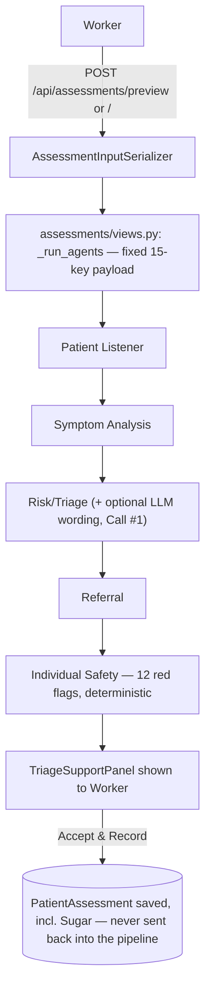
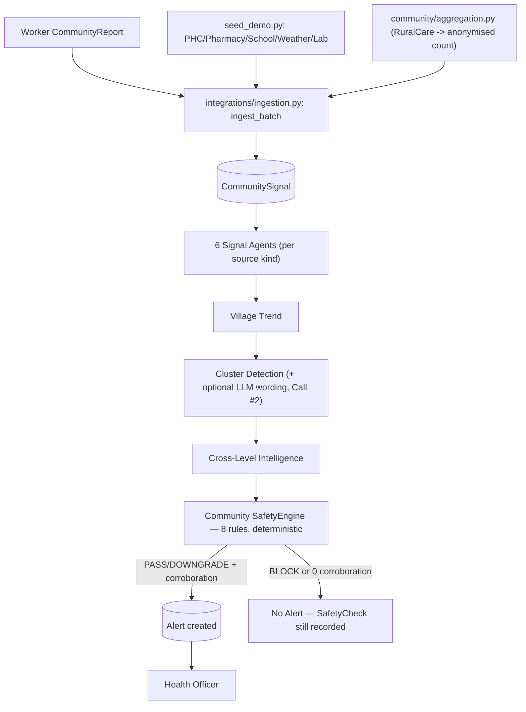
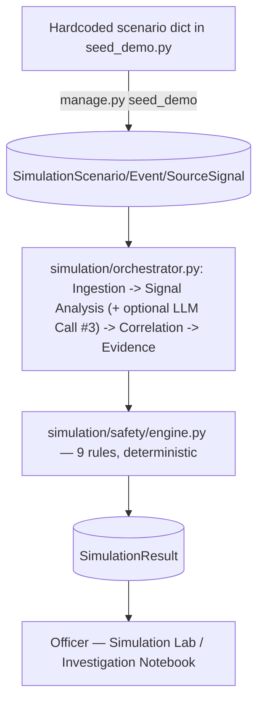

# GramSentinel + RuralCare — Data Provenance & AI/RAG Audit

**Scope:** this is an audit-only document. No application code, models, APIs, prompts, or agent behaviour were changed to produce it. Every claim below was verified by reading the actual source code at the time of writing (2026-09-15), not by trusting README/documentation text. Where a claim could not be verified, that is stated explicitly rather than guessed.

---

## 1. RAG Determination

### Is RAG implemented?

# **NO**

**"NO RAG IS IMPLEMENTED IN THE CURRENT CODEBASE."**

**How this was checked:** a case-insensitive, whole-repository search (backend + frontend + docs) for every term in the following list: `RAG`, `retrieval`, `embedding`, `vector db`, `vector store`, `FAISS`, `Chroma`, `Pinecone`, `Weaviate`, `pgvector`, `Qdrant`, `Milvus`, `LangChain`, `LlamaIndex`, `semantic search`, `similarity search`, `knowledge base`, `chunking`, `document loader`, `ICD-10`, `ICD-11`, `SNOMED`, `UMLS`, `RxNorm`, `MedDRA`, `LOINC`.

**Result:** 21 files matched the raw regex, and every single match was a false positive caused by the regex matching a substring inside an unrelated word — for example:
- `"RAG"` matched inside `...ListenerAgent` (the letters `...er` + `Agent` spell `...erAgent`, which contains `rAg`), and inside the English word `paragraph` (`pa-RAG-raph`).
- No match corresponded to an actual retrieval pipeline, vector database, embedding model, document loader, or medical terminology system.

`requirements.txt` (the full, authoritative Python dependency list) contains **no** `langchain`, `llama-index`, `chromadb`, `faiss-cpu`/`faiss-gpu`, `pinecone-client`, `weaviate-client`, `qdrant-client`, `pgvector`, or any embedding-model package. `frontend/package.json` contains no equivalent JS/TS retrieval packages either.

**What the system uses instead:** every place that looks like "the system knows something" is either (a) a fixed, hand-written Python dictionary/threshold/rule, or (b) an LLM's own pretrained knowledge, invoked with a short, self-contained prompt built from already-computed application data — never a lookup against stored documents, embeddings, or an external knowledge base at inference time. Full detail in Sections 2–4 below.

---

## 2. Internet / External Knowledge Audit

**Search method:** every Python file was searched for `requests.get`, `requests.post`, `httpx`, `urllib.request`, and `aiohttp` (the standard ways a Django backend would call an external service). Result:

```
backend\agents\llm\client.py:60:    response = requests.post(...)
```

**This is the only outbound HTTP call anywhere in the entire backend.** No weather API, no government/WHO API, no maps API, no medical database API, no other external service is called from Python code — confirmed by an exhaustive search, not an assumption.

| Service | Endpoint | Purpose | Input | Output | Used by |
|---|---|---|---|---|---|
| Anthropic Messages API | `https://api.anthropic.com/v1/messages` (configurable via `LLM_API_URL`) | Reword an already-decided sentence into plainer language | A short system prompt + a short user prompt built from already-computed data (never raw patient records) | One short paragraph of text | `RiskTriageAgent` (RuralCare), `ClusterDetectionAgent` (GramSentinel), the Simulation Lab's Signal Analysis stage — see Section 4 for exact prompts |

**One additional external resource exists, but it is not a data source** — `frontend/src/components/CommunityMap.tsx` embeds a Google Maps `<iframe>` (`https://maps.google.com/maps?q=...&output=embed`) built purely from the village's own text fields (name, taluk, district, state, PIN — all static seed data). No Google Maps API key is used, nothing is fetched by the backend, and no information from Google flows back into the application's data or decisions — it is a passive, client-side visual map widget only. This is the only place in the entire codebase that references Google Maps.

**Confirmed absent:** OpenAI, Gemini, Groq, Ollama, HuggingFace inference APIs, any weather API, any WHO/government API, any health/medical database API. None of these were found anywhere in the codebase, and `requirements.txt` lists no SDK for any of them (the LLM call itself is hand-rolled with the plain `requests` library, not an official Anthropic SDK).

---

## 3. LLM Audit — every LLM call in the project

**Total LLM call sites in the entire codebase: exactly 3.** Each is documented in full below, verified by reading the complete source of each file.

### LLM Call #1 — Risk/Triage Agent (RuralCare, individual layer)

**Location:** `backend/agents/ruralcare/triage.py`, class `RiskTriageAgent`, method `_maybe_polish()`.

**Provider:** Anthropic (via `agents/llm/client.py`'s hand-rolled `requests.post` to the Messages API — no official SDK installed).

**Model:** configured via `settings.LLM_MODEL`, default `"claude-sonnet-5"`.

**Input:** exactly this, quoted verbatim from the code:
```python
f"Triage level (fixed, do not change): {level}\n"
f"Observed factors: {'; '.join(factors) or 'none'}\n"
f"Current wording: {deterministic}"
```
— the already-decided triage level, a list of short factor phrases like `"recorded temperature 39.2 °C"` (never the raw vitals dict), and the deterministic template sentence to be reworded. No patient name, no symptom list, no history, no Sugar value.

**System prompt** (quoted in full):
```
"You rewrite an already-decided clinical triage rationale into two plain
sentences for a rural health worker. You must not name, suggest or imply
any disease or diagnosis. You must not change the triage level you are
given. You must not use the words 'diagnosis', 'confirmed', 'outbreak',
or 'guaranteed'. Describe only what was observed and what level was
assigned."
```

**Is the data retrieved?** NO — it is passed directly from the already-computed deterministic result in the same function call, not looked up from any store.

**Is RAG involved?** NO.

**What the LLM actually decides:** only the wording of the explanation sentence.

**What the LLM does NOT decide:** the triage score, the triage level (URGENT/CONCERNING/ROUTINE — fixed before the LLM is ever called), the referral pathway, or anything safety-related.

**Fallback:** if the client is unavailable (`client.available` is False, i.e. no API key), the call is skipped entirely and the deterministic template is used. If the call itself raises `LLMUnavailable` (timeout, network error, empty response), the deterministic template is used. **Additionally**, even a successful response is discarded (falling back to the template) if its text contains `"diagnos"`, `"confirmed"`, `"outbreak"`, or `"guaranteed"` — a post-hoc keyword guard specific to this agent.

---

### LLM Call #2 — Cluster Detection Agent (GramSentinel, community layer)

**Location:** `backend/agents/gramsentinel/cluster.py`, class `ClusterDetectionAgent`, method `_maybe_polish()`.

**Provider / Model:** same as Call #1.

**Input:** quoted verbatim:
```python
facts = "\n".join(
    f"- {c['source_kind']}: baseline {c['baseline']}, current "
    f"{c['current_value']}, change {c.get('change_pct')}%, "
    f"quality {c['data_quality']}"
    for c in corroborating
)
# sent as:
f"Cluster: {cluster}\nEvidence:\n{facts}\n\nCurrent wording:\n{deterministic}"
```
— a list of already-aggregated per-source numbers (baseline, current value, % change, data quality) for a village/week, plus the deterministic template narrative. No individual patient data of any kind — these numbers are already community-level aggregates by the time this agent runs.

**System prompt** (quoted in full):
```
"You write one short paragraph for a district health officer summarising
which independent data sources moved together in one village cluster in
one week. Rules you must follow: describe only the listed evidence; never
name or imply a disease; never state or imply that an outbreak exists, is
confirmed, or is declared; never use the words 'diagnosis', 'confirmed
outbreak', 'epidemic' or 'guaranteed'; always describe the finding as a
possible pattern that a human should decide whether to investigate."
```

**Is the data retrieved?** NO — it is passed directly from the evidence cards already assembled earlier in the same pipeline run.

**Is RAG involved?** NO.

**What the LLM actually decides:** only the wording of the narrative paragraph.

**What the LLM does NOT decide:** whether a pattern exists (`candidate_pattern.detected` is computed deterministically, before this call), the `"kind"` field (hardcoded to `"correlation_hypothesis"`, never LLM-settable), which sources corroborate, or anything about safety/alerting.

**Fallback:** if unavailable or no corroborating sources exist, the deterministic template is used, no call is made. If the call raises `LLMUnavailable`, the deterministic template is used. **Important distinction from Call #1:** this agent has **no post-hoc banned-word scan of its own** — its own module docstring explains why this is acceptable: *"If it is, the Safety Engine's Rule 6 still screens the result, so an over-reaching sentence gets the whole finding blocked rather than shown."* The safety net here is downstream (Rule 6 of the community Safety Engine), not inline in this agent.

---

### LLM Call #3 — Simulation Lab Signal Analysis stage (training/practice module)

**Location:** `backend/simulation/orchestrator.py`, function implementing the `signal_analysis` stage (module-level, not a class-based agent like the other two).

**Provider / Model:** same client, same configuration.

**Input:** quoted verbatim:
```python
f"Category: {primary_signal}. Current value: {current_value:g}. "
f"Previous value: {previous_value if previous_value is not None else 'unavailable'}. "
f"Deterministically classified trend: {trend}. Write one sentence "
"describing this for a health officer."
```
— the category name, this week's and last week's value for the primary signal, and the already-decided trend classification (NORMAL/STABLE/INCREASING/SIGNAL_DETECTED). All from seeded simulation data, never real patient or community data.

**System prompt** (quoted in full):
```
"You write one short, plain-language sentence describing a community
health signal trend for a health officer. You are given the trend
classification already decided by deterministic rules — restate it
faithfully in plain language. Never contradict the given trend, never
invent a different one, never mention diagnosis or outbreaks."
```

**Is the data retrieved?** NO.

**Is RAG involved?** NO.

**What the LLM actually decides:** only the sentence wording.

**What the LLM does NOT decide:** the trend classification itself (`_classify_trend()` runs first, deterministically, and its result is what the LLM is told to "restate faithfully").

**Fallback:** wrapped in a broad `try/except` — both `LLMUnavailable` and any other unexpected exception fall back to `_deterministic_explanation()`'s template sentence; the stage itself never fails because of this call.

---

## 4. LLM Knowledge Source — "Where does your AI get its medical knowledge from?"

The truthful answer, verified against the three call sites above: **F — the LLM relies on the pretrained knowledge of the external model, constrained by a short prompt built entirely from already-computed application data.**

"The current implementation does not retrieve medical documents or a medical knowledge base at inference time." There is no document store, no embedding index, no vector database, and no external medical-content lookup anywhere in the request path. Each of the three prompts above is self-contained: a system prompt written by the project's developers (a set of hard rules, not medical content) plus a short user prompt containing only numbers/labels the deterministic code already computed. Whatever "medical" fluency appears in the LLM's output comes entirely from the underlying model's own pretraining (outside this project's control or visibility), constrained by the explicit rules in the system prompt and, for two of the three call sites, screened again afterward for banned words or by the downstream Safety Engine.

---

## 5. RuralCare Agent-by-Agent Data-Provenance Audit

Full chain for every field, worker input to database, verified by reading `assessments/serializers.py`, `assessments/views.py`, and every agent file in `backend/agents/ruralcare/` in full.

```
Worker UI (New Assessment form)
    ↓  POST /api/assessments/preview/  or  POST /api/assessments/
AssessmentInputSerializer (assessments/serializers.py) — validates & type-checks
    ↓
assessments/views.py :: _run_agents(patient, data)  — builds a FIXED 15-key dict
    ↓
RuralCareOrchestrator.run(payload)  (agents/orchestration/orchestrator.py)
    ↓
PatientListenerAgent → SymptomAnalysisAgent → RiskTriageAgent → ReferralAgent → IndividualSafetyAgent
    ↓
(only on POST /api/assessments/) PatientAssessment.objects.create(...)  — persisted
```

---

## Agent: Patient Listener

### 1. Purpose
Turn whatever the worker typed/selected into a clean, structured "encounter" record, flagging what's incomplete rather than guessing at it.

### 2. Input
Exact field names read (`agents/ruralcare/listener.py`, `VITAL_FIELDS` tuple + direct `payload.get(...)` calls):
`symptoms`, `raw_symptom_text`, `other_symptom_text`, `symptom_timeline`, `duration_days`, `temperature_c`, `pulse_bpm`, `respiratory_rate`, `systolic_bp`, `diastolic_bp`, `spo2`, `age_months`, `history`.

### 3. Where does each input originate?
```
Worker fills the New Assessment form (frontend/src/pages/worker/NewAssessment.tsx)
    ↓
POST /api/assessments/preview/ or /api/assessments/  (JSON body)
    ↓
AssessmentInputSerializer (assessments/serializers.py) — validates types/ranges
    ↓
assessments/views.py :: _run_agents() — builds the payload dict, adds age_months/
village_code/cluster read from the Patient/Village database rows
    ↓
PatientListenerAgent.handle(payload, context)
```

### 4. Is the input:
- `symptoms`, `raw_symptom_text`, `other_symptom_text`, `symptom_timeline`, `duration_days`, all six vitals, `history` — **user-entered** (typed/selected by the worker on the form).
- `age_months` — **database-derived** (read from `Patient.age_years`/`age_months` at request time, converted via the `age_in_months` property).
- Nothing in this agent's input is hardcoded, synthetic-by-code, calculated, aggregated, externally fetched, or LLM-generated.

### 5. How does the agent process the information?
`extract_symptoms(symptoms, raw_symptom_text)` (see Section 6) maps each entry to a canonical code via exact dictionary lookup, keeping unrecognised text visible rather than discarding it. The optional day-wise timeline is cleaned (malformed/empty entries dropped, never failing the request). Vitals are collected into a dict; any not supplied are listed in `missing_vitals` — **no default value is ever substituted for a missing vital.** Duration is coerced to an int, defaulting to 0 only if literally absent/unparseable.

### 6. Does it use an LLM?
**NO.** No import of `agents.llm` anywhere in `listener.py`.

### 7. Does it use RAG?
**NO** — there is no retrieval step anywhere in this agent; it only operates on the request payload already in memory.

### 8. Does it use a medical knowledge source?
**None found in implementation.** No ICD/SNOMED/UMLS/terminology package is imported.

### 9. Exact source of knowledge
The only "knowledge" this agent has is a hand-written Python synonym dictionary (`agents/ruralcare/vocabulary.py::SYMPTOM_SYNONYMS`) — a developer-authored table, not a retrieved or database-stored dictionary, and not an ICD/SNOMED terminology system.

### 10. Jury explanation
"This first agent just tidies up what the worker entered — matching typed symptom words to our fixed internal list, and noting which vitals weren't filled in. It doesn't guess at anything, and it doesn't call any AI."

---

## Agent: Symptom Analysis

### 1. Purpose
Group the Listener's recognised symptom codes into clinically meaningful syndrome patterns and compute a symptom-burden score.

### 2. Input
Exact fields read (`agents/ruralcare/symptom.py`): `encounter.symptoms` (the Listener's normalised code list), `encounter.duration_days`, `encounter.vitals`, `encounter.age_months`, `supplementary_context`.

### 3. Where does each input originate?
Entirely from the **previous agent's output** (Patient Listener) — this agent never reads the original request payload directly.

### 4. Is the input:
Entirely **agent-derived** (the output of the previous, deterministic agent) — not itself user-entered, database-derived, hardcoded, synthetic, calculated by this agent from scratch, aggregated, external-API, or LLM-generated at this stage.

### 5. How does the agent process the information?
`INPUT (symptom codes)` → `set intersection against SYNDROME_GROUPS` (5 fixed groups: febrile/respiratory/gastrointestinal/neurological/haemorrhagic) → `present_groups` dict → `primary_syndrome` = the group with the most matched symptoms → `symptom_burden` = `sum(SYMPTOM_WEIGHT[s] for s in symptoms)`, a fixed per-symptom weight table → `duration_band` = a fixed threshold bucket (1/3/7 days) → `signal_category` = `community/aggregation.py::category_for_symptoms(symptoms)`, also a fixed lookup.

### 6. Does it use an LLM?
**NO.**

### 7. Does it use RAG?
**NO** — same reason as the Listener; no retrieval step exists.

### 8. Does it use a medical knowledge source?
**None found in implementation.**

### 9. Exact source of knowledge
Two hand-written Python dictionaries: `SYNDROME_GROUPS` and `SYMPTOM_WEIGHT` (both in `agents/ruralcare/vocabulary.py`) — fixed, developer-authored mappings, plus `duration_days` threshold constants inline in this file.

### 10. Jury explanation
"This agent looks at which symptoms were recorded together — fever plus breathlessness reads differently than fever alone — using a fixed table we wrote ourselves, not a live medical database or an AI judgment."

---

## Agent: Risk / Triage

### 1. Purpose
Compute a deterministic triage score and level, then optionally ask an LLM to reword the explanation sentence.

### 2. Input
Exact fields read (`agents/ruralcare/triage.py::handle()`): `normalised_symptoms`, `vitals` (dict containing `temperature_c`, `spo2`, `respiratory_rate`, `systolic_bp`, `pulse_bpm`), `duration_days`, `symptom_burden`, `age_months`.

### 3. Where does each input originate?
Entirely from the **previous agent's output** (Symptom Analysis).

### 4. Is the input:
Entirely **agent-derived** (calculated in the previous stage). The scoring performed *by this agent* is itself a **calculated** value (`score`), built from fixed threshold checks against the input.

### 5. How does the agent process the information?
`INPUT` → additive scoring: start at `symptom_burden`; `+2.0` if duration ≥7d, `+1.0` if ≥3d; `+2.0` if temp ≥39.0°C, `+1.0` if ≥38.0°C; `+2.5` if SpO2 <95; `+1.5` if respiratory rate >24; `+1.5` if systolic BP <100; `+1.0` if pulse >110; `+1.0` extra if age <60 months and score already >0 → `level = URGENT if score>=7.0 else CONCERNING if score>=3.0 else ROUTINE` → a deterministic template sentence is built from the triggered factors → **optionally**, the LLM is asked to reword that sentence (Section 3, LLM Call #1).

### 6. Does it use an LLM?
**YES** — see LLM Call #1 above for the exact provider, model, prompt, input, and fallback. The LLM only rewords the sentence; the score and level above are fixed before it is ever called.

### 7. Does it use RAG?
**NO.** The LLM call sends only the already-computed level/factors/template sentence — nothing is retrieved from a document store or database at call time.

### 8. Does it use a medical knowledge source?
**None found in implementation**, beyond the fixed numeric thresholds hand-written in this file (`CONCERNING_THRESHOLD = 3.0`, `URGENT_THRESHOLD = 7.0`, and the per-vital cutoffs above) — these are application-defined thresholds, not references to a published clinical guideline database.

### 9. Exact source of knowledge
Mathematical thresholds, hardcoded in this file by the project's developers. The LLM's *wording*, when used, draws on the model's own pretrained knowledge, constrained to rewording a fixed sentence.

### 10. Jury explanation
"The score and the triage level are pure arithmetic against fixed cutoffs — the same inputs always give the same level, no matter what any AI says. We optionally ask an AI to make the explanation read more naturally, but it cannot change the level, and we scan its output for banned words before it's ever shown."

---

## Agent: Referral

### 1. Purpose
Translate a triage level into a fixed referral recommendation and follow-up interval.

### 2. Input
Exact field read (`agents/ruralcare/referral.py::summarise_input()`): `triage_level` only.

### 3. Where does each input originate?
The **previous agent's output** (Risk/Triage) — no other field is read.

### 4. Is the input:
**Agent-derived** (calculated by the previous stage).

### 5. How does the agent process the information?
A single dictionary lookup: `REFERRAL_PATHWAYS[triage_level]` → returns a fixed `{recommendation, pathway, followup_interval_days}` triple. No arithmetic, no branching beyond the lookup itself.

### 6. Does it use an LLM?
**NO.**

### 7. Does it use RAG?
**NO** — a pure fixed dictionary lookup, no retrieval of any kind.

### 8. Does it use a medical knowledge source?
**None found in implementation.**

### 9. Exact source of knowledge
A hand-written Python dictionary, `REFERRAL_PATHWAYS`, defined directly in this file — three fixed entries, one per triage level.

### 10. Jury explanation
"Once the triage level is decided, the referral is just a fixed lookup table we wrote — Urgent always means same-day facility referral. There's no ambiguity or AI judgment here at all."

---

## Agent: Individual Safety

### 1. Purpose
The final, deterministic check — can escalate but never downgrade a triage decision, based on 12 fixed clinical red-flag rules.

### 2. Input
Exact fields read (`agents/ruralcare/safety_agent.py::handle()`, building an `IndividualCase`): `normalised_symptoms`, `duration_days`, `age_months`, `vitals.temperature_c`, `vitals.pulse_bpm`, `vitals.respiratory_rate`, `vitals.systolic_bp`, `vitals.spo2`, `triage_level` (the model's pre-safety level).

### 3. Where does each input originate?
The **merged output of Symptom Analysis + Risk/Triage** (the orchestrator explicitly merges both dicts before calling this agent).

### 4. Is the input:
**Agent-derived** (outputs of the two prior stages).

### 5. How does the agent process the information?
Builds an `IndividualCase` dataclass → `safety/engine.py::SafetyEngine.evaluate_individual(case)` → checks 12 fixed predicates from `safety/red_flags.py` (altered consciousness, seizure, fever+neck stiffness, SpO2<92, respiratory rate>30, systolic BP<90, fever≥40.0°C, chest pain+breathlessness, bleeding, severe dehydration, infant<2mo+fever, prolonged fever≥7d) → **any match forces `final_triage_level = URGENT`**, one-directional (never downgrades).

### 6. Does it use an LLM?
**NO** — confirmed by the module's own docstring: "deliberately the only one with no model inference in it at all." No `agents.llm` import anywhere in this file or in `safety/engine.py`/`safety/red_flags.py`.

### 7. Does it use RAG?
**NO** — no retrieval mechanism of any kind; the 12 rules are evaluated in-process against the case object.

### 8. Does it use a medical knowledge source?
**None found in implementation.** The 12 red-flag conditions are hand-written Python predicates, not references to a clinical guideline database, ICD, or SNOMED terminology.

### 9. Exact source of knowledge
`safety/red_flags.py::RED_FLAGS` — a fixed tuple of 12 developer-authored `RedFlag(code, label, predicate, rationale)` entries. This is the single most safety-critical piece of "knowledge" in the whole system, and it is 100% hardcoded, testable Python — never AI-generated or AI-modifiable.

### 10. Jury explanation
"This is the one agent that never calls any AI, on purpose. It checks a fixed list of twelve red-flag conditions, and if any one is true, it forces the case to Urgent no matter what the earlier score said. It can only push the alarm up, never down, and no AI can override it."

---

## 6. Symptom Recognition Architecture

**The exact question:** "When the worker types/selects a symptom, how does RuralCare know what that symptom means?"

**The exact mechanism, verified by reading `backend/agents/ruralcare/vocabulary.py` in full — plain keyword/dictionary matching, not fuzzy matching, not NLP, not embeddings, not an LLM.**

```
Worker input (checkbox codes and/or free-text symptom description)
    ↓
normalise_symptom(raw): lowercase → strip everything except letters/spaces →
    collapse whitespace → exact dictionary lookup
    ↓
Exact match against SYMPTOM_SYNONYMS (26 canonical codes, each with a fixed
    tuple of accepted surface forms) via a flattened reverse map (_SURFACE_TO_CODE)
    ↓
extract_symptoms(): for checkbox/list items, exact match per item; for free
    text, a padded-space substring check (" fever " in " ...text... ") per
    known surface form — still exact string matching, not fuzzy/regex-fuzzy
    ↓
Recognised → canonical code (e.g. "fever"); Unrecognised → kept visible as
    free text, never silently dropped, never guessed at
    ↓
SymptomAnalysisAgent groups codes into syndromes (Section 5)
    ↓
RiskTriageAgent scores using a fixed per-code weight table
```

**File path:** `backend/agents/ruralcare/vocabulary.py`
**Key structures:** `SYMPTOM_SYNONYMS: dict[str, tuple[str, ...]]` (26 entries), `_SURFACE_TO_CODE` (a flattened reverse-lookup built from it at module load), function `normalise_symptom(raw: str) -> str | None`, function `extract_symptoms(items, free_text) -> tuple[list[str], list[str]]`.

**Number/type of entries:** 26 canonical symptom codes, each mapped to between 1 and 5 accepted surface-form strings (English terms, common misspellings/variants, and two Tamil/Hindi transliterations).

**10 representative examples** (verbatim from the dictionary):
| Canonical code | Accepted surface forms |
|---|---|
| `fever` | "fever", "temperature", "pyrexia", "jvaram" (Tamil), "bukhar" (Hindi) |
| `high_fever` | "high fever", "very high fever" |
| `breathlessness` | "breathlessness", "shortness of breath", "difficulty breathing", "sob" |
| `chest_pain` | "chest pain", "chest discomfort" |
| `diarrhoea` | "diarrhoea", "diarrhea", "loose motion", "loose stools" |
| `neck_stiffness` | "neck stiffness", "stiff neck" |
| `altered_consciousness` | "altered consciousness", "confusion", "disoriented", "drowsy" |
| `seizure` | "seizure", "convulsion", "fits" |
| `unable_to_drink` | "unable to drink", "not drinking", "refusing feeds" |
| `jaundice` | "jaundice", "yellow eyes" |

**Does the system do `"fever"` → fever category, or `"high temperature"` → fever, or does an LLM interpret it?** Confirmed: `"fever"` matches directly; a phrase like `"high temperature"` is **not** in the dictionary and would **not** match `fever` (only the exact surface form `"temperature"` alone maps to `fever` — `"high temperature"` as a whole phrase is unrecognised and is kept as free text, not silently reinterpreted). This precisely demonstrates that the mechanism is exact/fixed-vocabulary matching, not semantic understanding — a phrase not in the table is never guessed at, by rule or by AI. No LLM is ever called for symptom recognition — confirmed by the complete absence of any `agents.llm` import in `vocabulary.py`, `listener.py`, or `symptom.py`.

---

## 7. Medical Terminology Database Check

Searched specifically for: ICD, ICD-10, ICD-11, SNOMED CT, UMLS, RxNorm, MedDRA, LOINC, WHO terminology, medical ontology, terminology API, medical NLP model.

**Result: NO.**

"The current symptom recognition is application-defined rather than retrieved from a medical terminology service." This is confirmed by code: `agents/ruralcare/vocabulary.py` is a self-contained, hand-written Python module with no import of, or network call to, any external terminology system. `core/constants.py::SignalCategory` (the 20-value category vocabulary used for community aggregation) is likewise a hand-written `TextChoices` enum, not derived from ICD or any other published coding system.

---

## 8. RuralCare Triage Audit — full input table

| Input | Source | Used by | Deterministic/AI | Affects triage? |
|---|---|---|---|---|
| `symptoms` (checkbox codes) | User-entered | Listener → Symptom Analysis → Risk/Triage (via `symptom_burden`) | Deterministic | **Yes** |
| `raw_symptom_text` | User-entered | Listener (matched against vocabulary), then same path as above | Deterministic | **Yes**, only for recognised terms found within it |
| `other_symptom_text` | User-entered | Carried as supplementary context only | N/A | **No** — explicitly `interpreted_by_triage: False` |
| `symptom_timeline` (day-wise notes) | User-entered | Carried as supplementary context only | N/A | **No** |
| `duration_days` | User-entered | Symptom Analysis (`duration_band`), Risk/Triage (score) | Deterministic | **Yes** |
| `age_months` | Database-derived (`Patient.age_in_months`) | Symptom Analysis, Risk/Triage, Safety | Deterministic | **Yes** (young-child scoring bonus, infant red flag) |
| `sex` | Stored on `Patient`, but **never read by `_run_agents()`'s payload dict** | — | — | **No** — confirmed absent from the 15-key payload |
| `temperature_c` | User-entered | Risk/Triage (score), Safety (very-high-fever red flag) | Deterministic | **Yes** |
| `pulse_bpm` | User-entered | Risk/Triage (score), Safety | Deterministic | **Yes** |
| `respiratory_rate` | User-entered | Risk/Triage (score), Safety (red flag >30) | Deterministic | **Yes** |
| `systolic_bp` | User-entered | Risk/Triage (score), Safety (red flag <90) | Deterministic | **Yes** |
| `diastolic_bp` | User-entered | Stored and passed through as part of `vitals`, but **no threshold rule reads it** in `triage.py` or `red_flags.py` | Deterministic | **No** — collected, but confirmed unused by any scoring/red-flag rule |
| `spo2` | User-entered | Risk/Triage (score), Safety (red flag <92) | Deterministic | **Yes** |
| `sugar_mg_dl` | User-entered | **Nothing** — not in the `_run_agents()` payload | N/A | **No — structurally excluded** |
| `blood_sugar_measurement_type` | User-entered | **Nothing** — not in the `_run_agents()` payload | N/A | **No — structurally excluded** |
| `history` | User-entered | Passed through to the payload, but not read by any scoring/threshold logic in `triage.py`/`red_flags.py` | Deterministic (unused) | **No** |
| `village_code`, `cluster` | Database-derived (`Patient.village`) | Not used in scoring; carried for context/category assignment downstream | Deterministic | **No** (not a triage input) |

**Confirmation on Sugar, exact and unambiguous:** `assessments/views.py::_run_agents()` builds the orchestrator payload as an explicit, fixed dictionary with exactly these keys — `symptoms`, `raw_symptom_text`, `other_symptom_text`, `symptom_timeline`, `duration_days`, `temperature_c`, `pulse_bpm`, `respiratory_rate`, `systolic_bp`, `diastolic_bp`, `spo2`, `history`, `age_months`, `village_code`, `cluster` — **15 keys, no more.** `sugar_mg_dl` and `blood_sugar_measurement_type` are read from the serializer's validated data only when constructing the `PatientAssessment` row itself (a separate code path, after the agents have already run), never included in this dict. This was independently verified by a dedicated test (`tests/test_patient_history_and_sugar.py`) that patches `RuralCareOrchestrator.run` to capture the literal payload dict and asserts both keys are absent.

---

## 9. GramSentinel Community Data Audit

| Source | Actual origin (verified) | Current implementation | Real or synthetic | Used by |
|---|---|---|---|---|
| CHW / ASHA | Worker-submitted `CommunityReport`/`CommunityReportEntry`, ingested via `integrations/ingestion.py::ingest_batch()` | Real, running code path — genuine worker input in this demo | **Real code, synthetic/demo data in this deployment** (the worker accounts and villages are demo accounts) | CHW Signal Agent |
| PHC | Seeded `CommunitySignal` rows (`source_kind=PHC`), created by `core/management/commands/seed_demo.py` | No PHC system is called at request time — confirmed by the complete absence of any `requests`/`httpx` call outside `agents/llm/client.py` | **Synthetic — seeded, not live** | PHC Signal Agent |
| Pharmacy | Seeded `CommunitySignal` rows (`source_kind=PHARMACY`) | Same as above — seed data only | **Synthetic — seeded, not live** | Pharmacy Signal Agent |
| School | Seeded `CommunitySignal` rows (`source_kind=SCHOOL`) | Same as above | **Synthetic — seeded, not live** | School Signal Agent |
| Weather | Seeded `CommunitySignal` rows (`source_kind=WEATHER`) | Same as above — **no weather API is ever called**, confirmed by the external-API search in Section 2 | **Synthetic — seeded, not live** | Weather Signal Agent (context-only) |
| Lab | Seeded `CommunitySignal` rows (`source_kind=LAB`) | Same as above — no lab system integration exists | **Synthetic — seeded, not live** | Lab Evidence Agent |
| RuralCare Aggregate | **Calculated**, by `community/aggregation.py::aggregate_village_week()`, from real (in-app) `PatientAssessment` rows | Real, running aggregation code, operating on synthetic patient records in this deployment | **Real code / calculated; underlying patient data is synthetic** | Cross-Level Intelligence Agent only (excluded from the six Signal Agents' routing) |

**Do not claim any source is "live"** beyond what's shown above — every non-CHW, non-aggregate source kind's values in this running application come from `seed_demo.py`/`data/synthetic/scenario.py`, written directly into the database via Django's ORM, not fetched from any external system at any point.

---

## 10. Community Aggregation Audit — the privacy boundary, in exact detail

```
PatientAssessment  (assessments/models.py — individual layer)
    ↓
community/aggregation.py :: build_aggregate_payloads(village, week_start, week_end)
    ↓
    PatientAssessment.objects
        .filter(village=village, is_draft=False,
                encounter_date__gte=week_start, encounter_date__lte=week_end)
        .values("primary_category")
        .annotate(encounter_count=Count("id"))
    ↓
    Each row -> {village_code, category, week_label, encounter_count,
                 period_start, period_end}   -- exactly 6 fields
    ↓
    assert_no_identifiers(payload)  -- raises ValueError if ANY other key is present
    ↓
CommunitySignal  (source_kind=RURALCARE_AGGREGATE)  — community layer
```

**Grouping fields:** `village`, `is_draft` (filter, not grouping), `encounter_date` (filter, not grouping), `primary_category` (the actual `.values()` grouping key).

**Counting:** `Count("id")` — a raw count of assessment rows per category, nothing more.

**Category:** yes — `primary_category`, the one category value computed by the Symptom Analysis agent (Section 5), is the only per-assessment field that crosses.

**Time period:** the assessment's own `encounter_date`, bucketed into the calendar week it falls in.

**Village:** yes, the assessment's `village` FK — used only to scope which rows are included, never emitted as anything other than `village_code`.

**Any filtering beyond village/date/draft-status?** No.

**Does symptom text enter?** **No** — `raw_symptom_text`, `other_symptom_text`, and the full `symptoms` list are never selected by this query.

**Do vitals enter?** **No** — none of the six vitals are selected.

**Does Sugar enter?** **No** — `sugar_mg_dl` and `blood_sugar_measurement_type` are never selected; the query's `.values()` call does not name them, and the code-level `assert_no_identifiers()` guard would raise an exception if they somehow appeared in the payload dict.

**Does patient identity enter?** **No** — no `patient` FK, `patient_code`, or name field is ever selected.

**The privacy boundary is confirmed at two independent levels:** (1) structurally, the ORM query's `.values("primary_category")` call cannot select any other column — it is not merely omitted by convention, the query object itself has no reference to those fields; (2) defensively, `assert_no_identifiers()` re-checks every payload dict against a hardcoded `PERMITTED_AGGREGATE_FIELDS` frozenset (`village_code`, `category`, `week_label`, `encounter_count`, `period_start`, `period_end`) and raises `ValueError` on any violation — a runtime backstop even if the query were ever changed carelessly.

---

## 11. GramSentinel Agents — Data Provenance

### Signal Agents (CHW / PHC / Pharmacy / School / Weather / Lab) — one class per source kind, `agents/gramsentinel/signal_agents.py`

- **Input:** one source's payload for one village/week/category — `source_kind`, `source_name`, `category`, `village_code`, `week_label`, `value`, `baseline`, `unit`, `is_reported`, `data_quality`.
- **Input source:** `integrations/ingestion.py::build_agent_payloads()`, which reads `CommunitySignal` rows already stored in the database (themselves populated per Section 9's table above — worker-submitted for CHW, seeded for the rest, calculated for RuralCare Aggregate).
- **Processing:** deterministic threshold comparison — each source's current value vs. its own rolling baseline, against a fixed per-kind anomaly threshold (`settings.GRAMSENTINEL["ANOMALY_THRESHOLDS"]`: CHW 40%, PHC 30%, PHARMACY 30%, SCHOOL 50% + an absolute-point-rise rule). The Weather agent additionally forces `is_corroborating=False` regardless of its own threshold result.
- **Output:** one uniform evidence card per source.
- **Storage:** becomes an `AlertEvidence` row only if an `Alert` is ultimately raised.
- **Next stage:** Village Trend Agent.
- **Deterministic or LLM:** Deterministic — no LLM import in this file.
- **RAG:** No.
- **External data:** No live external call; reads only already-stored `CommunitySignal` rows (Section 9).
- **Jury explanation:** "Each data source gets its own specialist agent that only compares that source's own number to its own recent normal — a fixed threshold check, not AI."

### Village Trend Agent

- **Input:** the full list of evidence cards from all six Signal Agents.
- **Input source:** previous agents (all six, collected into one shared list).
- **Processing:** deterministic aggregation across cards (counts anomalous vs. corroborating vs. context-only sources).
- **Output:** a trend summary.
- **Storage:** contributes to `Alert.corroborating_source_count`.
- **Next stage:** Cluster Detection Agent.
- **Deterministic or LLM:** Deterministic.
- **RAG:** No.
- **External data:** No.
- **Jury explanation:** "This agent looks across all the sources together for one village and category, to see if there's a pattern worth a closer look."

### Cluster Detection Agent

- **Input:** the Village Trend Agent's output (evidence cards + trend).
- **Input source:** previous agent.
- **Processing:** deterministic candidate-pattern assembly (`kind` hardcoded to `"correlation_hypothesis"`), plus an **optional LLM call** to reword the narrative — see LLM Call #2 in Section 3.
- **Output:** a `Hypothesis`-shaped `candidate_pattern` dict, plus narrative text.
- **Storage:** contributes to `Alert.title`/`summary`.
- **Next stage:** Cross-Level Intelligence Agent.
- **Deterministic or LLM:** **Hybrid** — the pattern itself is deterministic; only narrative wording is optionally LLM-assisted.
- **RAG:** No — see LLM Call #2, the prompt is built entirely from already-computed evidence-card numbers.
- **External data:** No, other than the optional Anthropic API call for wording.
- **Jury explanation:** "This agent names the pattern carefully — always as a 'correlation hypothesis,' never as a confirmed outbreak — using fixed evidence numbers, with an optional AI rewording pass that the safety engine still screens afterward."

### Cross-Level Intelligence Agent

- **Input:** the community hypothesis, plus `aggregated_individual_snapshot()` — `counts_by_category`/`baselines_by_category`, built only from `RURALCARE_AGGREGATE`-source `CommunitySignal` rows (already anonymized per Section 10).
- **Input source:** previous agent (community side) + `community/aggregation.py` (individual-aggregate side).
- **Processing:** deterministic percentage-change threshold comparison — `change_pct >= 40.0` → `CONSISTENT`; `<= 10.0` → `CONTRADICTORY`; else `SILENT`. Gated by three boolean alignment checks (category/geography/time).
- **Output:** `cross_level_verdict`, `cross_level_statement`.
- **Storage:** `Alert.cross_level_verdict`, `Alert.cross_level_statement`.
- **Next stage:** the operational Safety Engine (`evaluate_community`).
- **Deterministic or LLM:** Deterministic.
- **RAG:** No.
- **External data:** No.
- **Jury explanation:** "This is where the two layers of the system talk to each other — a fixed percentage comparison, not a subjective AI judgment, and it only ever sees already-anonymized aggregate counts, never an individual record."

### Evidence + Safety (community Safety Engine)

- **Input:** all evidence cards + the Cross-Level verdict, packaged into `EvidenceRecord`/`Hypothesis` objects.
- **Input source:** all prior agents.
- **Processing:** 8 fixed deterministic rules (R1–R8, Section 11 of `ALLDETAILS.md`; not re-derived here since this audit's focus is provenance, not safety-rule detail — see that document for the full rule table).
- **Output:** verdict (PASS/DOWNGRADE/BLOCK), severity, a transparent arithmetic confidence score.
- **Storage:** `SafetyCheck` row always; `Alert` row only if not BLOCK and ≥1 corroborating source.
- **Next stage:** Health Officer (human).
- **Deterministic or LLM:** Deterministic — confirmed zero `get_llm_client()` calls anywhere under `backend/safety/`.
- **RAG:** No.
- **External data:** No.
- **Jury explanation:** "The safety gate that decides whether anything becomes an alert is plain, fixed Python logic — no AI is involved in that decision at all."

---

## 12. Simulation Data Audit

**Where are scenario values created?** Hardcoded Python dict/list literals, written directly inside `backend/core/management/commands/seed_demo.py` (a `scenarios = [...]` list, each entry specifying per-week category totals, a status label, per-source values, and occasional context notes) — **not** database fixtures, not random generators, not CSV imports, not frontend mock data, and not LLM-generated. These literals are materialized into real database rows (`SimulationScenario`, `SimulationEvent`, `SimulationSourceSignal`) by calling `.update_or_create()` when `python manage.py seed_demo` runs.

```
Hardcoded scenario dict, in seed_demo.py's source code
    ↓  python manage.py seed_demo
SimulationScenario.objects.update_or_create(...)      -- one row per scenario type/village
    ↓
SimulationEvent.objects.update_or_create(...)          -- one row per simulated week,
    |                                                      source_signals JSON = the week's
    |                                                      category totals + status label
    ↓
SimulationSourceSignal.objects.create(...)              -- one row per source per week
    ↓  (only when an officer clicks "Advance" or connects live)
simulation/orchestrator.py :: MultiAgentOrchestrator     -- reads these rows, never invents values
    ↓
SimulationAgentRun rows (one per stage) + SimulationSafetyCheck rows
    ↓
SimulationResult
    ↓
Officer (Simulation Lab UI / Investigation Notebook)
```

**Does the Simulation Lab use real data, synthetic data, LLM-generated data, or external data?** **Synthetic data only.** Every numeric value an officer sees in a simulation session traces back to one of the hardcoded week entries in `seed_demo.py`. The pipeline's Signal Analysis stage may optionally use an LLM to reword one sentence (LLM Call #3, Section 3) — but the *numbers themselves* are never LLM-generated, only read from the pre-seeded `SimulationSourceSignal` rows. No external API is called anywhere in the `simulation` app (confirmed by the same repository-wide `requests`/`httpx` search in Section 2 — zero hits under `backend/simulation/`).

Only 4 of the 8 declared `ScenarioType` enum values actually have seeded data (`EMERGING_SIGNAL`, `STABLE_COMMUNITY`, `LIVE_EMERGENCE`, `MISSING_DATA`), all for village code `KVL` (Kovilur) only — `WEAK_EVIDENCE` and `SOURCE_DISAGREEMENT` are enum labels with no corresponding scenario content in `seed_demo.py`.

---

## 13. Manikkampatti Real-World Research Audit

**Verified location:** `backend/data/synthetic/scenario.py`, dict `VILLAGES["ARY"]` — a Python dict literal, hand-typed by the project's developers, containing the researched values below. It is loaded into the database by `seed_demo.py::_seed_villages()`, which calls `Village.objects.update_or_create(code="ARY", defaults={...researched fields...})`.

| Field | Source in code | Original source | Live retrieval? | Current storage |
|---|---|---|---|---|
| Village name (Manikkampatti) | `VILLAGES["ARY"]["name"]` | Publicly researched | **No** | `core.Village.name`, a static database column |
| Taluk (Melur) | `VILLAGES["ARY"]["taluk"]` | Publicly researched | **No** | `core.Village.taluk` |
| District (Madurai) | `VILLAGES["ARY"]["district"]` | Publicly researched | **No** | `core.Village.district` |
| State (Tamil Nadu) | `VILLAGES["ARY"]["state"]` | Publicly researched | **No** | `core.Village.state` |
| Population (676) | `VILLAGES["ARY"]["population"]` | Publicly researched (census-style figure) | **No** | `core.Village.population` |
| Households (188) | `VILLAGES["ARY"]["households"]` | Publicly researched | **No** | `core.Village.households` |
| Male (349) | `VILLAGES["ARY"]["male_population"]` | Publicly researched | **No** | `core.Village.male_population` |
| Female (327) | `VILLAGES["ARY"]["female_population"]` | Publicly researched | **No** | `core.Village.female_population` |
| Children 0–6 (84) | `VILLAGES["ARY"]["children_0_6"]` | Publicly researched | **No** | `core.Village.children_0_6` |
| Area (222.82 hectares) | `VILLAGES["ARY"]["area_hectares"]` | Publicly researched | **No** | `core.Village.area_hectares` |
| Census Village Code (640545) | `VILLAGES["ARY"]["census_village_code"]` | Publicly researched | **No** | `core.Village.census_village_code` |
| PIN (625122) | `VILLAGES["ARY"]["pin_code"]` | Publicly researched | **No** | `core.Village.pin_code` |
| ASHA availability (Available) | `VILLAGES["ARY"]["asha_chw_status"]` | Publicly researched | **No** | `core.Village.asha_chw_status` |
| Nearby Government PHC (Yes) | `VILLAGES["ARY"]["nearby_government_phc_status"]` | Publicly researched | **No** | `core.Village.nearby_government_phc_status` |
| Health Sub-Centre (Not reported) | `VILLAGES["ARY"]["health_sub_centre_status"]` | Publicly researched (absence of a source figure, recorded honestly as "Not reported") | **No** | `core.Village.health_sub_centre_status` |
| PHC inside village (Not reported) | `VILLAGES["ARY"]["phc_inside_village_status"]` | Same as above | **No** | `core.Village.phc_inside_village_status` |
| CHC inside village (Not reported) | `VILLAGES["ARY"]["chc_inside_village_status"]` | Same as above | **No** | `core.Village.chc_inside_village_status` |

**Verdict on the A–G classification asked for:** **A + E, combined** — a manually-entered research value (E), currently stored as static seed data hardcoded in a Python source file (A). Confirmed **not** C (no live website/API fetch), **not** D (not read from an external dataset file at runtime), **not** F (not synthetic/generated — these specific figures are the one deliberately real-world input in the whole system).

**Exact, honest phrasing for every one of these fields:** *"Publicly researched value, currently stored as static seed data."* None of these seventeen fields are fetched dynamically — `Village` is a completely ordinary Django model column, populated once by `seed_demo.py` and then read like any other database field by every view that displays it (`WorkerDashboardView`, `OfficerDashboardView`, `RealWorldCommunityProfile`/`CommunityMap` on the frontend).

---

## 14. Manikkampatti Health Data Audit

**"Does GramSentinel collect real health data from Manikkampatti?"**

# **NO.**

Searched specifically for: live PHC integration, government health API, pharmacy API, school database, lab system, ASHA mobile data feed, hospital EHR, DHIS2 integration, government surveillance API, weather API. **None found** — confirmed by the same exhaustive external-API search in Section 2 (the only outbound HTTP call in the entire backend is the LLM client) and by the complete absence of any DHIS2/EHR/government-API package in `requirements.txt`.

**"The current prototype does not collect real medical surveillance data from Manikkampatti."**

Broken down precisely, by category:
- **Demographic context** (population, households, ASHA availability, etc.) = **publicly researched data**, hand-entered into `data/synthetic/scenario.py` (Section 13).
- **Patient records** associated with Manikkampatti/village code `ARY` in this running application = **synthetic/demo data**, generated by `seed_demo.py`'s `PATIENTS` list (`ARY-P-001` through `ARY-P-004`, invented names like "Demo Patient" entries).
- **Community signals** for Manikkampatti = **synthetic/seeded data** (Section 9) — and per the seed data's own comments, Manikkampatti is deliberately used as the *lower-corroboration* "negative control" scenario (fewer sources than Kovilur), which itself demonstrates the Safety Engine correctly withholding a high-confidence alert when evidence is thin.
- **Simulation** = **synthetic**, and in fact none of the seeded Simulation Lab scenarios (Section 12) are even associated with Manikkampatti's village code (`ARY`) — all 4 seeded scenario types are scoped to Kovilur (`KVL`) only.

---

## 15. Future Real-World Data Sources

**Everything below is FUTURE / NOT CURRENTLY IMPLEMENTED.** None of these exist as working integrations today — presented only to answer "where would the data come from if this were deployed in a real village," without implying any of it is built.

| Community source | Future real-world origin | Status |
|---|---|---|
| ASHA / CHW | Mobile data-entry app, syncing to the same `CommunityReport`/`PatientAssessment` models that already exist | **FUTURE** — the models and API already exist; only the live submission channel would need to change from a demo web form to a real field-deployed mobile app |
| PHC | A health-facility information system / API feed, replacing the seeded `PHC`-kind `CommunitySignal` rows | **FUTURE / NOT CURRENTLY IMPLEMENTED** |
| Laboratory | A lab information system / API, replacing the seeded `LAB`-kind rows | **FUTURE / NOT CURRENTLY IMPLEMENTED** |
| Pharmacy | Aggregated dispensing/sales data feed, replacing the seeded `PHARMACY`-kind rows | **FUTURE / NOT CURRENTLY IMPLEMENTED** |
| School | Attendance/absenteeism data feed, replacing the seeded `SCHOOL`-kind rows | **FUTURE / NOT CURRENTLY IMPLEMENTED** |
| Weather | A real weather API, replacing the seeded `WEATHER`-kind rows | **FUTURE / NOT CURRENTLY IMPLEMENTED** |
| Government surveillance | An approved public-health data integration (e.g. a state IDSP/IHIP-style feed), subject to appropriate data-sharing agreements | **FUTURE / NOT CURRENTLY IMPLEMENTED** |

The architecture's `DataSource`/`CommunitySignal` model shape (Section 9) is designed so that a real integration would populate the *same* tables `ingest_batch()` already writes to — the signal agents, safety engine, and everything downstream would not need to change to consume real data instead of seeded data. That is a statement about the *shape* of the architecture being ready for this, not a claim that any such integration exists today.

---

## 16. Master Data Provenance Table

| Information | Collected From | Stored Where | Used By | Real/Synthetic | LLM? | RAG? | External API? |
|---|---|---|---|---|---|---|---|
| Patient name (`display_name`) | Worker-entered at registration | `patients.Patient` | Worker UI only | Synthetic | No | No | No |
| Patient identifier (`patient_code`) | Auto-generated (e.g. `KVL-P-012`) or worker-entered | `patients.Patient` | Worker UI, internal FK | Synthetic | No | No | No |
| Symptoms | Worker-entered (checkbox + free text) | `assessments.PatientAssessment.symptoms` | All 5 RuralCare agents | Synthetic | No (recognition is dictionary matching) | No | No |
| Duration | Worker-entered | `PatientAssessment.duration_days` | Symptom Analysis, Risk/Triage | Synthetic | No | No | No |
| Temperature | Worker-entered | `PatientAssessment.temperature_c` | Risk/Triage, Safety | Synthetic | No | No | No |
| Pulse | Worker-entered | `PatientAssessment.pulse_bpm` | Risk/Triage, Safety | Synthetic | No | No | No |
| Respiratory rate | Worker-entered | `PatientAssessment.respiratory_rate` | Risk/Triage, Safety | Synthetic | No | No | No |
| Blood pressure (systolic/diastolic) | Worker-entered | `PatientAssessment.systolic_bp`/`diastolic_bp` | Risk/Triage (systolic only), Safety (systolic only) | Synthetic | No | No | No |
| SpO2 | Worker-entered | `PatientAssessment.spo2` | Risk/Triage, Safety | Synthetic | No | No | No |
| Sugar | Worker-entered | `PatientAssessment.sugar_mg_dl` | **Nothing in the AI pipeline** — record-keeping only | Synthetic | No | No | No |
| Sugar measurement type | Worker-entered | `PatientAssessment.blood_sugar_measurement_type` | **Nothing in the AI pipeline** — record-keeping only | Synthetic | No | No | No |
| Community category | Calculated (`category_for_symptoms()`) | `PatientAssessment.primary_category` | Aggregation boundary | Derived from synthetic input | No | No | No |
| CHW signal | Worker-submitted `CommunityReport` | `community.CommunitySignal` | CHW Signal Agent | Synthetic (real submission mechanism, demo data) | No | No | No |
| PHC signal | Seeded (`seed_demo.py`) | `community.CommunitySignal` | PHC Signal Agent | Synthetic | No | No | No |
| Pharmacy signal | Seeded | `community.CommunitySignal` | Pharmacy Signal Agent | Synthetic | No | No | No |
| School signal | Seeded | `community.CommunitySignal` | School Signal Agent | Synthetic | No | No | No |
| Weather signal | Seeded | `community.CommunitySignal` | Weather Signal Agent (context-only) | Synthetic | No | No | No |
| Lab signal | Seeded | `community.CommunitySignal` | Lab Evidence Agent | Synthetic | No | No | No |
| RuralCare aggregate | Calculated (`aggregate_village_week()`) from real `PatientAssessment` rows | `community.CommunitySignal` (source kind `RURALCARE_AGGREGATE`) | Cross-Level Intelligence Agent | Real aggregation code / synthetic underlying data | No | No | No |
| Manikkampatti population etc. | Publicly researched, hand-entered | `core.Village` (static columns) | Dashboards, `CommunityMap` | **Real-world context** | No | No | No (Google Maps `<iframe>` is display-only, not a data source — Section 2) |
| Manikkampatti households | Same as above | `core.Village.households` | Dashboards | **Real-world context** | No | No | No |
| Manikkampatti healthcare context (ASHA/PHC/sub-centre/CHC) | Same as above | `core.Village.*_status` fields | Dashboards | **Real-world context** | No | No | No |
| Simulation values | Hardcoded in `seed_demo.py`, written to DB | `simulation.SimulationEvent`/`SimulationSourceSignal` | Simulation pipeline only | Synthetic | Optional, wording only (LLM Call #3) | No | No |
| Alert | Calculated by `run_community_pipeline()` | `alerts.Alert` | Health Officer | Generated from synthetic inputs by real code | No | No | No |
| Evidence | Calculated by Signal Agents | `alerts.AlertEvidence` | Health Officer | Generated from synthetic inputs by real code | No | No | No |
| Safety result | Calculated by `SafetyEngine` | `alerts.SafetyCheck` | Health Officer | Generated by real, deterministic code | No | No | No |
| Investigation outcome | Health Officer's own decision, entered directly | `alerts.Investigation`, `alerts.Feedback` | Health Officer, Alert record | **Real human judgment**, applied to a synthetic-data alert | No | No | No |

---

## 17. Agent-by-Agent Data Flow Diagrams

### RuralCare


### GramSentinel


### Simulation


---

## 18. Direct Answers for Jury

### Q1. Is RAG used in GramSentinel?
**Short Answer:** No.
**Technical Answer:** No vector database, embedding pipeline, or document retrieval layer exists anywhere in the community pipeline's code path.
**Evidence:** Repository-wide search, Section 1; `requirements.txt` (no vector/RAG packages).

### Q2. Is RAG used in RuralCare?
**Short Answer:** No.
**Technical Answer:** Same as Q1 — confirmed by reading every file in `backend/agents/ruralcare/`.
**Evidence:** Section 1; `backend/agents/ruralcare/*.py`.

### Q3. Does the AI search the internet?
**Short Answer:** No.
**Technical Answer:** The only outbound HTTP call in the whole backend is a single, fixed-endpoint POST to Anthropic's Messages API — the model cannot browse or issue its own requests.
**Evidence:** `backend/agents/llm/client.py:60`.

### Q4. Does the AI search medical PDFs?
**Short Answer:** No.
**Technical Answer:** No PDF ingestion, document loader, or file-based knowledge source exists (the only `reportlab` usage in the project *generates* a PDF export of a simulation investigation — it never reads one in).
**Evidence:** Section 1; `backend/simulation/investigation.py` (PDF generation, not ingestion).

### Q5. Does the AI use a vector database?
**Short Answer:** No.
**Technical Answer:** No vector database package is installed or imported anywhere in the codebase.
**Evidence:** `requirements.txt`; Section 1's search.

### Q6. Where does RuralCare get symptom knowledge from?
**Short Answer:** A fixed, developer-written Python dictionary.
**Technical Answer:** `SYMPTOM_SYNONYMS` in `agents/ruralcare/vocabulary.py` — 26 canonical codes mapped to accepted surface forms.
**Evidence:** Section 6; `backend/agents/ruralcare/vocabulary.py`.

### Q7. How does RuralCare recognize "fever", "cough", "headache", etc.?
**Short Answer:** Exact keyword/dictionary matching, not AI.
**Technical Answer:** `normalise_symptom()` lowercases and strips the input, then does an exact dictionary lookup against the fixed synonym table; unmatched phrases are kept as visible free text, never guessed at.
**Evidence:** `agents/ruralcare/vocabulary.py::normalise_symptom()`.

### Q8. Is symptom recognition AI-based or rule-based?
**Short Answer:** Rule-based.
**Technical Answer:** 100% deterministic dictionary lookup; no LLM, embedding, or classifier is ever involved in recognizing a symptom.
**Evidence:** Section 6.

### Q9. Is there an ICD/SNOMED/medical terminology database?
**Short Answer:** No.
**Technical Answer:** Searched for ICD/SNOMED/UMLS/RxNorm/MedDRA/LOINC across the whole repository — zero genuine matches.
**Evidence:** Section 7.

### Q10. Where does the triage score come from?
**Short Answer:** Fixed arithmetic thresholds, written directly in code.
**Technical Answer:** `RiskTriageAgent.handle()` — an additive score built from fixed per-symptom weights and fixed vital-sign thresholds (e.g. `+2.0` if temperature ≥39.0°C).
**Evidence:** `agents/ruralcare/triage.py`; Section 5's Risk/Triage agent entry.

### Q11. Where does the LLM get its medical knowledge from?
**Short Answer:** Its own pretraining — nothing is retrieved from our system.
**Technical Answer:** Each of the three call sites sends only a short, fixed system prompt plus already-computed application numbers; the model's fluency comes entirely from its own pretrained weights, outside this project's control.
**Evidence:** Section 4.

### Q12. Does the LLM directly access the database?
**Short Answer:** No.
**Technical Answer:** `LLMClient.summarise()` only ever sends the exact text string(s) its caller constructed — it has no query capability and no database connection.
**Evidence:** `backend/agents/llm/client.py`.

### Q13. What exact information is sent to the LLM?
**Short Answer:** Only already-decided results and aggregate numbers — never raw patient records.
**Technical Answer:** See the three exact, verbatim prompts quoted in Section 3.
**Evidence:** `agents/ruralcare/triage.py`, `agents/gramsentinel/cluster.py`, `simulation/orchestrator.py`.

### Q14. Are the community signals real?
**Short Answer:** CHW signals reflect real (demo-account) worker submissions; every other source is seeded.
**Technical Answer:** See the source table in Section 9.
**Evidence:** Section 9.

### Q15. Are the PHC signals real?
**Short Answer:** No — seeded/synthetic.
**Technical Answer:** No PHC system integration exists; values come from `seed_demo.py`.
**Evidence:** Section 9; Section 2 (no external API calls).

### Q16. Are the pharmacy signals real?
**Short Answer:** No — seeded/synthetic.
**Technical Answer:** Same as Q15, for `source_kind=PHARMACY`.
**Evidence:** Section 9.

### Q17. Are school signals real?
**Short Answer:** No — seeded/synthetic.
**Technical Answer:** Same as Q15, for `source_kind=SCHOOL`.
**Evidence:** Section 9.

### Q18. Is weather data live?
**Short Answer:** No.
**Technical Answer:** No weather API is called anywhere in the codebase — confirmed by the exhaustive external-API search.
**Evidence:** Section 2; Section 9.

### Q19. Is laboratory data live?
**Short Answer:** No.
**Technical Answer:** No lab system integration exists; `LAB`-kind signals are seeded.
**Evidence:** Section 9.

### Q20. Does GramSentinel collect actual Manikkampatti health data?
**Short Answer:** No.
**Technical Answer:** See Section 14 in full — no live PHC/lab/pharmacy/school/ASHA feed exists for any village, including Manikkampatti.
**Evidence:** Section 14.

### Q21. Where did the Manikkampatti demographic information come from?
**Short Answer:** Public research, manually entered into the seed data.
**Technical Answer:** `data/synthetic/scenario.py::VILLAGES["ARY"]`.
**Evidence:** Section 13's field-by-field table.

### Q22. Is Manikkampatti information dynamically retrieved?
**Short Answer:** No.
**Technical Answer:** It is a static Django model column, populated once at seed time; the only "live" element on the page is a Google Maps iframe built from those same static text fields, which does not feed data back into the app.
**Evidence:** Section 13; Section 2 (`CommunityMap.tsx`).

### Q23. Where are the Manikkampatti values stored?
**Short Answer:** In the `Village` database table.
**Technical Answer:** `core.Village`'s real-world-profile columns (`population`, `households`, `male_population`, etc.), populated by `seed_demo.py`.
**Evidence:** Section 13.

### Q24. If you deploy this in the real world, where would the data come from?
**Short Answer:** Real ASHA mobile entry, PHC/lab/pharmacy/school system integrations — none of which exist today.
**Technical Answer:** See the Future Real-World Data Sources table.
**Evidence:** Section 15.

### Q25. What is synthetic in the current project?
**Short Answer:** Every patient, assessment, and non-CHW community signal, plus all simulation data.
**Technical Answer:** See the Master Provenance Table.
**Evidence:** Section 16.

### Q26. What is actually real?
**Short Answer:** The code itself, the CHW-submission mechanism, the aggregation/safety logic, and Manikkampatti's public demographic profile.
**Technical Answer:** See Section 19 below ("What is Real vs Synthetic").
**Evidence:** Sections 9, 13, 16.

### Q27. What happens if the LLM fails?
**Short Answer:** Silent fallback to a pre-written template sentence.
**Technical Answer:** Every call site catches `LLMUnavailable` (and, in two of three, any other exception) and substitutes a deterministic template; `used_llm` is set to `False`.
**Evidence:** Section 3, all three LLM Call entries.

### Q28. Can the LLM diagnose a patient?
**Short Answer:** No.
**Technical Answer:** The LLM is never asked to interpret symptoms or assign a triage level — it only rewords an already-fixed sentence, and its own system prompt explicitly forbids naming a disease.
**Evidence:** Section 3, LLM Call #1's system prompt.

### Q29. Can the LLM declare an outbreak?
**Short Answer:** No.
**Technical Answer:** Both relevant system prompts explicitly forbid outbreak language, and the downstream deterministic Safety Engine (Rule 6) independently scans generated text for prohibited phrases and blocks the finding if any appear.
**Evidence:** Section 3, LLM Call #2's system prompt; `safety/rules.py` Rule 6 (documented in `ALLDETAILS.md` Section 11).

### Q30. Why use an LLM at all if the important calculations are deterministic?
**Short Answer:** To make an already-decided result read more naturally, nothing more.
**Technical Answer:** All three call sites exist purely for sentence-level wording; the system is fully functional, with identical clinical/safety behaviour, if no LLM API key is ever configured.
**Evidence:** Section 3; `agents/llm/client.py`'s own docstring ("The healthcare workflow never depends on it").

---

## 19. Important Distinction: AI Knowledge vs. Application Data

**Application Data** — everything our own code supplies: patient assessment fields, symptoms, vitals, community signals, simulation values, Manikkampatti's researched profile. All of this lives in our database or is entered live through our forms; none of it depends on an LLM to exist or to be correct.

**Model Knowledge** — general knowledge already baked into the pretrained LLM at Anthropic before our project ever calls it. This project does **not** retrieve external medical knowledge at runtime to feed the model — no document store, no search, no API call to a medical knowledge source. Whatever medical fluency the LLM's *wording* reflects comes from its own pretraining, not from anything our application looked up for it. This is why every LLM output is treated as **wording only** and never as a source of medical fact within this system — the actual facts and decisions are computed by our own deterministic code before the model is ever involved.

---

## 20. What is Real vs. Synthetic?

**REAL-WORLD CONTEXT**
Manikkampatti's demographic and geographic profile (population, households, male/female/children counts, area, census code, PIN, ASHA/PHC/sub-centre/CHC status) — publicly researched, hand-entered into `data/synthetic/scenario.py`.

**SYNTHETIC DEMONSTRATION DATA**
Every `Patient`, every `PatientAssessment` (including Sugar), every worker/officer demo account, every `CommunityReport`, every PHC/Pharmacy/School/Weather/Lab `CommunitySignal`, every `Alert`/`AlertEvidence`/`SafetyCheck`, and the entire Simulation Lab's scenario data.

**FUTURE REAL DATA**
An actual PHC/lab/pharmacy/school system integration, actual live ASHA mobile-entry reporting, an approved government/public-health surveillance feed, a real weather API — none of these exist in the current code (Section 15).

These three categories are never mixed in this codebase or in this audit: a value is either researched-and-static, fabricated-for-demo, or not built yet.

---

## 21. Final Truth About Our AI/Data Architecture

- **RAG:** NO
- **Vector DB:** NO
- **External medical knowledge retrieval:** NO
- **Internet access by agents:** NO (one fixed-endpoint LLM API call only; a client-side Google Maps iframe is display-only and not agent-driven)
- **External health APIs:** NO
- **LLM provider(s):** Anthropic Claude API (via a hand-rolled `requests` call, no official SDK), default model `claude-sonnet-5`
- **Number of actual LLM call sites:** 3 (`RiskTriageAgent`, `ClusterDetectionAgent`, Simulation Signal Analysis stage) — all wording-only, all with deterministic fallback
- **RuralCare agents:** 5 (Patient Listener, Symptom Analysis, Risk/Triage, Referral, Individual Safety)
- **GramSentinel agents:** 9 (6 Signal Agents + Village Trend + Cluster Detection + Cross-Level Intelligence)
- **Deterministic components:** everything except the 3 LLM call sites — every score, threshold, red-flag rule, symptom-matching lookup, and safety verdict
- **Synthetic data:** all patients, assessments, non-CHW community signals, alerts, evidence, safety checks, and simulation data
- **Real-world data:** Manikkampatti's public demographic/geographic profile only
- **Manikkampatti data source:** publicly researched values, manually entered into `data/synthetic/scenario.py`, stored as static `Village` database columns
- **Live health surveillance integration:** NONE
- **Future data integrations:** ASHA mobile entry, PHC/lab/pharmacy/school system feeds, government surveillance data, live weather API — all explicitly future scope, none implemented

### What I Should Say to the Jury — "Where does your AI get its information from?"

"Our AI gets its information from two very different places, and it's important not to mix them up. Everything factual — the patient's symptoms, their vitals, the community's reported case counts, even Manikkampatti's population and healthcare context — comes from our own application: either typed in by a worker or officer right now, stored in our database from an earlier visit, generated by our seed script as synthetic demonstration data, or, for Manikkampatti specifically, researched from public sources and entered once as static context. None of that depends on AI to exist.

Our deterministic code processes all of that first — a fixed symptom dictionary, fixed scoring thresholds, twelve red-flag rules, and an eight-rule community safety gate — and reaches a triage level or a safety verdict before any AI is ever involved. Only after that decision is already made do we optionally call a language model, in exactly three places in the whole system, and only to reword the explanation into plainer language. The model never sees a raw patient record — it's given a short, fixed prompt containing only the already-decided level or already-aggregated numbers. It cannot change the level, cannot name a disease, and cannot declare an outbreak — those words are explicitly forbidden in its instructions, and its output is screened again afterward, either by a keyword filter or by our safety engine. If the AI is unavailable for any reason, the system falls back to a pre-written sentence and keeps working exactly the same. The final decision on any community alert always belongs to a Health Officer, not the AI."

---

## Final Verification Notes

Every claim above was checked directly against the current source files, not against README or prior documentation text. Two places where documentation could plausibly have overclaimed were specifically checked and found accurate: the repository's own `README.md` does not claim RAG or live external integrations anywhere it was searched, and no discrepancy between documentation and code was found on these specific questions. The one notable internal nuance worth remembering for a follow-up question: `RiskTriageAgent` (LLM Call #1) has an inline post-hoc banned-word filter of its own, while `ClusterDetectionAgent` (LLM Call #2) relies entirely on the downstream Safety Engine's Rule 6 to catch anything over-reaching — two different, deliberately-chosen safety mechanisms for two different call sites, not an inconsistency.
